# The Progressive Journey Through Module 1: Agent Fundamentals

This document presents a stage-by-stage breakdown of the agent architecture in Module 1, gradually building up to the complete picture.

## 1. Agent Architecture: Stage-by-Stage Breakdown

### Stage 1: The Basic Sense-Think-Act Loop

Let's start with the core loop that forms the foundation of all agents:

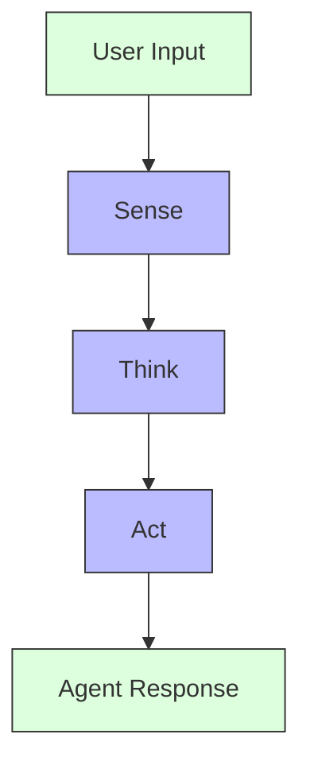

### Stage 2: The SimpleAgent Implementation

Now let's look at how the SimpleAgent implements this loop:

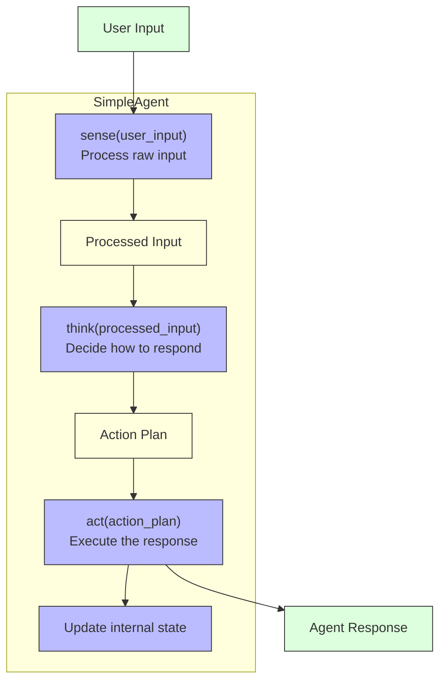

### Stage 3: Adding Prompt Templates

Let's add prompt templates to create the PromptDrivenAgent:

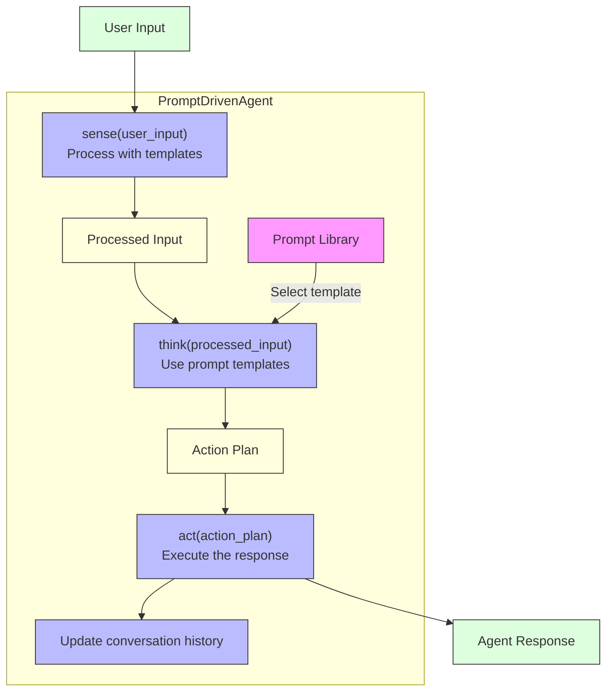

### Stage 4: Adding State Management

Now let's add state management to create the StatefulAgent:

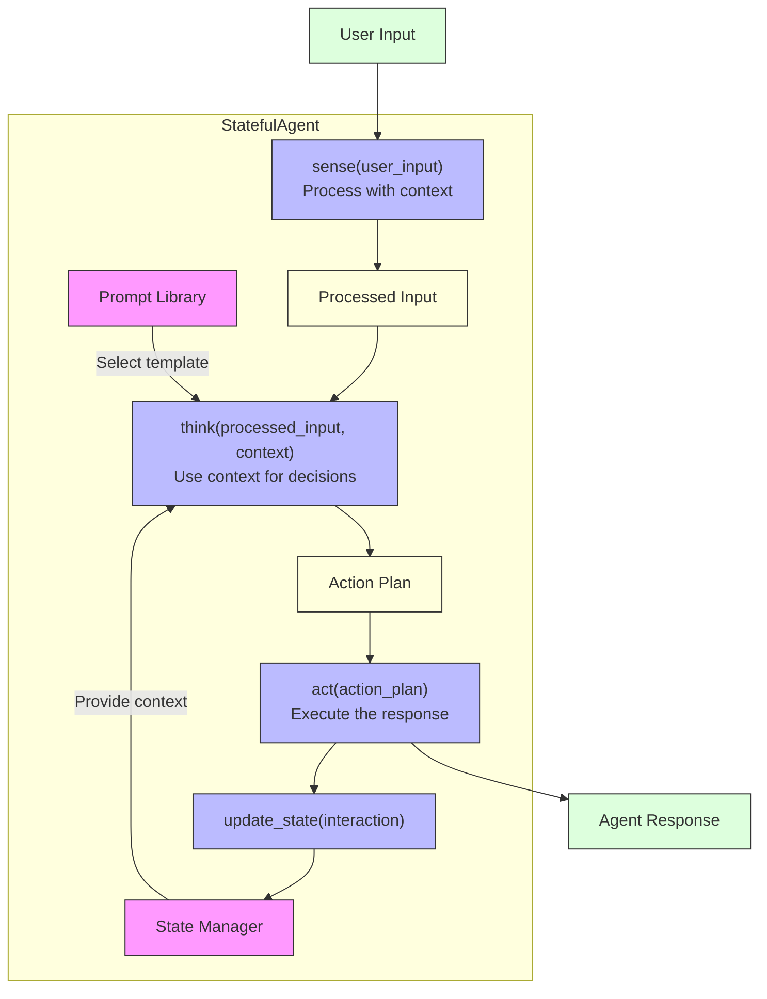

### Stage 5: Complete Agent Architecture

Finally, let's add task management to create the TaskManagerAgent:

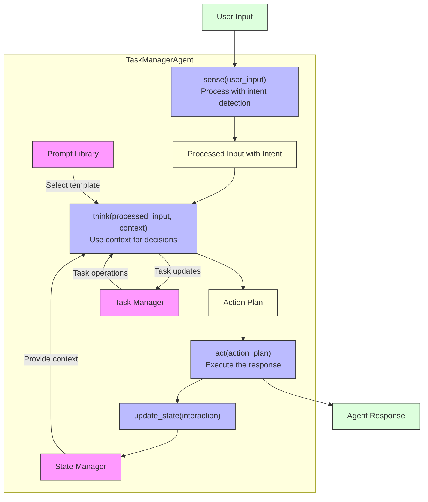

## 2. Prompt Engineering Flow: Stage-by-Stage Breakdown

### Stage 1: Basic Prompt Template

Let's start with a basic prompt template:

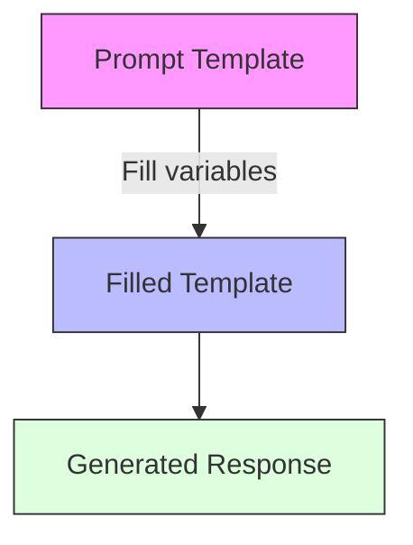

### Stage 2: Adding Context and Variables

Now let's add context and variables:

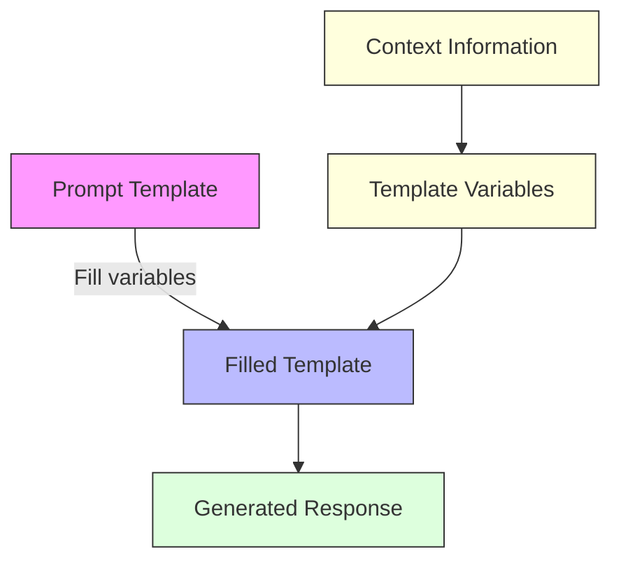

### Stage 3: Complete Prompt Engineering Flow

Finally, let's add the complete prompt engineering flow:

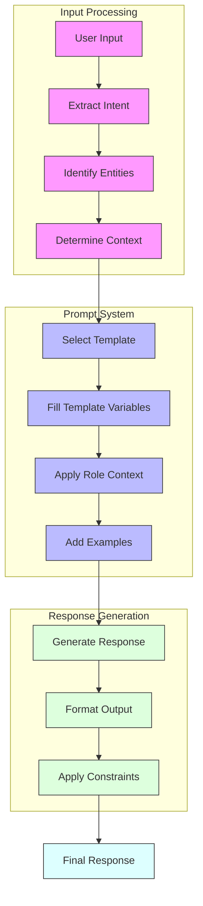

## 3. Class Hierarchy: Stage-by-Stage Breakdown

### Stage 1: SimpleAgent

Let's start with the SimpleAgent class:

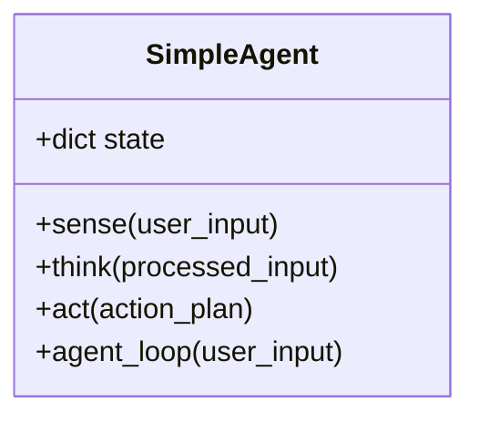

### Stage 2: Adding PromptDrivenAgent

Now let's add the PromptDrivenAgent:

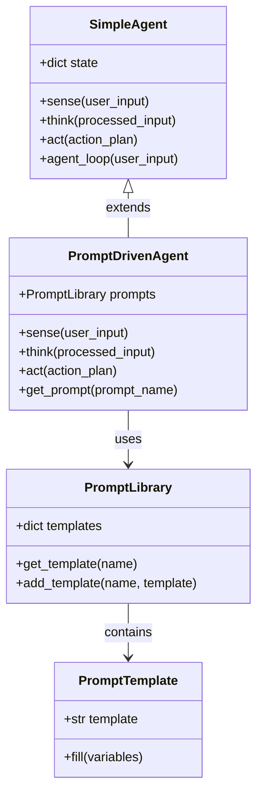

### Stage 3: Adding StatefulAgent

Let's add the StatefulAgent:

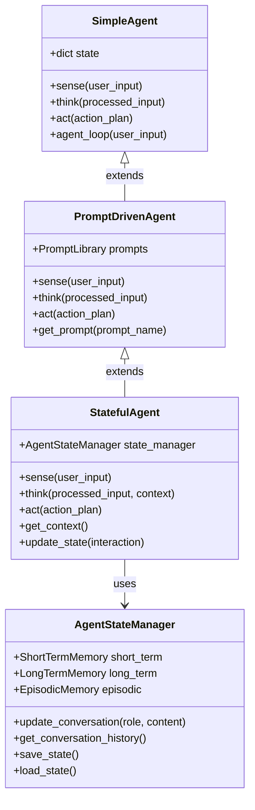

### Stage 4: Complete Class Hierarchy

Finally, let's add the TaskManagerAgent to complete the hierarchy:

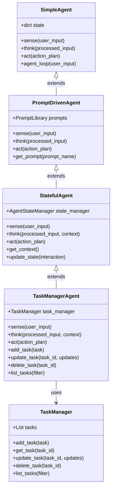
