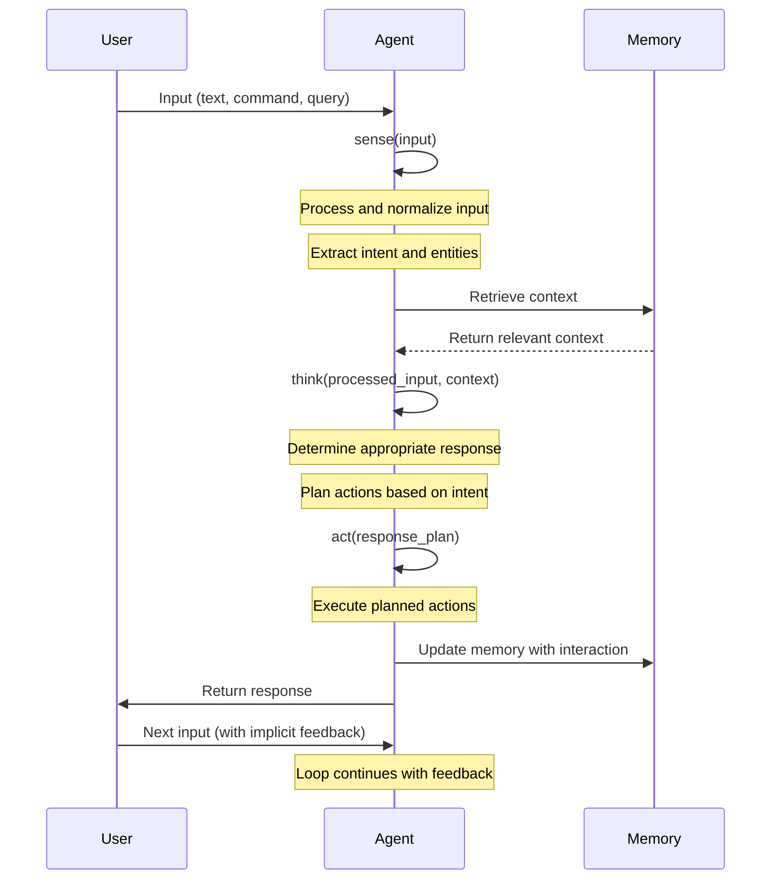
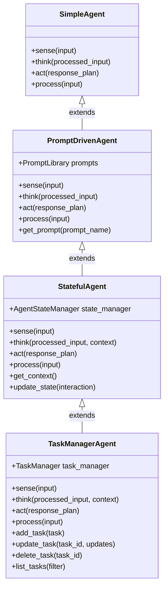
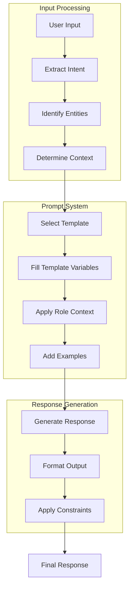
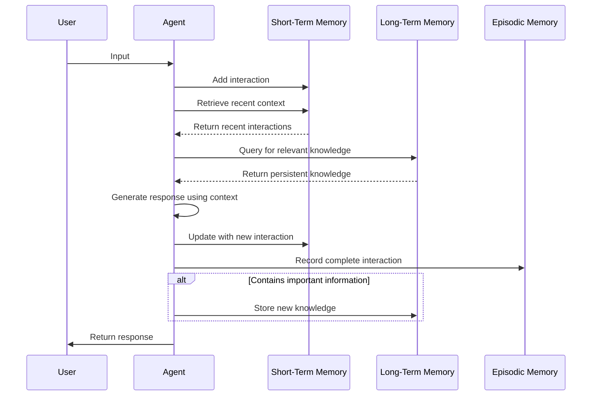
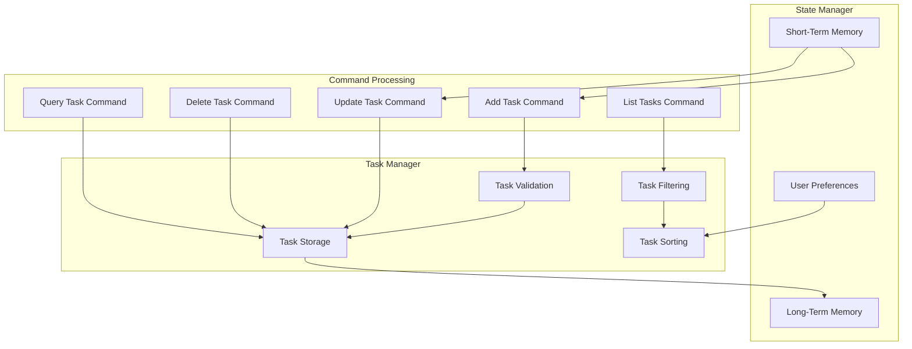

# 📊 Module 1: Agent Fundamentals - Explanatory Diagrams

Visual explanations of the key concepts in Module 1 through sequence diagrams, flowcharts, and class diagrams.

## 🔄 Sense-Think-Act Loop

The following sequence diagram illustrates the core agent loop that forms the foundation of all agents in this module:

## 🧩 Agent Architecture

The following class diagram shows the relationship between the different agent types in Module 1:

## 📝 Prompt Engineering Flow

This flowchart illustrates how prompts are processed in the PromptDrivenAgent:

## 🧠 State Management Architecture

This diagram shows how different memory types interact in the StatefulAgent:

## 🗃️ Task Manager Data Flow

This flowchart illustrates how data flows through the TaskManagerAgent:

