# The Progressive Journey Through Module 2-LLM: Memory Systems with Groq API

This document presents a stage-by-stage breakdown of the LLM-enhanced memory systems in Module 2-LLM, gradually building up to the complete picture.

## 1. LLM Integration: Stage-by-Stage Breakdown

### Stage 1: Basic LLM Client

Let's start with the basic LLM client:

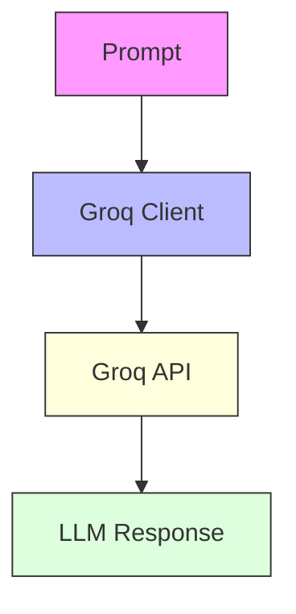

### Stage 2: Adding Text Generation and Embeddings

Now let's add text generation and embedding capabilities:

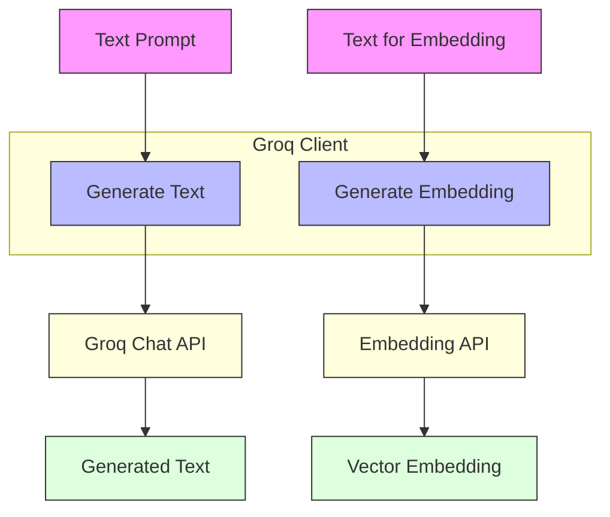

### Stage 3: Adding Error Handling and Fallbacks

Let's add error handling and fallback mechanisms:

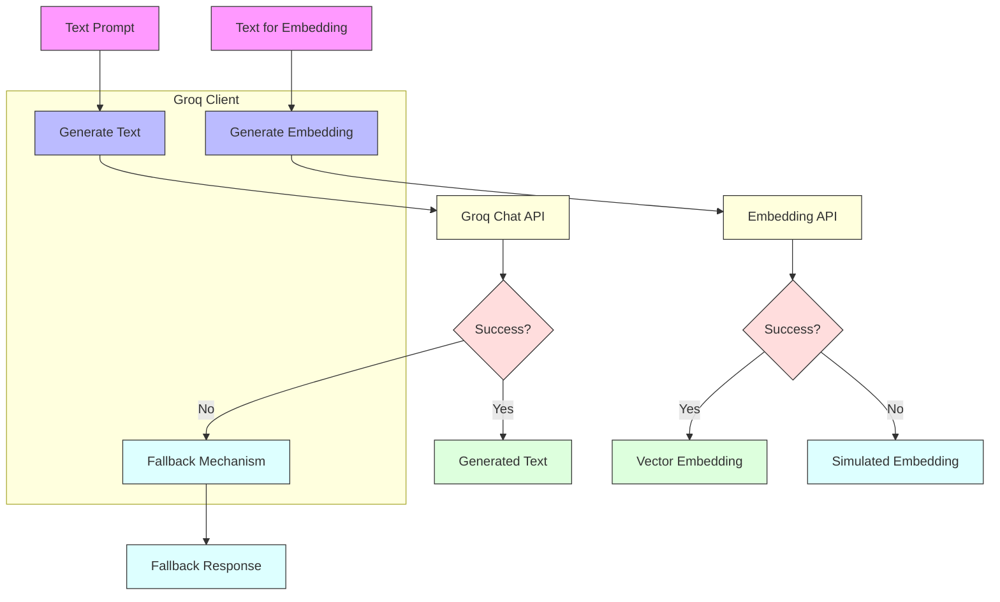

### Stage 4: Complete LLM Client Architecture

Finally, let's add the complete LLM client architecture:

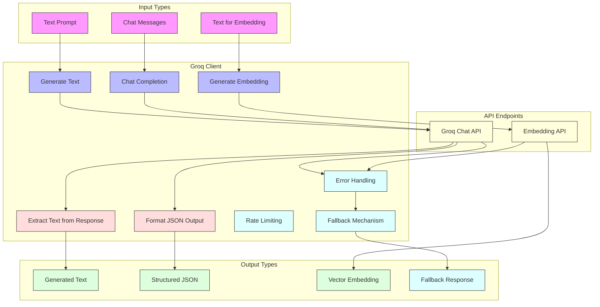

## 2. LLM-Enhanced Memory Systems: Stage-by-Stage Breakdown

### Stage 1: Basic Memory Types with LLM

Let's start with the basic memory types enhanced with LLM:

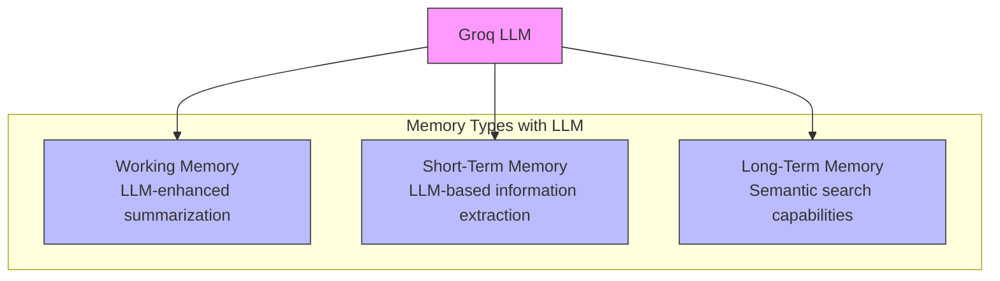

### Stage 2: Adding LLM-Enhanced Operations

Now let's add the LLM-enhanced operations for each memory type:

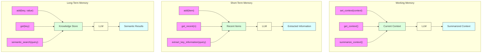

### Stage 3: Adding Episodic Memory with LLM

Let's add LLM-enhanced episodic memory:

```mermaid
flowchart TD
    subgraph WorkingMemory["Working Memory"]
        W1["set_context(context)"] --> W2["Current Context"]
        W3["get_context()"] --> W2
        W4["summarize_context()"] --> W2 --> LLM1[LLM] --> W5["Summarized Context"]
    end
    
    subgraph ShortTermMemory["Short-Term Memory"]
        S1["add(item)"] --> S2["Recent Items"]
        S3["get_recent(n)"] --> S2
        S4["extract_key_information(query)"] --> S2 --> LLM2[LLM] --> S5["Extracted Information"]
    end
    
    subgraph LongTermMemory["Long-Term Memory"]
        L1["add(key, value)"] --> L2["Knowledge Store"]
        L3["get(key)"] --> L2
        L4["semantic_search(query)"] --> L2 --> LLM3[LLM] --> L5["Semantic Results"]
    end
    
    subgraph EpisodicMemory["Episodic Memory"]
        E1["add_episode(episode)"] --> E2["Episodes"]
        E3["get_episodes(filter)"] --> E2
        E4["analyze_episodes(filter)"] --> E2 --> LLM4[LLM] --> E5["Episode Analysis"]
        E6["generate_summary()"] --> E2 --> LLM4 --> E7["Experience Summary"]
    end
    
    classDef operation fill:#f9f,stroke:#333,stroke-width:1px;
    classDef storage fill:#dfd,stroke:#333,stroke-width:1px;
    classDef llm fill:#ffd,stroke:#333,stroke-width:1px;
    classDef output fill:#dff,stroke:#333,stroke-width:1px;
    
    class W1,W3,W4,S1,S3,S4,L1,L3,L4,E1,E3,E4,E6 operation;
    class W2,S2,L2,E2 storage;
    class LLM1,LLM2,LLM3,LLM4 llm;
    class W5,S5,L5,E5,E7 output;
```

### Stage 4: Integrated LLM-Enhanced Memory System

Now let's integrate all memory types into a unified LLM-enhanced system:

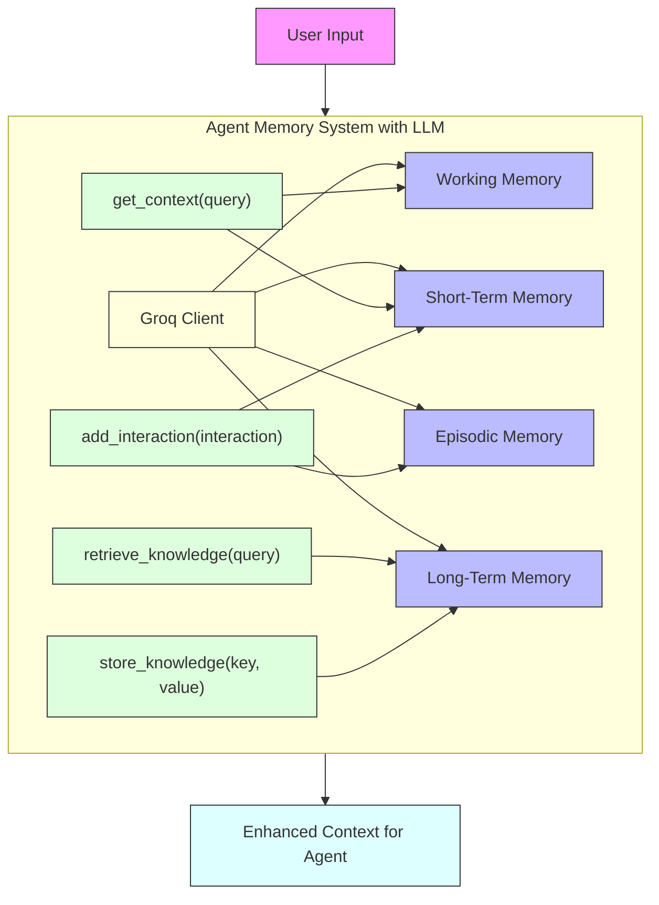

### Stage 5: Complete LLM-Enhanced Memory Architecture

Finally, let's add the vector database and retrieval components with LLM enhancement:

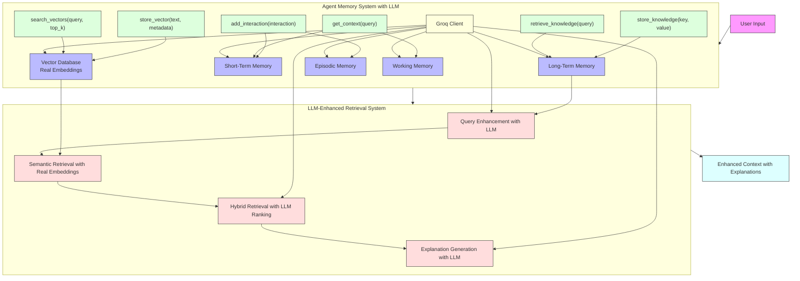

## 3. LLM-Enhanced Vector Database: Stage-by-Stage Breakdown

### Stage 1: Basic Vector Database with Real Embeddings

Let's start with a basic vector database using real embeddings:

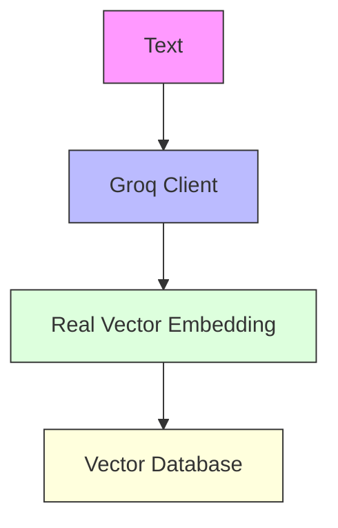

### Stage 2: Adding Vector Operations with LLM

Now let's add the LLM-enhanced operations for the vector database:

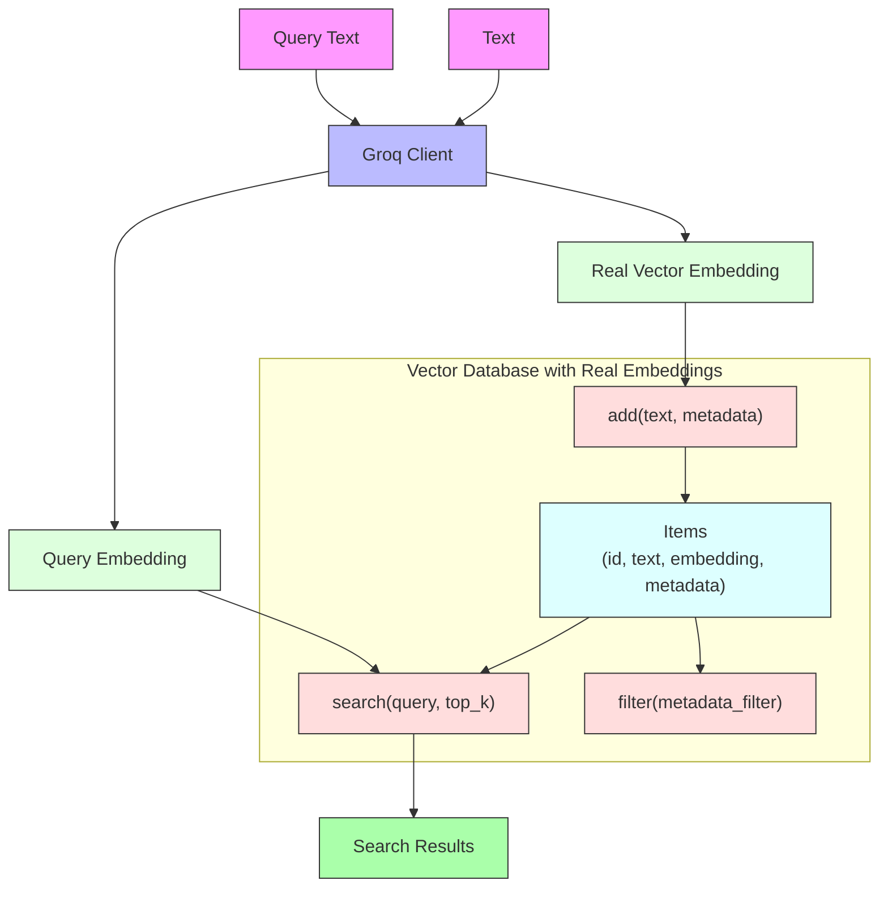

### Stage 3: Adding LLM-Enhanced Search Capabilities

Let's add LLM-enhanced search capabilities:

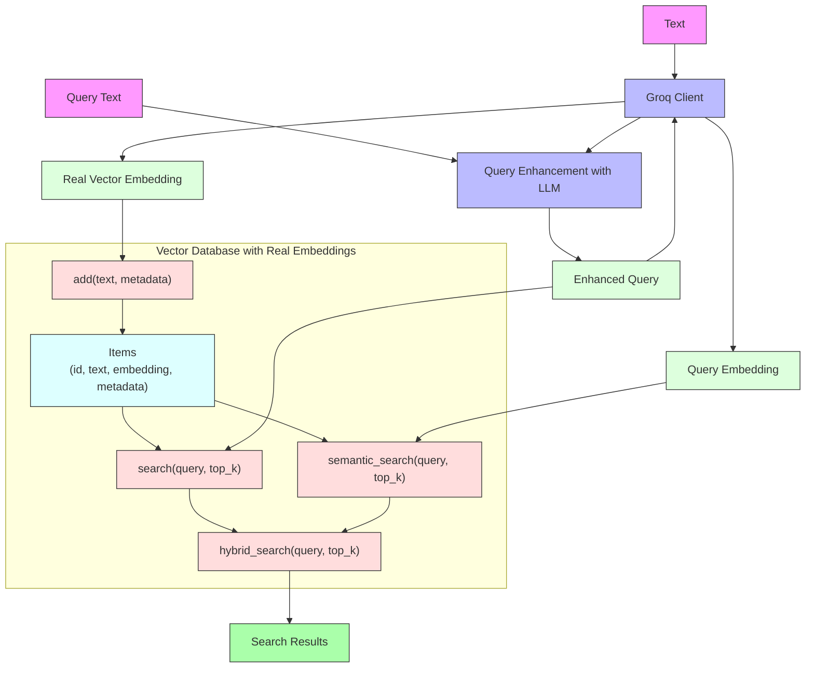

### Stage 4: Complete LLM-Enhanced Vector Database

Finally, let's add the complete LLM-enhanced vector database with advanced features:

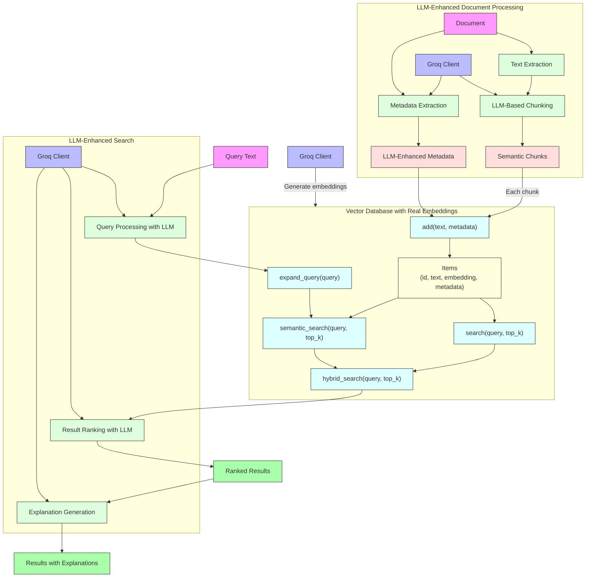
