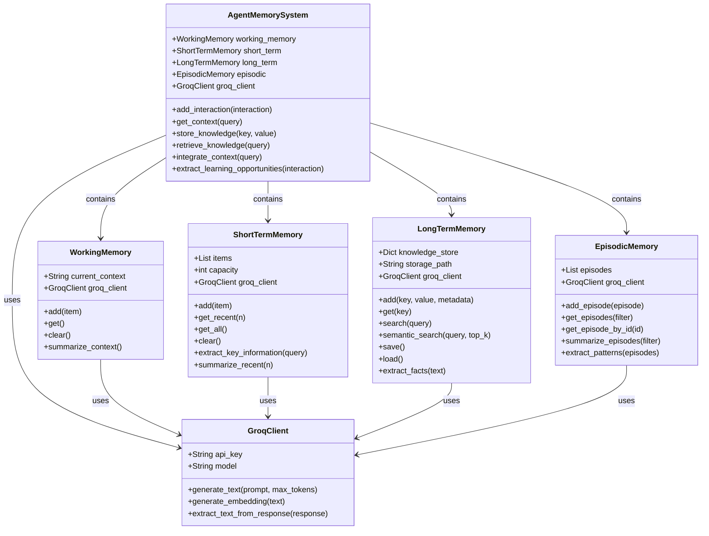
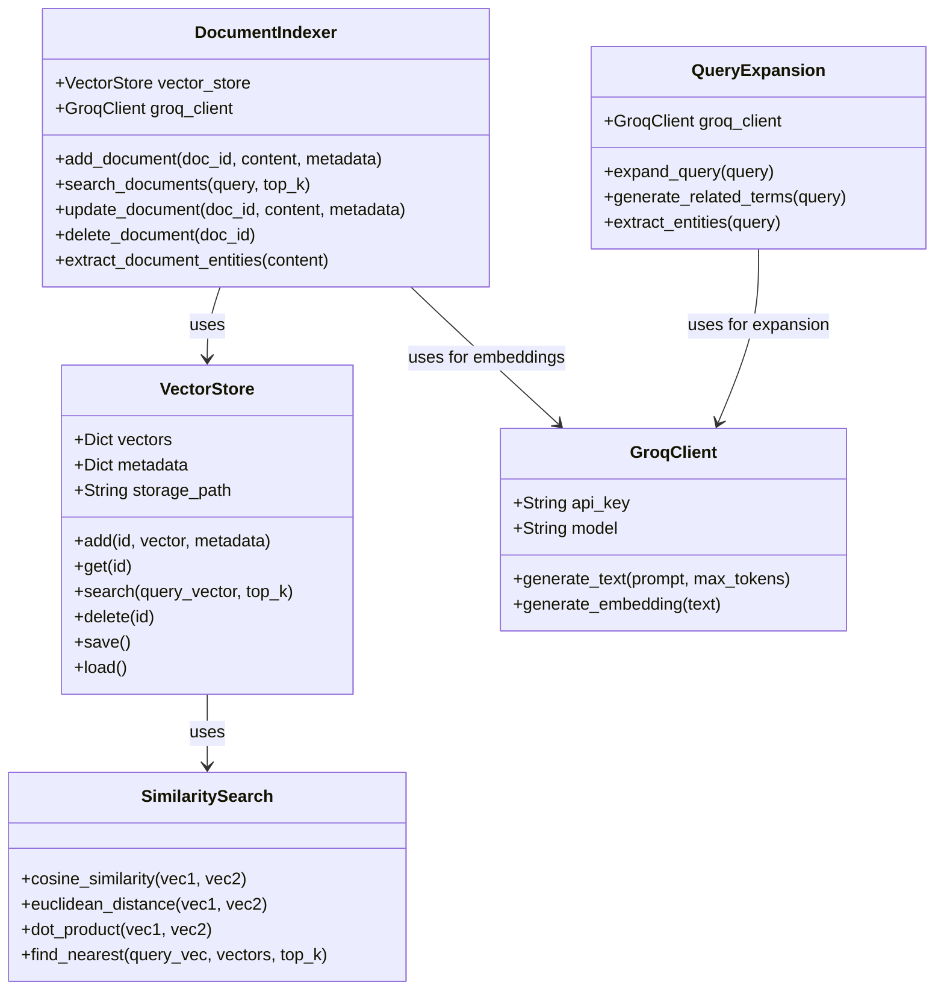
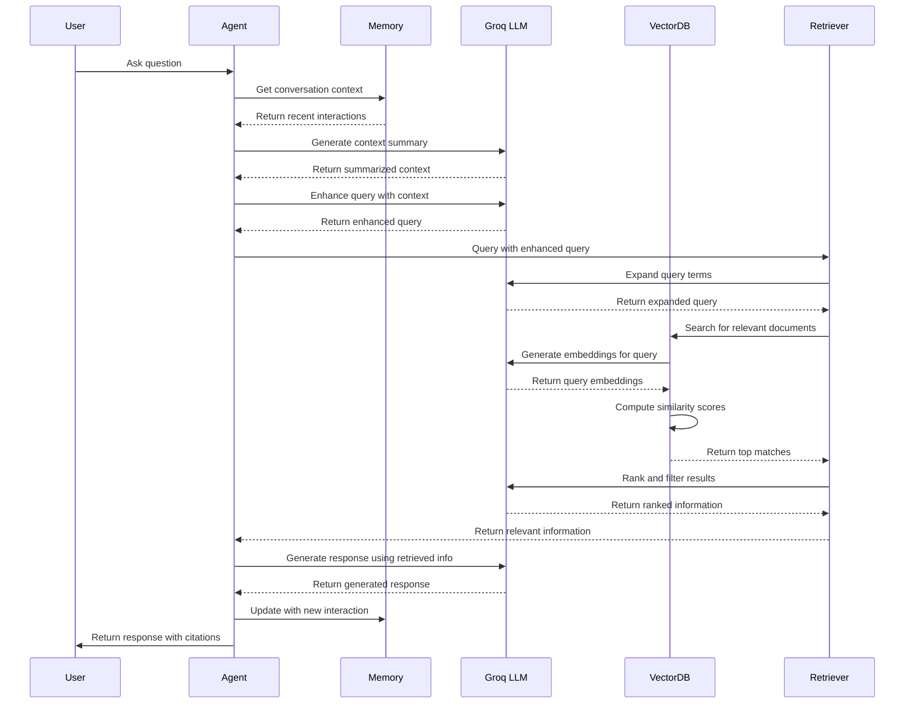
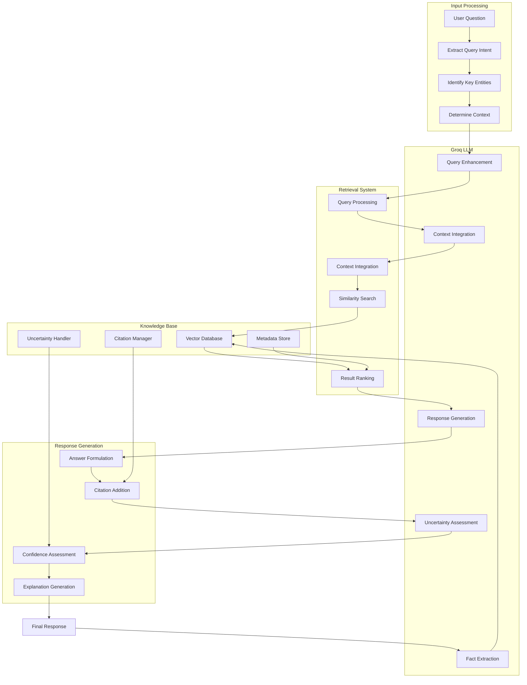
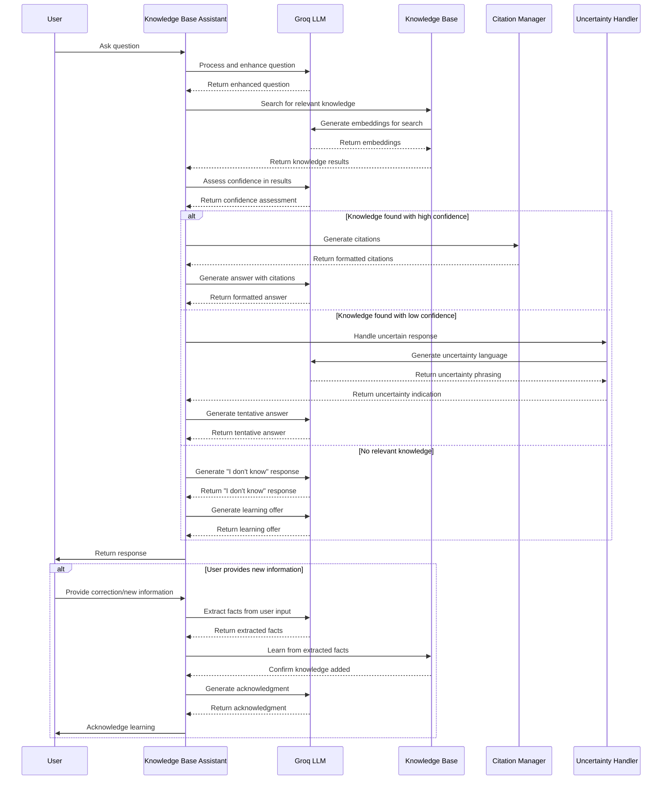
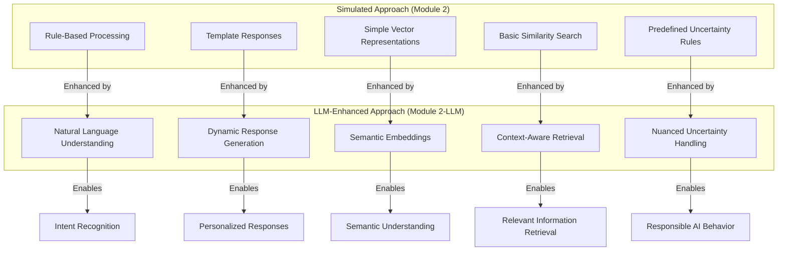

# 📊 Module 2-LLM: Memory Systems with Groq API - Explanatory Diagrams

This document provides visual explanations of the key concepts in Module 2-LLM through sequence diagrams, flowcharts, and class diagrams, highlighting the integration with real LLMs via the Groq API.

## 🧠 LLM-Enhanced Memory System Architecture

The following class diagram illustrates the different memory types with LLM integration:

## 🔍 LLM-Enhanced Vector Database System

This diagram shows the components of the vector database system with real embeddings:

## 🔄 LLM-Enhanced Retrieval Process Flow

The following sequence diagram illustrates the retrieval process with LLM enhancement:

## 📚 LLM-Enhanced Knowledge Base Architecture

This flowchart shows how the knowledge base system works with LLM integration:

## 🧠 LLM-Enhanced Knowledge Base Assistant Interaction

This sequence diagram shows how the knowledge base assistant handles a user query with LLM integration:

## 🔄 Comparing Simulated vs. LLM-Enhanced Approaches

This diagram illustrates the key differences between the simulated approach and the LLM-enhanced approach:

These diagrams provide visual explanations of the key concepts and architectures in Module 2-LLM, highlighting how real LLM integration enhances the memory systems and knowledge base assistant compared to the simulated approach in the standard Module 2.
