# The Progressive Journey Through Module 2: Memory Systems

This document presents a stage-by-stage breakdown of the memory systems in Module 2, gradually building up to the complete picture.

## 1. Memory Architecture: Stage-by-Stage Breakdown

### Stage 1: Basic Memory Types

Let's start with the basic memory types:

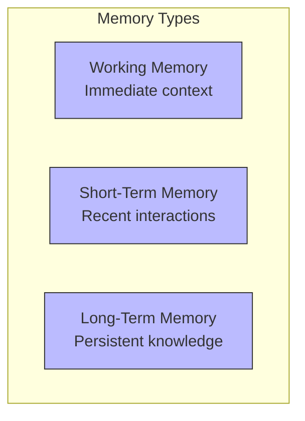

### Stage 2: Adding Memory Operations

Now let's add the basic operations for each memory type:

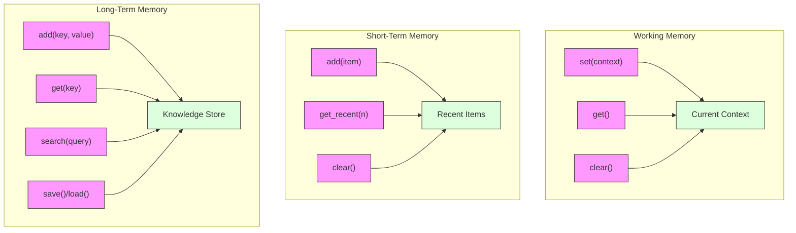

### Stage 3: Adding Episodic Memory

Let's add episodic memory to the system:

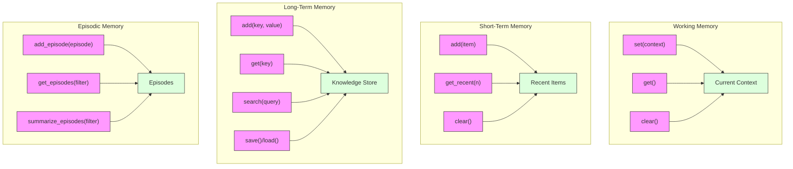

### Stage 4: Integrated Memory System

Now let's integrate all memory types into a unified system:

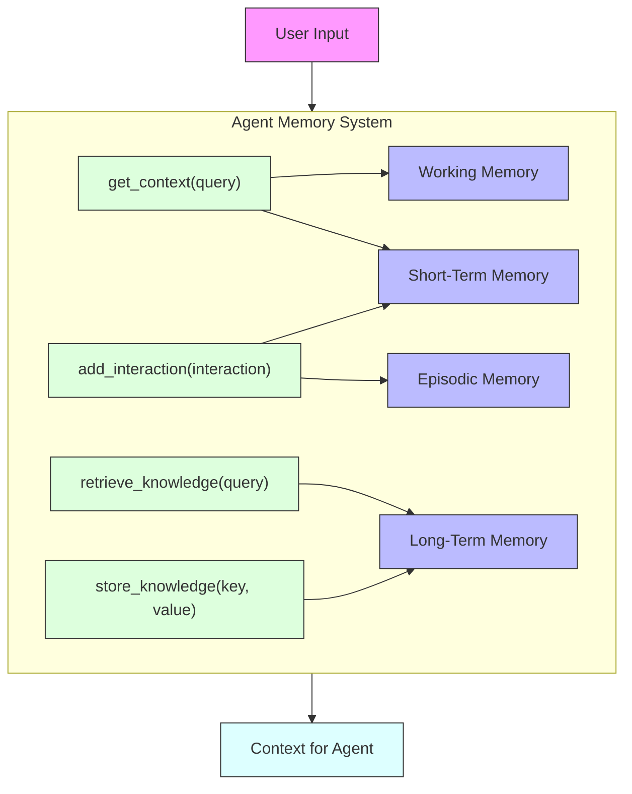

### Stage 5: Complete Memory Architecture

Finally, let's add the vector database and retrieval components:

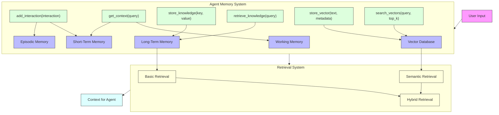

## 2. Vector Database: Stage-by-Stage Breakdown

### Stage 1: Basic Vector Database

Let's start with a basic vector database:

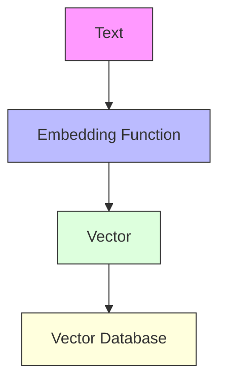

### Stage 2: Adding Vector Operations

Now let's add the basic operations for the vector database:

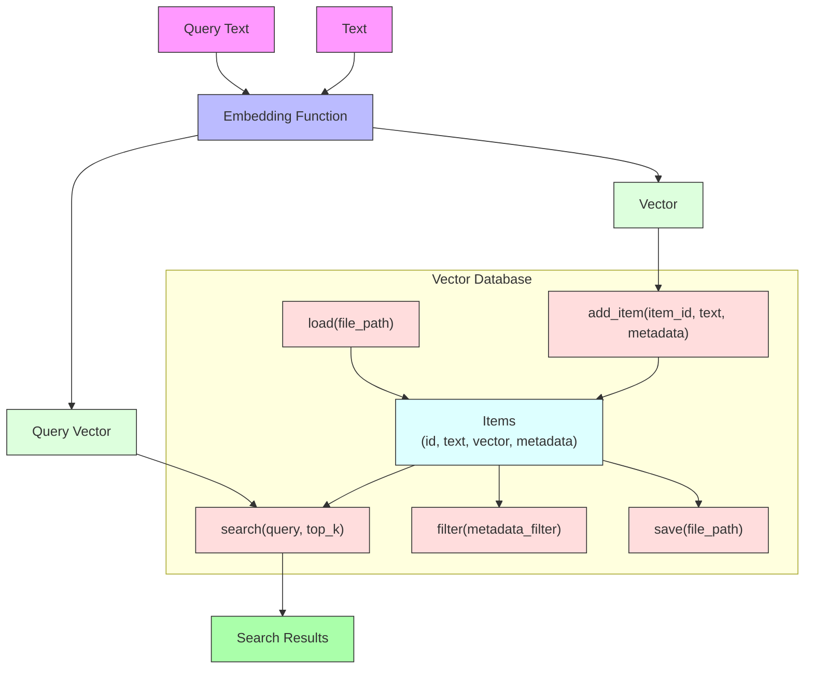

### Stage 3: Complete Vector Database System

Finally, let's add the similarity search and document processing:

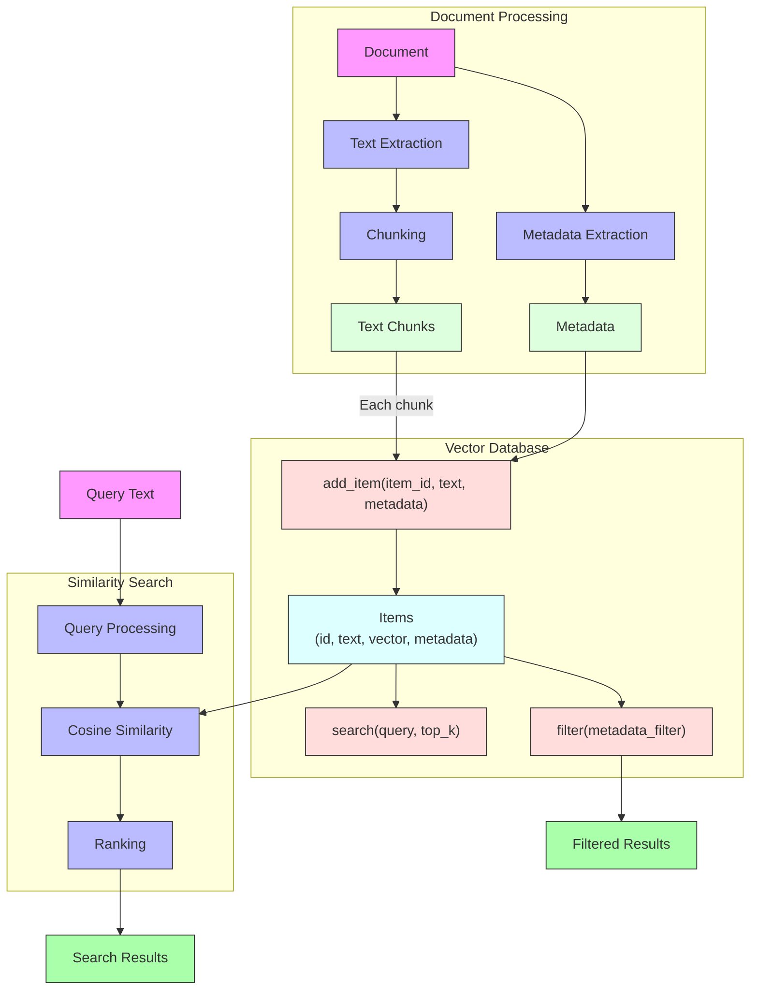

## 3. Retrieval Patterns: Stage-by-Stage Breakdown

### Stage 1: Basic Retrieval

Let's start with basic retrieval:

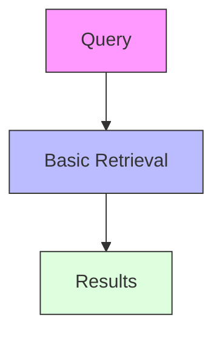

### Stage 2: Adding Different Retrieval Types

Now let's add different types of retrieval:

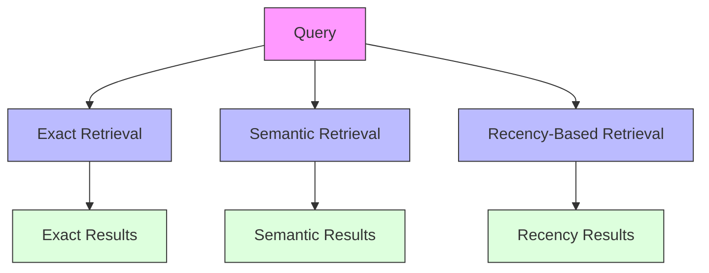

### Stage 3: Adding Hybrid Retrieval

Let's add hybrid retrieval that combines different approaches:

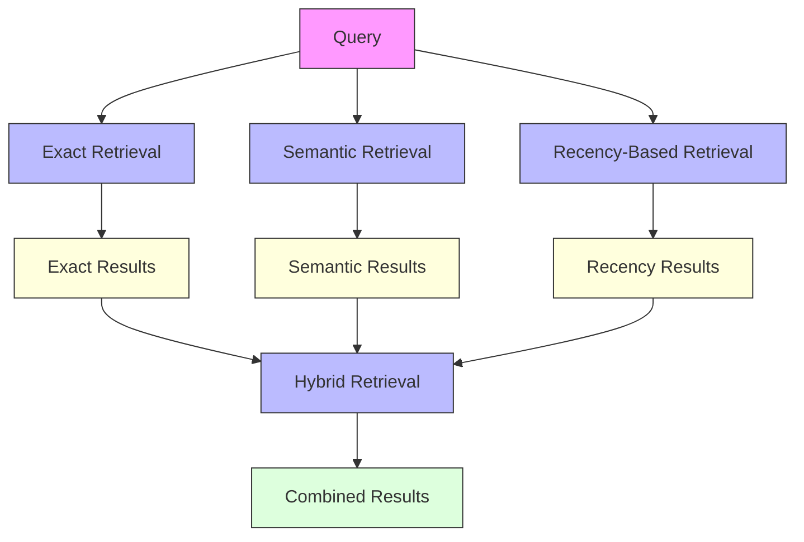

### Stage 4: Adding Context-Aware Retrieval

Now let's add context-aware retrieval:

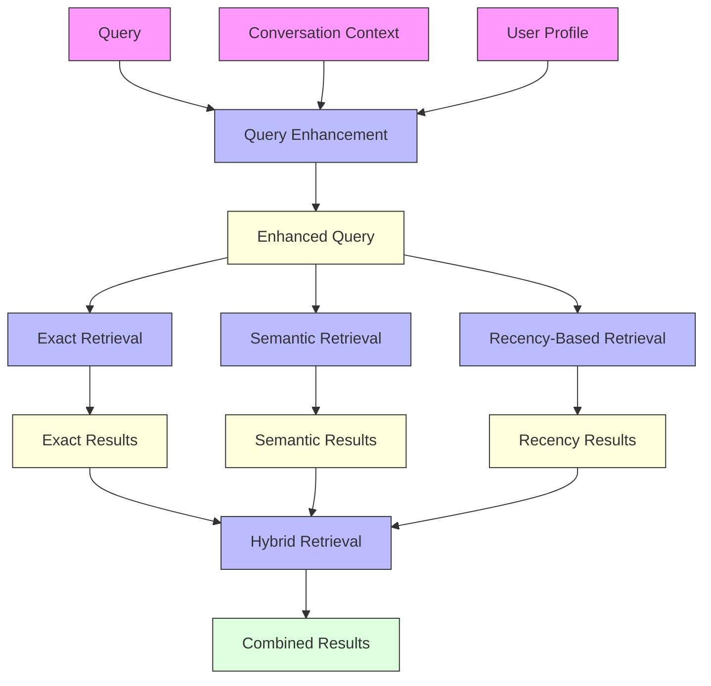

### Stage 5: Complete Retrieval System

Finally, let's add the complete retrieval system with explanation capabilities:

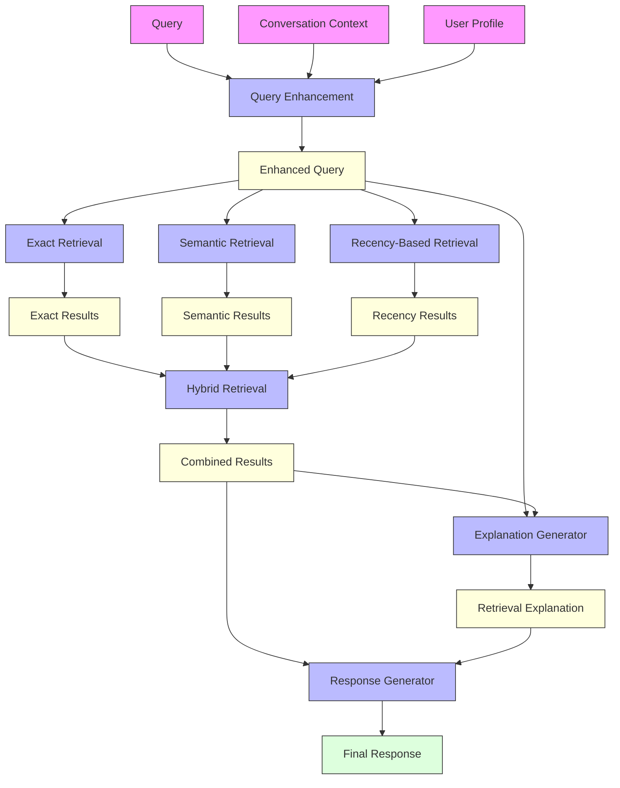
