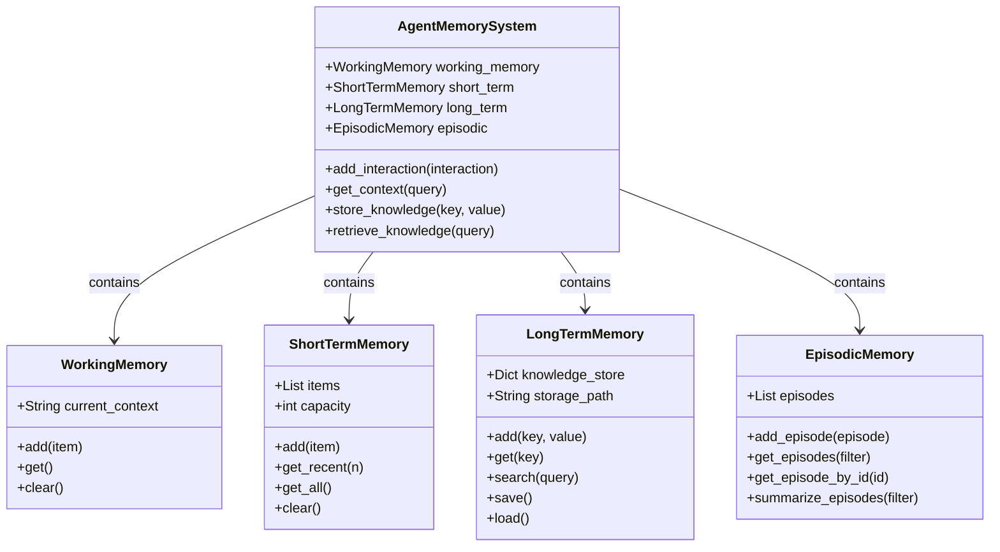
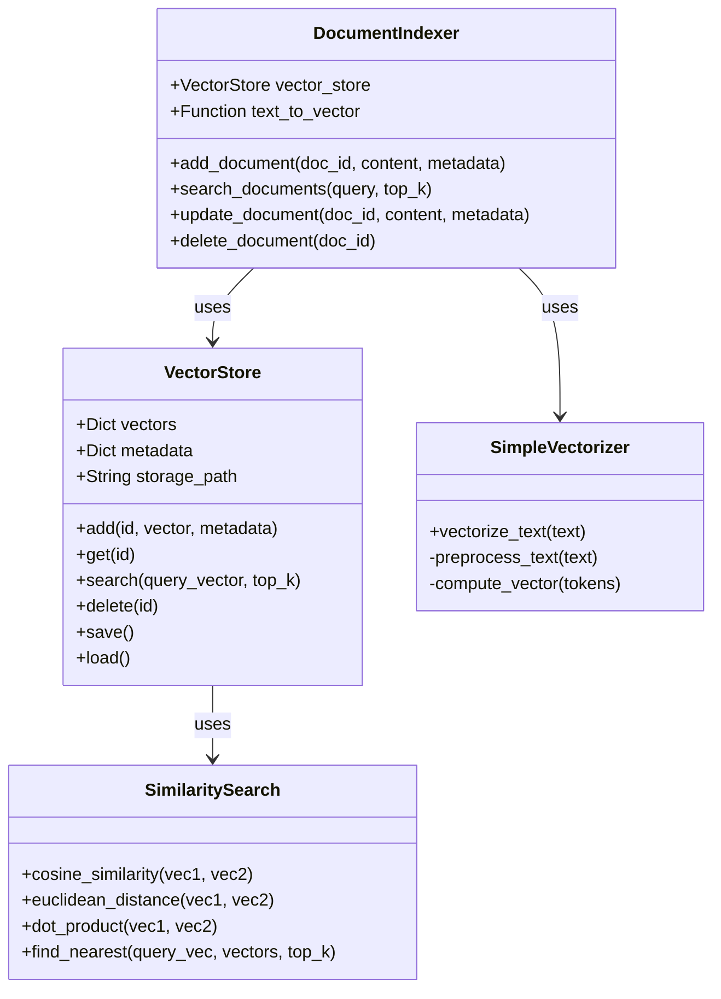
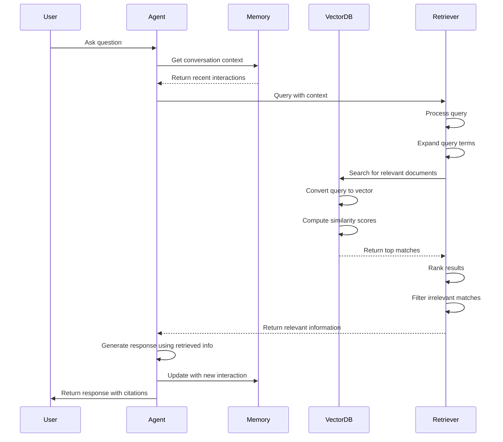
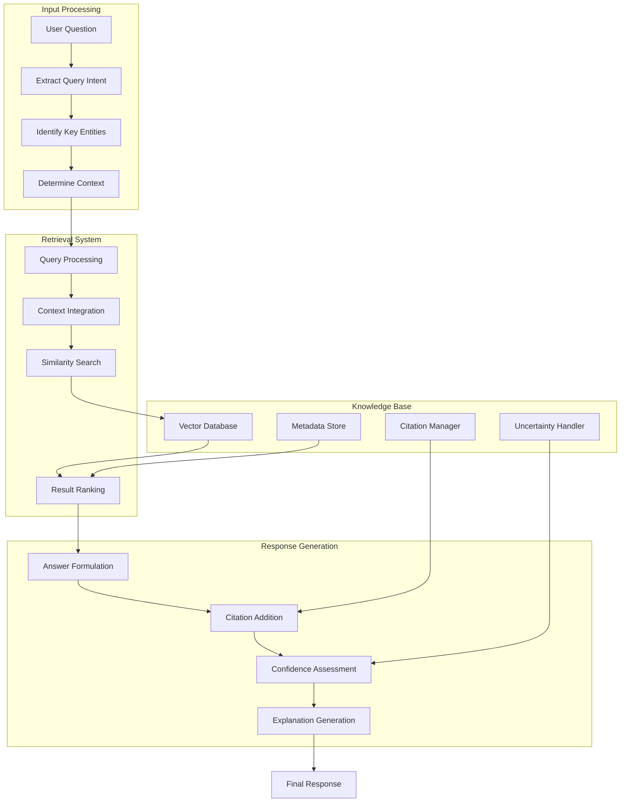
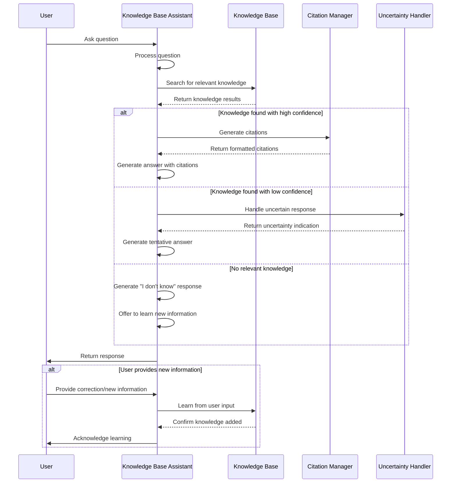

# 📊 Module 2: Memory Systems - Explanatory Diagrams

Visual explanations of the key concepts in Module 2 through sequence diagrams, flowcharts, and class diagrams.

## 🧠 Memory System Architecture

The following class diagram illustrates the different memory types and their relationships:

## 🔍 Vector Database System

This diagram shows the components of the vector database system:

## 🔄 Retrieval Process Flow

The following sequence diagram illustrates the retrieval process:

## 📚 Knowledge Base Architecture

This flowchart shows how the knowledge base system works:

## 🧠 Knowledge Base Assistant Interaction

This sequence diagram shows how the knowledge base assistant handles a user query:

