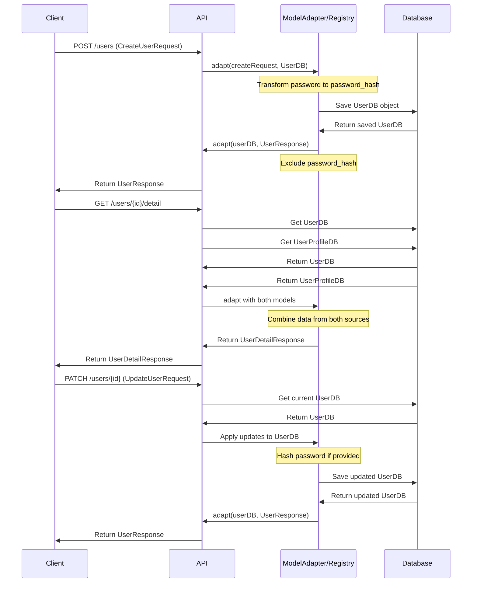
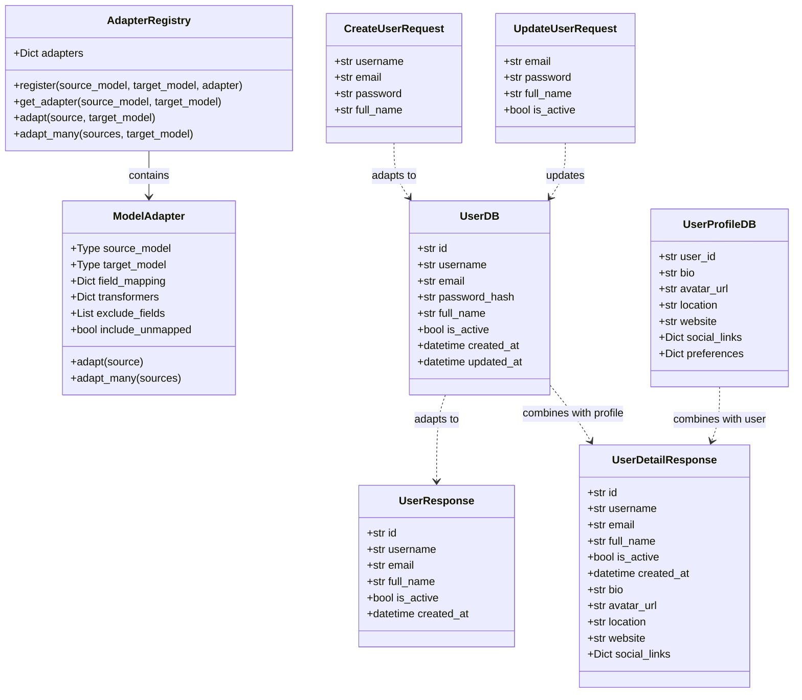
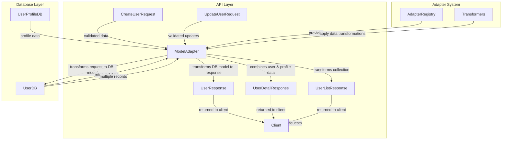

# Model Adapter Patterns

This file contains diagrams illustrating the Model Adapter pattern and its applications in API flows.

## Common API Flows

The following sequence diagram illustrates three common API flows using the Model Adapter pattern:
1. Creating a user
2. Getting detailed user information
3. Updating a user

## Class Diagram: Model Adapter System

The following class diagram illustrates the structure of the Model Adapter pattern and the relationships between different components:

## Data Flow Diagram

The following flowchart illustrates how data flows through the different layers of the application when using the Model Adapter pattern:

