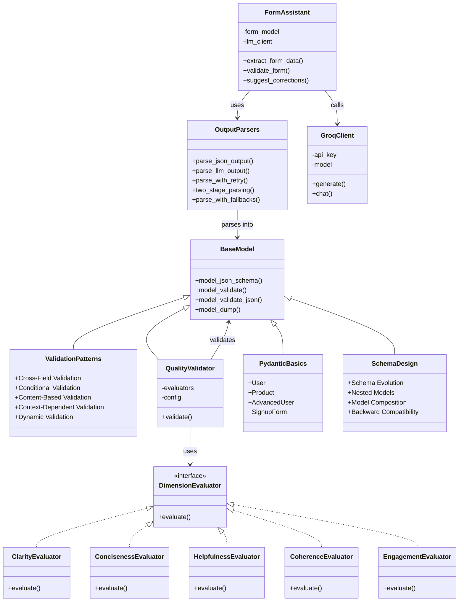

# Module 3 Architecture: Data Validation & Structured Outputs

This diagram illustrates the architecture of Module 3, focusing on Pydantic validation and structured outputs.

```mermaid
classDiagram
    class BaseModel {
        +model_json_schema()
        +model_validate()
        +model_validate_json()
        +model_dump()
    }
    
    class ValidationPatterns {
        +Cross-Field Validation
        +Conditional Validation
        +Content-Based Validation
        +Context-Dependent Validation
        +Dynamic Validation
    }
    
    class OutputParsers {
        +parse_json_output()
        +parse_llm_output()
        +parse_with_retry()
        +two_stage_parsing()
        +parse_with_fallbacks()
    }
    
    class QualityValidator {
        -evaluators
        -config
        +validate()
    }
    
    class PydanticBasics {
        +User
        +Product
        +AdvancedUser
        +SignupForm
    }
    
    class SchemaDesign {
        +Schema Evolution
        +Nested Models
        +Model Composition
        +Backward Compatibility
    }
    
    class FormAssistant {
        -form_model
        -llm_client
        +extract_form_data()
        +validate_form()
        +suggest_corrections()
    }
    
    class GroqClient {
        -api_key
        -model
        +generate()
        +chat()
    }
    
    BaseModel <|-- PydanticBasics
    BaseModel <|-- ValidationPatterns
    BaseModel <|-- SchemaDesign
    BaseModel <|-- QualityValidator
    
    OutputParsers --> BaseModel : parses into
    FormAssistant --> OutputParsers : uses
    FormAssistant --> GroqClient : calls
    QualityValidator --> BaseModel : validates
    
    class DimensionEvaluator {
        <<interface>>
        +evaluate()
    }
    
    class ClarityEvaluator {
        +evaluate()
    }
    
    class ConcisenessEvaluator {
        +evaluate()
    }
    
    class HelpfulnessEvaluator {
        +evaluate()
    }
    
    class CoherenceEvaluator {
        +evaluate()
    }
    
    class EngagementEvaluator {
        +evaluate()
    }
    
    DimensionEvaluator <|.. ClarityEvaluator
    DimensionEvaluator <|.. ConcisenessEvaluator
    DimensionEvaluator <|.. HelpfulnessEvaluator
    DimensionEvaluator <|.. CoherenceEvaluator
    DimensionEvaluator <|.. EngagementEvaluator
    
    QualityValidator --> DimensionEvaluator : uses
```
