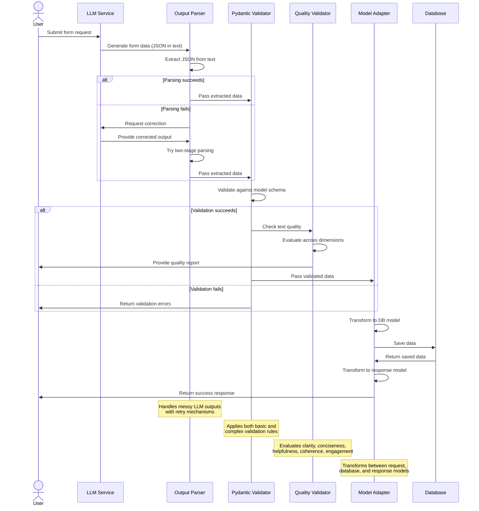
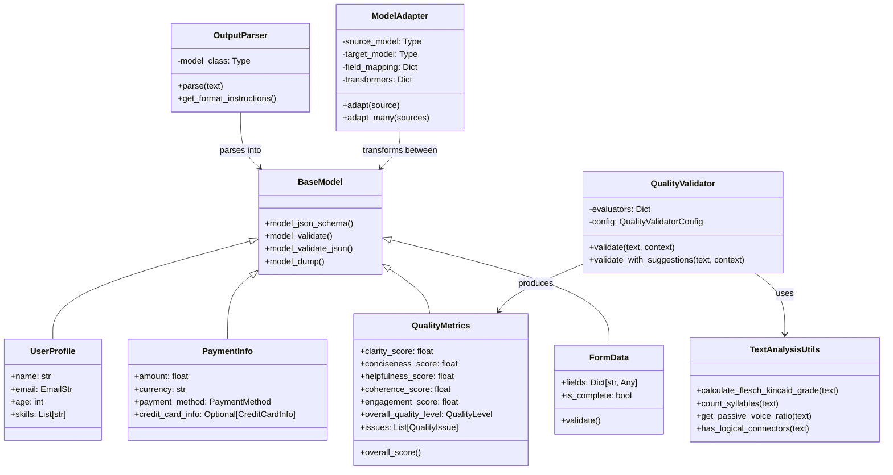

# The Journey of Data Through Module 3

This diagram illustrates the complete journey of data through Module 3's validation and processing pipeline, showing how all components interact to process, validate, and transform data.

```mermaid
flowchart TD
    %% Main data sources
    UserInput[User Input\n📝] --> InputValidation
    LLMOutput[LLM Output\n🤖] --> OutputParsing
    
    %% Main processing stages
    subgraph InputValidation["Input Validation 🛡️"]
        PydanticModels["Pydantic Models\nBasic type & constraint validation"]
        ValidationPatterns["Validation Patterns\nComplex business rules"]
        
        PydanticModels --> ValidationPatterns
    end
    
    subgraph OutputParsing["Output Parsing 🔄"]
        BasicParsing["Basic Parsing\nExtract JSON from text"]
        RetryMechanisms["Retry Mechanisms\nHandle parsing failures"]
        TwoStageParsing["Two-Stage Parsing\nExtraction & refinement"]
        
        BasicParsing --> RetryMechanisms
        RetryMechanisms --> TwoStageParsing
    end
    
    subgraph QualityAssessment["Quality Assessment 📊"]
        ClarityEval["Clarity Evaluator\nReadability & comprehension"]
        ConcisenessEval["Conciseness Evaluator\nBrevity & focus"]
        HelpfulnessEval["Helpfulness Evaluator\nUtility & relevance"]
        CoherenceEval["Coherence Evaluator\nLogical flow & organization"]
        EngagementEval["Engagement Evaluator\nTone & style"]
        
        QualityMetrics["Quality Metrics\nScores & issues"]
        
        ClarityEval & ConcisenessEval & HelpfulnessEval & CoherenceEval & EngagementEval --> QualityMetrics
    end
    
    subgraph DataTransformation["Data Transformation 🔄"]
        ModelAdapters["Model Adapters\nConvert between data models"]
        FieldMapping["Field Mapping\nMap fields between models"]
        Transformers["Transformers\nApply data transformations"]
        
        ModelAdapters --> FieldMapping
        ModelAdapters --> Transformers
    end
    
    %% Connections between main components
    InputValidation --> |Valid data| DataTransformation
    OutputParsing --> |Structured data| InputValidation
    OutputParsing --> |Text content| QualityAssessment
    
    %% Data destinations
    DataTransformation --> DBModels[Database Models\n💾]
    DataTransformation --> APIResponses[API Responses\n📤]
    QualityAssessment --> QualityReport[Quality Report\n📋]
    
    %% Special flows
    LLMOutput --> |Form data| FormExtractor[Form Extractor\nExtract structured form data]
    FormExtractor --> InputValidation
    
    %% Error handling
    InputValidation --> |Validation errors| ValidationErrors[Validation Errors\n❌]
    OutputParsing --> |Parsing failures| ParsingErrors[Parsing Errors\n❌]
    
    %% Utility components
    TextAnalysisUtils[Text Analysis Utilities\n🔍] --> ClarityEval & ConcisenessEval & HelpfulnessEval & CoherenceEval & EngagementEval
    
    %% Real-world examples
    subgraph Examples["Real-World Examples"]
        UserProfile["User Profile\nname, email, age, skills"]
        PaymentInfo["Payment Processing\npayment method, amount, card info"]
        ContentModeration["Content Moderation\nsafety checks, bias detection"]
        FormFilling["Form Filling Assistant\nextract & validate form data"]
    end
    
    InputValidation -.-> UserProfile & PaymentInfo
    QualityAssessment -.-> ContentModeration
    OutputParsing & InputValidation -.-> FormFilling
    
    %% Styling
    classDef input fill:#f9f,stroke:#333,stroke-width:2px;
    classDef process fill:#bbf,stroke:#333,stroke-width:1px;
    classDef output fill:#dfd,stroke:#333,stroke-width:1px;
    classDef error fill:#fdd,stroke:#333,stroke-width:1px;
    classDef utility fill:#dff,stroke:#333,stroke-width:1px;
    classDef example fill:#ffd,stroke:#333,stroke-width:1px;
    
    class UserInput,LLMOutput input;
    class InputValidation,OutputParsing,QualityAssessment,DataTransformation process;
    class DBModels,APIResponses,QualityReport output;
    class ValidationErrors,ParsingErrors error;
    class TextAnalysisUtils utility;
    class UserProfile,PaymentInfo,ContentModeration,FormFilling example;
```

## Component Interactions and Data Flow

This sequence diagram shows how the different components interact when processing a form submission from an LLM:

## Data Models and Their Relationships

This class diagram shows the key data models and their relationships:

