# The Progressive Journey of Data Through Module 3

This document presents a stage-by-stage breakdown of how data flows through Module 3, gradually building up to the complete picture.

## 1. Data Flow: Stage-by-Stage Breakdown

### Stage 1: Data Sources

Let's start with the sources of data in our system:

```mermaid
flowchart TD
    %% Main data sources
    UserInput[User Input\n📝] --> InputValidation[Input Validation\n🛡️]
    LLMOutput[LLM Output\n🤖] --> OutputParsing[Output Parsing\n🔄]
    
    %% Styling
    classDef input fill:#f9f,stroke:#333,stroke-width:2px;
    classDef process fill:#bbf,stroke:#333,stroke-width:1px;
    
    class UserInput,LLMOutput input;
    class InputValidation,OutputParsing process;
```

### Stage 2: Basic Validation and Parsing

Now let's add the basic validation and parsing components:

```mermaid
flowchart TD
    %% Main data sources
    UserInput[User Input\n📝] --> InputValidation
    LLMOutput[LLM Output\n🤖] --> OutputParsing
    
    %% Main processing stages
    subgraph InputValidation["Input Validation 🛡️"]
        PydanticModels["Pydantic Models\nBasic type & constraint validation"]
    end
    
    subgraph OutputParsing["Output Parsing 🔄"]
        BasicParsing["Basic Parsing\nExtract JSON from text"]
    end
    
    %% Connections
    OutputParsing --> |Structured data| InputValidation
    
    %% Styling
    classDef input fill:#f9f,stroke:#333,stroke-width:2px;
    classDef process fill:#bbf,stroke:#333,stroke-width:1px;
    
    class UserInput,LLMOutput input;
    class InputValidation,OutputParsing process;
```

### Stage 3: Advanced Validation and Parsing

Let's expand the validation and parsing components:

```mermaid
flowchart TD
    %% Main data sources
    UserInput[User Input\n📝] --> InputValidation
    LLMOutput[LLM Output\n🤖] --> OutputParsing
    
    %% Main processing stages
    subgraph InputValidation["Input Validation 🛡️"]
        PydanticModels["Pydantic Models\nBasic type & constraint validation"]
        ValidationPatterns["Validation Patterns\nComplex business rules"]
        
        PydanticModels --> ValidationPatterns
    end
    
    subgraph OutputParsing["Output Parsing 🔄"]
        BasicParsing["Basic Parsing\nExtract JSON from text"]
        RetryMechanisms["Retry Mechanisms\nHandle parsing failures"]
        TwoStageParsing["Two-Stage Parsing\nExtraction & refinement"]
        
        BasicParsing --> RetryMechanisms
        RetryMechanisms --> TwoStageParsing
    end
    
    %% Connections
    OutputParsing --> |Structured data| InputValidation
    
    %% Error handling
    InputValidation --> |Validation errors| ValidationErrors[Validation Errors\n❌]
    OutputParsing --> |Parsing failures| ParsingErrors[Parsing Errors\n❌]
    
    %% Styling
    classDef input fill:#f9f,stroke:#333,stroke-width:2px;
    classDef process fill:#bbf,stroke:#333,stroke-width:1px;
    classDef error fill:#fdd,stroke:#333,stroke-width:1px;
    
    class UserInput,LLMOutput input;
    class InputValidation,OutputParsing process;
    class ValidationErrors,ParsingErrors error;
```

### Stage 4: Adding Quality Assessment

Now let's introduce the quality assessment components:

```mermaid
flowchart TD
    %% Main data sources
    UserInput[User Input\n📝] --> InputValidation
    LLMOutput[LLM Output\n🤖] --> OutputParsing
    
    %% Main processing stages
    subgraph InputValidation["Input Validation 🛡️"]
        PydanticModels["Pydantic Models\nBasic type & constraint validation"]
        ValidationPatterns["Validation Patterns\nComplex business rules"]
        
        PydanticModels --> ValidationPatterns
    end
    
    subgraph OutputParsing["Output Parsing 🔄"]
        BasicParsing["Basic Parsing\nExtract JSON from text"]
        RetryMechanisms["Retry Mechanisms\nHandle parsing failures"]
        TwoStageParsing["Two-Stage Parsing\nExtraction & refinement"]
        
        BasicParsing --> RetryMechanisms
        RetryMechanisms --> TwoStageParsing
    end
    
    subgraph QualityAssessment["Quality Assessment 📊"]
        ClarityEval["Clarity Evaluator"]
        ConcisenessEval["Conciseness Evaluator"]
        HelpfulnessEval["Helpfulness Evaluator"]
        
        QualityMetrics["Quality Metrics\nScores & issues"]
        
        ClarityEval & ConcisenessEval & HelpfulnessEval --> QualityMetrics
    end
    
    %% Connections
    OutputParsing --> |Structured data| InputValidation
    OutputParsing --> |Text content| QualityAssessment
    
    %% Error handling
    InputValidation --> |Validation errors| ValidationErrors[Validation Errors\n❌]
    OutputParsing --> |Parsing failures| ParsingErrors[Parsing Errors\n❌]
    
    %% Output
    QualityAssessment --> QualityReport[Quality Report\n📋]
    
    %% Styling
    classDef input fill:#f9f,stroke:#333,stroke-width:2px;
    classDef process fill:#bbf,stroke:#333,stroke-width:1px;
    classDef output fill:#dfd,stroke:#333,stroke-width:1px;
    classDef error fill:#fdd,stroke:#333,stroke-width:1px;
    
    class UserInput,LLMOutput input;
    class InputValidation,OutputParsing,QualityAssessment process;
    class QualityReport output;
    class ValidationErrors,ParsingErrors error;
```

### Stage 5: Adding Data Transformation

Now let's add the data transformation components:

```mermaid
flowchart TD
    %% Main data sources
    UserInput[User Input\n📝] --> InputValidation
    LLMOutput[LLM Output\n🤖] --> OutputParsing
    
    %% Main processing stages
    subgraph InputValidation["Input Validation 🛡️"]
        PydanticModels["Pydantic Models\nBasic type & constraint validation"]
        ValidationPatterns["Validation Patterns\nComplex business rules"]
        
        PydanticModels --> ValidationPatterns
    end
    
    subgraph OutputParsing["Output Parsing 🔄"]
        BasicParsing["Basic Parsing\nExtract JSON from text"]
        RetryMechanisms["Retry Mechanisms\nHandle parsing failures"]
        TwoStageParsing["Two-Stage Parsing\nExtraction & refinement"]
        
        BasicParsing --> RetryMechanisms
        RetryMechanisms --> TwoStageParsing
    end
    
    subgraph QualityAssessment["Quality Assessment 📊"]
        ClarityEval["Clarity Evaluator"]
        ConcisenessEval["Conciseness Evaluator"]
        HelpfulnessEval["Helpfulness Evaluator"]
        
        QualityMetrics["Quality Metrics\nScores & issues"]
        
        ClarityEval & ConcisenessEval & HelpfulnessEval --> QualityMetrics
    end
    
    subgraph DataTransformation["Data Transformation 🔄"]
        ModelAdapters["Model Adapters\nConvert between data models"]
        FieldMapping["Field Mapping\nMap fields between models"]
        
        ModelAdapters --> FieldMapping
    end
    
    %% Connections
    InputValidation --> |Valid data| DataTransformation
    OutputParsing --> |Structured data| InputValidation
    OutputParsing --> |Text content| QualityAssessment
    
    %% Data destinations
    DataTransformation --> DBModels[Database Models\n💾]
    DataTransformation --> APIResponses[API Responses\n📤]
    QualityAssessment --> QualityReport[Quality Report\n📋]
    
    %% Error handling
    InputValidation --> |Validation errors| ValidationErrors[Validation Errors\n❌]
    OutputParsing --> |Parsing failures| ParsingErrors[Parsing Errors\n❌]
    
    %% Styling
    classDef input fill:#f9f,stroke:#333,stroke-width:2px;
    classDef process fill:#bbf,stroke:#333,stroke-width:1px;
    classDef output fill:#dfd,stroke:#333,stroke-width:1px;
    classDef error fill:#fdd,stroke:#333,stroke-width:1px;
    
    class UserInput,LLMOutput input;
    class InputValidation,OutputParsing,QualityAssessment,DataTransformation process;
    class DBModels,APIResponses,QualityReport output;
    class ValidationErrors,ParsingErrors error;
```

### Stage 6: Complete Data Flow

Finally, let's add the remaining components to complete the picture:

```mermaid
flowchart TD
    %% Main data sources
    UserInput[User Input\n📝] --> InputValidation
    LLMOutput[LLM Output\n🤖] --> OutputParsing
    
    %% Main processing stages
    subgraph InputValidation["Input Validation 🛡️"]
        PydanticModels["Pydantic Models\nBasic type & constraint validation"]
        ValidationPatterns["Validation Patterns\nComplex business rules"]
        
        PydanticModels --> ValidationPatterns
    end
    
    subgraph OutputParsing["Output Parsing 🔄"]
        BasicParsing["Basic Parsing\nExtract JSON from text"]
        RetryMechanisms["Retry Mechanisms\nHandle parsing failures"]
        TwoStageParsing["Two-Stage Parsing\nExtraction & refinement"]
        
        BasicParsing --> RetryMechanisms
        RetryMechanisms --> TwoStageParsing
    end
    
    subgraph QualityAssessment["Quality Assessment 📊"]
        ClarityEval["Clarity Evaluator\nReadability & comprehension"]
        ConcisenessEval["Conciseness Evaluator\nBrevity & focus"]
        HelpfulnessEval["Helpfulness Evaluator\nUtility & relevance"]
        CoherenceEval["Coherence Evaluator\nLogical flow & organization"]
        EngagementEval["Engagement Evaluator\nTone & style"]
        
        QualityMetrics["Quality Metrics\nScores & issues"]
        
        ClarityEval & ConcisenessEval & HelpfulnessEval & CoherenceEval & EngagementEval --> QualityMetrics
    end
    
    subgraph DataTransformation["Data Transformation 🔄"]
        ModelAdapters["Model Adapters\nConvert between data models"]
        FieldMapping["Field Mapping\nMap fields between models"]
        Transformers["Transformers\nApply data transformations"]
        
        ModelAdapters --> FieldMapping
        ModelAdapters --> Transformers
    end
    
    %% Connections between main components
    InputValidation --> |Valid data| DataTransformation
    OutputParsing --> |Structured data| InputValidation
    OutputParsing --> |Text content| QualityAssessment
    
    %% Data destinations
    DataTransformation --> DBModels[Database Models\n💾]
    DataTransformation --> APIResponses[API Responses\n📤]
    QualityAssessment --> QualityReport[Quality Report\n📋]
    
    %% Special flows
    LLMOutput --> |Form data| FormExtractor[Form Extractor\nExtract structured form data]
    FormExtractor --> InputValidation
    
    %% Error handling
    InputValidation --> |Validation errors| ValidationErrors[Validation Errors\n❌]
    OutputParsing --> |Parsing failures| ParsingErrors[Parsing Errors\n❌]
    
    %% Utility components
    TextAnalysisUtils[Text Analysis Utilities\n🔍] --> ClarityEval & ConcisenessEval & HelpfulnessEval & CoherenceEval & EngagementEval
    
    %% Real-world examples
    subgraph Examples["Real-World Examples"]
        UserProfile["User Profile\nname, email, age, skills"]
        PaymentInfo["Payment Processing\npayment method, amount, card info"]
        ContentModeration["Content Moderation\nsafety checks, bias detection"]
        FormFilling["Form Filling Assistant\nextract & validate form data"]
    end
    
    InputValidation -.-> UserProfile & PaymentInfo
    QualityAssessment -.-> ContentModeration
    OutputParsing & InputValidation -.-> FormFilling
    
    %% Styling
    classDef input fill:#f9f,stroke:#333,stroke-width:2px;
    classDef process fill:#bbf,stroke:#333,stroke-width:1px;
    classDef output fill:#dfd,stroke:#333,stroke-width:1px;
    classDef error fill:#fdd,stroke:#333,stroke-width:1px;
    classDef utility fill:#dff,stroke:#333,stroke-width:1px;
    classDef example fill:#ffd,stroke:#333,stroke-width:1px;
    
    class UserInput,LLMOutput input;
    class InputValidation,OutputParsing,QualityAssessment,DataTransformation process;
    class DBModels,APIResponses,QualityReport output;
    class ValidationErrors,ParsingErrors error;
    class TextAnalysisUtils utility;
    class UserProfile,PaymentInfo,ContentModeration,FormFilling example;
```

## 2. Sequence Diagram: Stage-by-Stage Breakdown

### Stage 1: Basic Request-Response Flow

Let's start with a simple request-response flow:

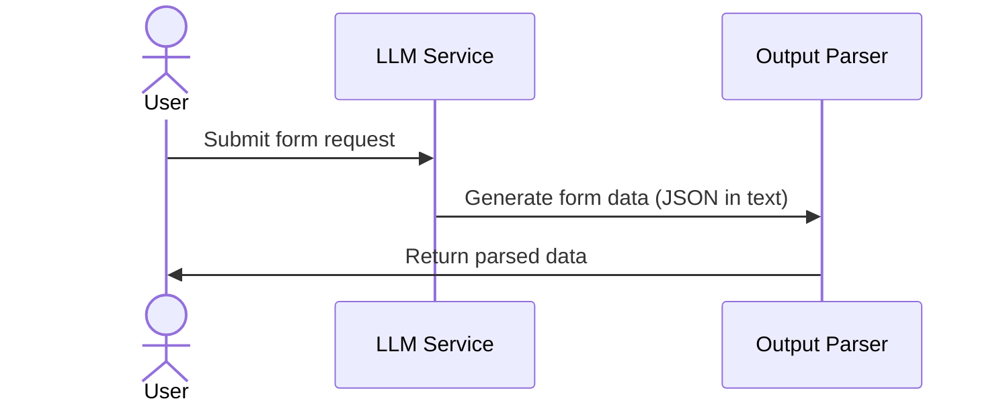

### Stage 2: Adding Parsing Logic

Now let's add the parsing logic:

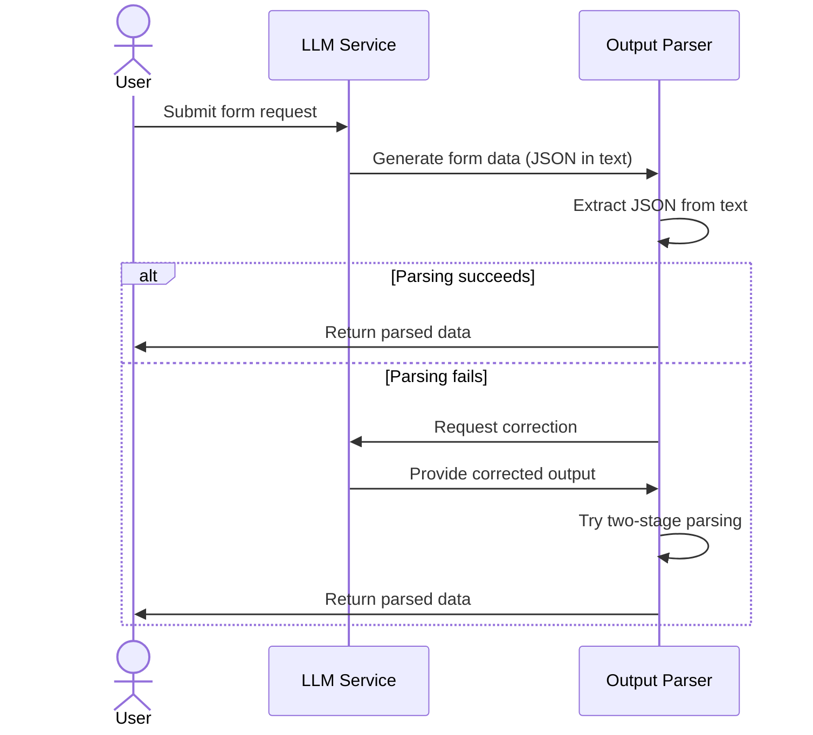

### Stage 3: Adding Validation

Let's add the validation step:

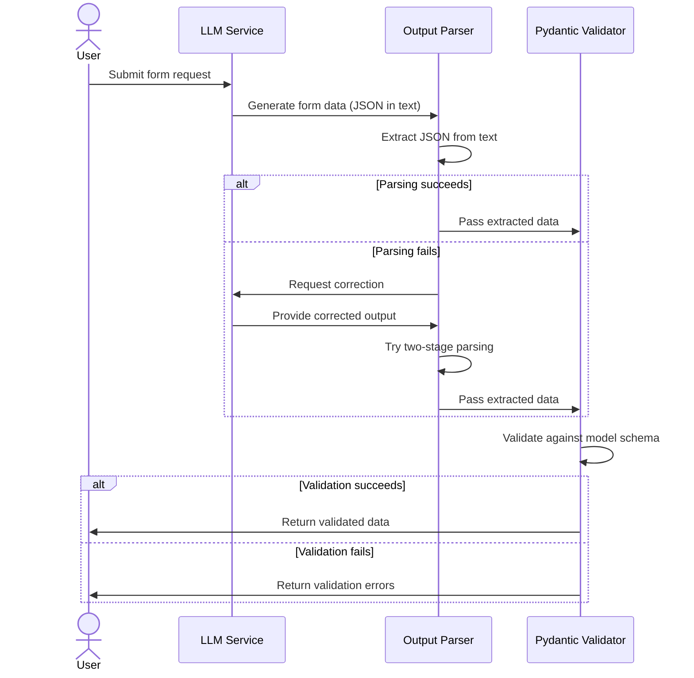

### Stage 4: Adding Quality Assessment

Now let's add the quality assessment step:

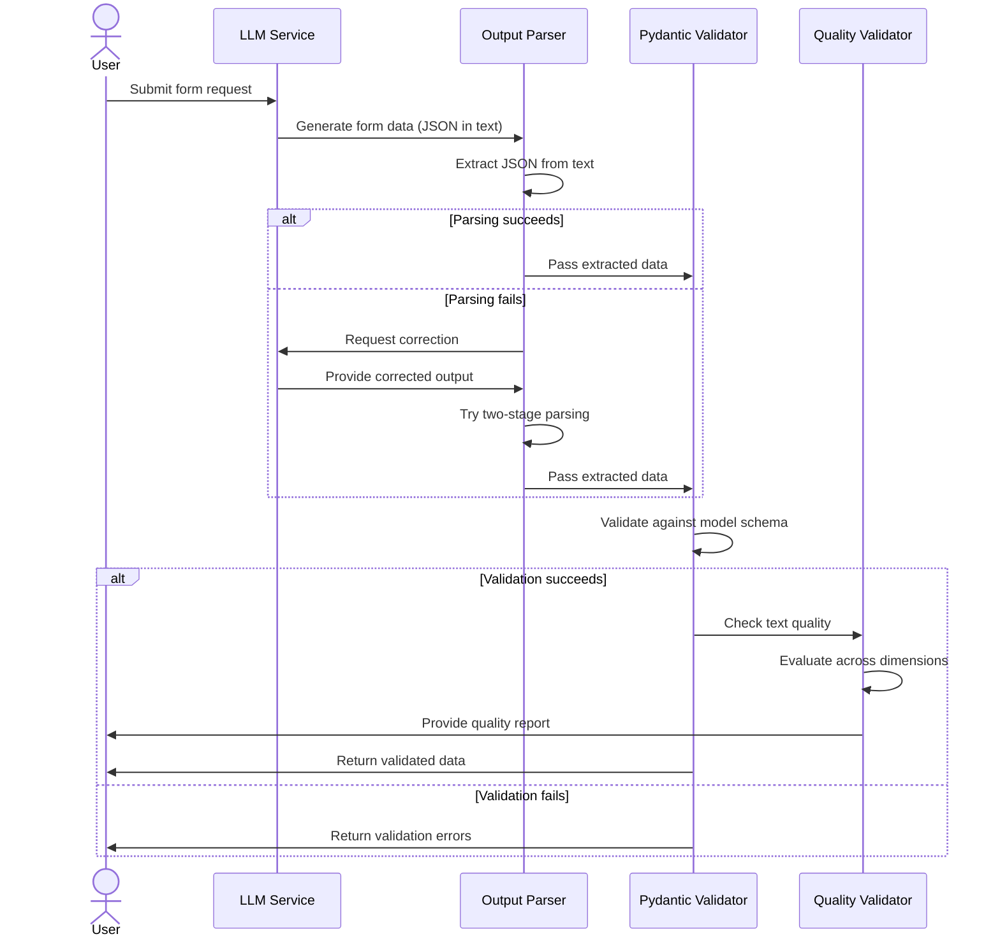

### Stage 5: Complete Sequence with Data Transformation

Finally, let's add the data transformation step to complete the sequence:

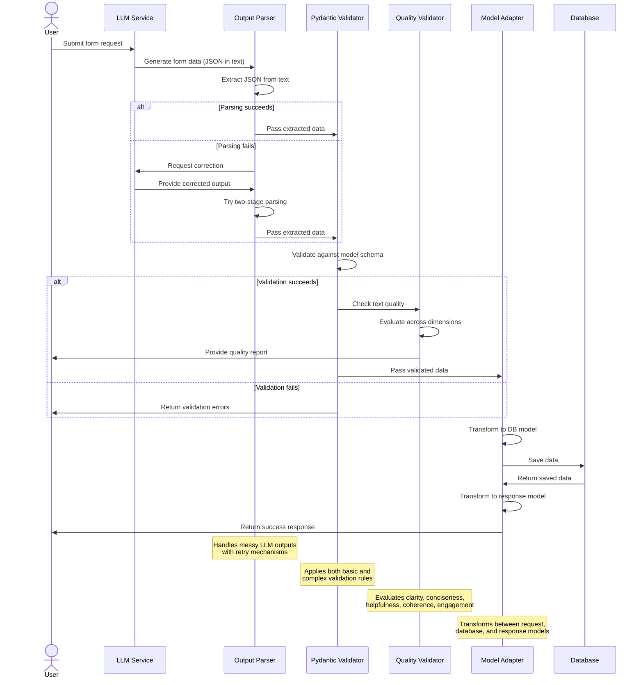

## 3. Class Diagram: Stage-by-Stage Breakdown

### Stage 1: Core Models

Let's start with the core models:

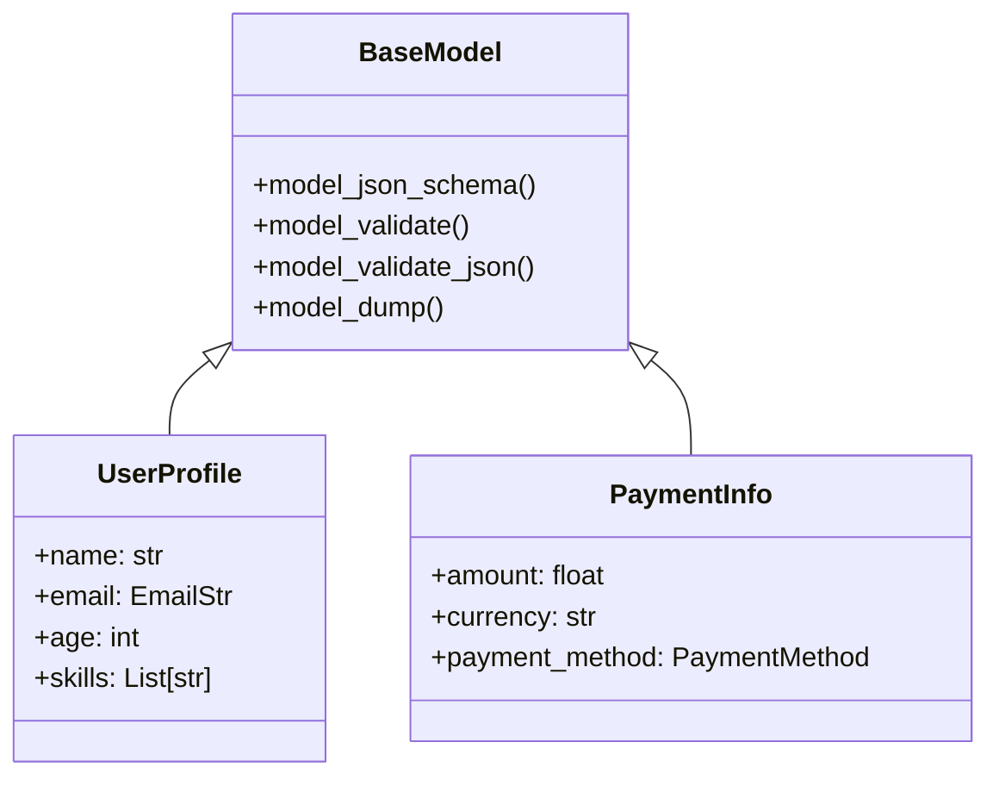

### Stage 2: Adding Validation Components

Now let's add the validation components:

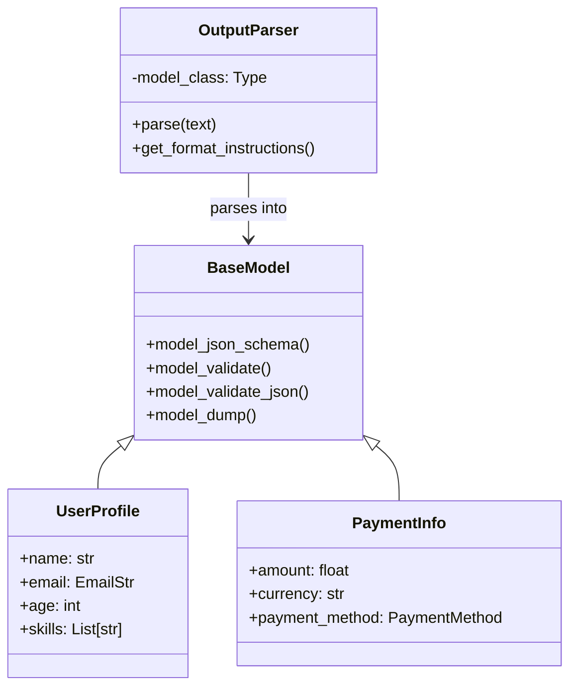

### Stage 3: Adding Quality Assessment

Let's add the quality assessment components:

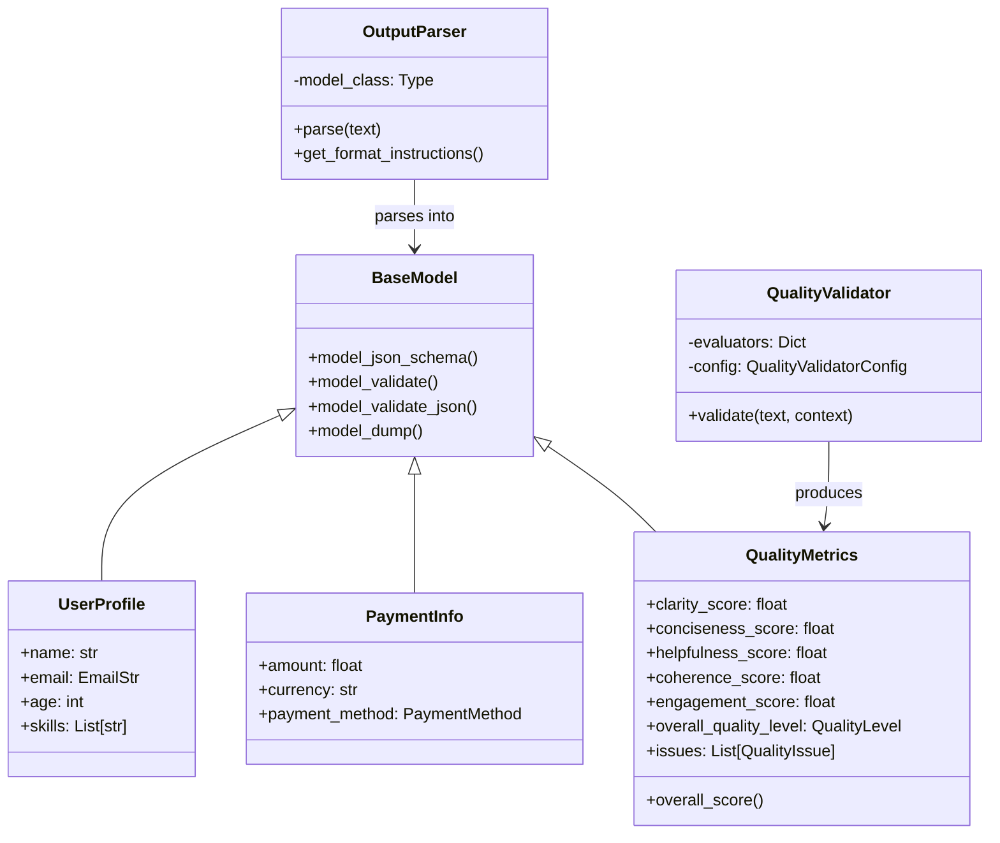

### Stage 4: Complete Class Diagram

Finally, let's add the remaining components to complete the class diagram:

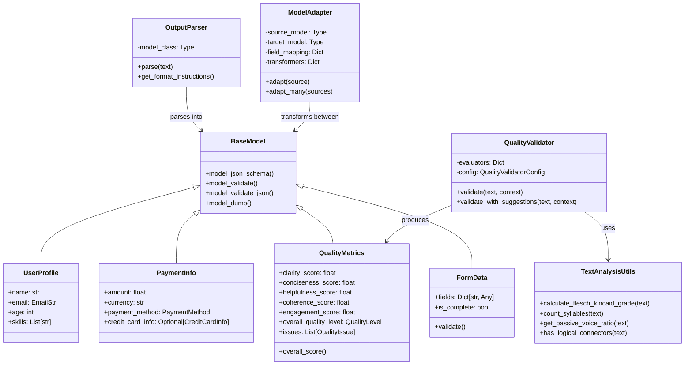
