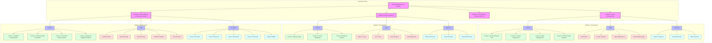

# Module Structure Overview

This diagram shows the high-level structure of the Agentic AI course modules and their relationships.

```mermaid
graph TD
    subgraph "Course Structure"
        Course[Accelerated Agentic AI Mastery]
        M1[Module 1: Agent Fundamentals]
        M2[Module 2: Memory Systems]
        M2L[Module 2-LLM: Memory Systems with LLM]
        M3[Module 3: Data Validation & Structured Outputs]
    end

    Course --> M1
    Course --> M2
    Course --> M2L
    Course --> M3

    subgraph "Module 1 Components"
        M1 --> M1L[Lessons]
        M1 --> M1C[Code]
        M1 --> M1E[Exercises]
        
        M1L --> M1L1[Lesson 1: Sense-Think-Act Loop]
        M1L --> M1L2[Lesson 2: Prompt Engineering]
        M1L --> M1L3[Lesson 3: State Management]
        M1L --> M1L4[Lesson 4: Personal Task Manager]
        
        M1C --> M1C1[Simple Agent]
        M1C --> M1C2[Prompt Template]
        M1C --> M1C3[State Management]
        M1C --> M1C4[Task Manager Agent]
        
        M1E --> M1E1[Exercise Solutions]
        M1E --> M1E2[Prompt Exercises]
        M1E --> M1E3[State Exercises]
    end
    
    subgraph "Module 2 Components"
        M2 --> M2L1[Lessons]
        M2 --> M2C[Code]
        M2 --> M2E[Exercises]
        
        M2L1 --> M2L1_1[Lesson 1: Memory Types]
        M2L1 --> M2L1_2[Lesson 2: Vector Databases]
        M2L1 --> M2L1_3[Lesson 3: Retrieval Patterns]
        
        M2C --> M2C1[Memory Types]
        M2C --> M2C2[Vector Store]
        M2C --> M2C3[Retrieval Agent]
        M2C --> M2C4[Knowledge Base]
        
        M2E --> M2E1[Memory Exercises]
        M2E --> M2E2[Vector Exercises]
        M2E --> M2E3[Retrieval Exercises]
    end
    
    subgraph "Module 3 Components"
        M3 --> M3L[Lessons]
        M3 --> M3C[Code]
        M3 --> M3E[Exercises]
        
        M3L --> M3L1[Lesson 1: Pydantic Fundamentals]
        M3L --> M3L2[Lesson 2: Schema Design & Evolution]
        M3L --> M3L3[Lesson 3: Structured Output Parsing]
        M3L --> M3L4[Lesson 4: Advanced Validation Patterns]
        
        M3C --> M3C1[Pydantic Basics]
        M3C --> M3C2[Schema Design]
        M3C --> M3C3[Output Parsing]
        M3C --> M3C4[Validation Patterns]
        M3C --> M3C5[Form Assistant]
        
        M3E --> M3E1[Lesson 1 Exercises]
        M3E --> M3E2[Lesson 2 Exercises]
        M3E --> M3E3[Lesson 3 Exercises]
        M3E --> M3E4[Lesson 4 Exercises]
        M3E --> M3E5[Quality Validator]
    end

    classDef module fill:#f9f,stroke:#333,stroke-width:2px;
    classDef component fill:#bbf,stroke:#333,stroke-width:1px;
    classDef lesson fill:#dfd,stroke:#333,stroke-width:1px;
    classDef code fill:#fdd,stroke:#333,stroke-width:1px;
    classDef exercise fill:#dff,stroke:#333,stroke-width:1px;
    
    class Course,M1,M2,M2L,M3 module;
    class M1L,M1C,M1E,M2L1,M2C,M2E,M3L,M3C,M3E component;
    class M1L1,M1L2,M1L3,M1L4,M2L1_1,M2L1_2,M2L1_3,M3L1,M3L2,M3L3,M3L4 lesson;
    class M1C1,M1C2,M1C3,M1C4,M2C1,M2C2,M2C3,M2C4,M3C1,M3C2,M3C3,M3C4,M3C5 code;
    class M1E1,M1E2,M1E3,M2E1,M2E2,M2E3,M3E1,M3E2,M3E3,M3E4,M3E5 exercise;
```
