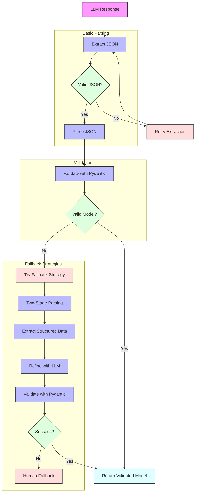
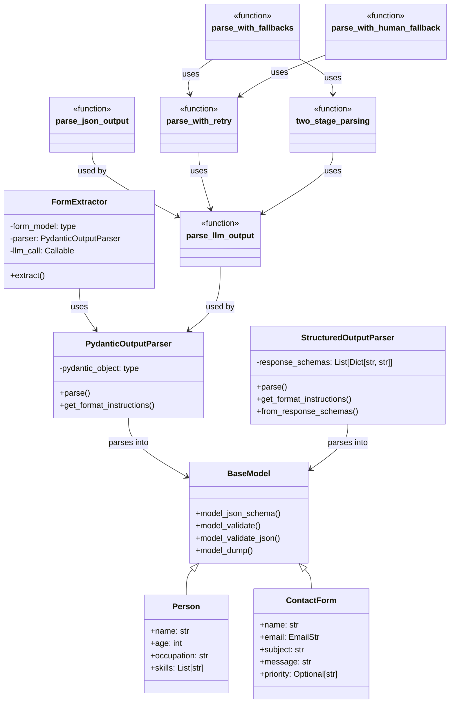

# Output Parsing Flow

This diagram illustrates the flow of parsing and validating LLM outputs in Module 3.

```mermaid
flowchart TD
    LLM[LLM Response] --> Extract[Extract JSON]
    Extract --> Valid{Valid JSON?}
    
    Valid -->|Yes| ParseJSON[Parse JSON]
    Valid -->|No| Retry[Retry Extraction]
    
    Retry --> Extract
    
    ParseJSON --> ValidateModel[Validate with Pydantic]
    ValidateModel --> ModelValid{Valid Model?}
    
    ModelValid -->|Yes| Success[Return Validated Model]
    ModelValid -->|No| FallbackStrategy[Try Fallback Strategy]
    
    FallbackStrategy --> TwoStage[Two-Stage Parsing]
    TwoStage --> Extract2[Extract Structured Data]
    Extract2 --> Refine[Refine with LLM]
    Refine --> ValidateModel2[Validate with Pydantic]
    ValidateModel2 --> Success2{Success?}
    
    Success2 -->|Yes| Success
    Success2 -->|No| HumanFallback[Human Fallback]
    
    subgraph "Basic Parsing"
        Extract
        Valid
        ParseJSON
    end
    
    subgraph "Validation"
        ValidateModel
        ModelValid
    end
    
    subgraph "Fallback Strategies"
        FallbackStrategy
        TwoStage
        Extract2
        Refine
        ValidateModel2
        Success2
        HumanFallback
    end
    
    classDef llm fill:#f9f,stroke:#333,stroke-width:2px;
    classDef process fill:#bbf,stroke:#333,stroke-width:1px;
    classDef decision fill:#dfd,stroke:#333,stroke-width:1px;
    classDef success fill:#dff,stroke:#333,stroke-width:1px;
    classDef fallback fill:#fdd,stroke:#333,stroke-width:1px;
    
    class LLM llm;
    class Extract,ParseJSON,ValidateModel,TwoStage,Extract2,Refine,ValidateModel2 process;
    class Valid,ModelValid,Success2 decision;
    class Success success;
    class Retry,FallbackStrategy,HumanFallback fallback;
```

## Parser Classes and Relationships

```mermaid
classDiagram
    class BaseModel {
        +model_json_schema()
        +model_validate()
        +model_validate_json()
        +model_dump()
    }
    
    class Person {
        +name: str
        +age: int
        +occupation: str
        +skills: List[str]
    }
    
    class ContactForm {
        +name: str
        +email: EmailStr
        +subject: str
        +message: str
        +priority: Optional[str]
    }
    
    class PydanticOutputParser {
        -pydantic_object: type
        +parse()
        +get_format_instructions()
    }
    
    class StructuredOutputParser {
        -response_schemas: List[Dict[str, str]]
        +parse()
        +get_format_instructions()
        +from_response_schemas()
    }
    
    class FormExtractor {
        -form_model: type
        -parser: PydanticOutputParser
        -llm_call: Callable
        +extract()
    }
    
    BaseModel <|-- Person
    BaseModel <|-- ContactForm
    
    PydanticOutputParser --> BaseModel : parses into
    StructuredOutputParser --> BaseModel : parses into
    FormExtractor --> PydanticOutputParser : uses
    
    class parse_json_output {
        <<function>>
    }
    
    class parse_llm_output {
        <<function>>
    }
    
    class parse_with_retry {
        <<function>>
    }
    
    class two_stage_parsing {
        <<function>>
    }
    
    class parse_with_fallbacks {
        <<function>>
    }
    
    class parse_with_human_fallback {
        <<function>>
    }
    
    parse_json_output --> parse_llm_output : used by
    parse_llm_output --> PydanticOutputParser : used by
    parse_with_retry --> parse_llm_output : uses
    two_stage_parsing --> parse_llm_output : uses
    parse_with_fallbacks --> parse_with_retry : uses
    parse_with_fallbacks --> two_stage_parsing : uses
    parse_with_human_fallback --> parse_with_retry : uses
```
