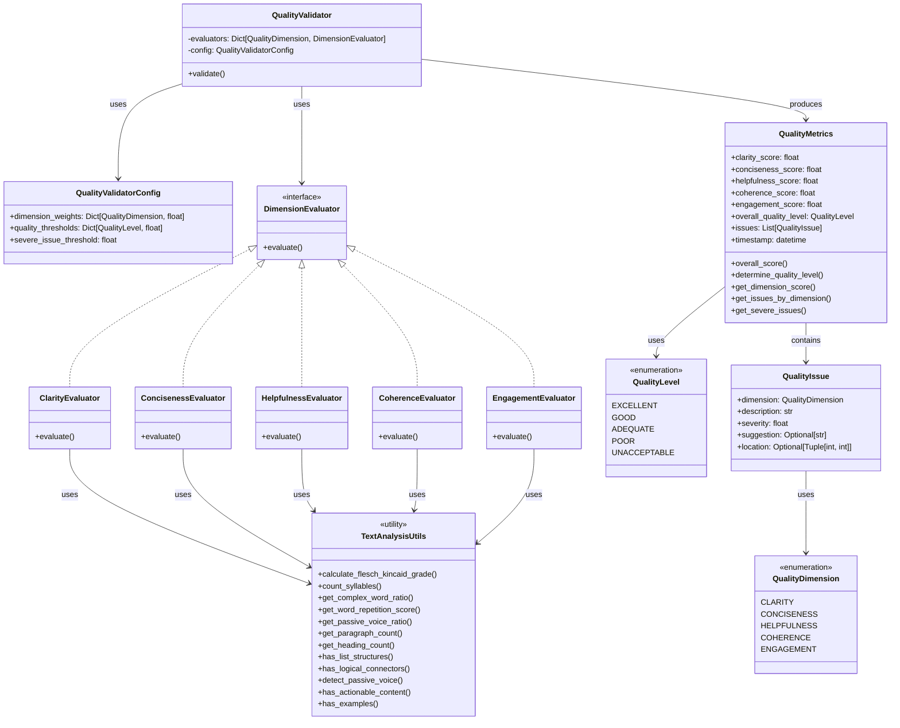

# Quality Validator Components

This diagram shows the components and relationships in the QualityValidator system.

```mermaid
classDiagram
    class QualityDimension {
        <<enumeration>>
        CLARITY
        CONCISENESS
        HELPFULNESS
        COHERENCE
        ENGAGEMENT
    }
    
    class QualityLevel {
        <<enumeration>>
        EXCELLENT
        GOOD
        ADEQUATE
        POOR
        UNACCEPTABLE
    }
    
    class QualityIssue {
        +dimension: QualityDimension
        +description: str
        +severity: float
        +suggestion: Optional[str]
        +location: Optional[Tuple[int, int]]
    }
    
    class QualityMetrics {
        +clarity_score: float
        +conciseness_score: float
        +helpfulness_score: float
        +coherence_score: float
        +engagement_score: float
        +overall_quality_level: QualityLevel
        +issues: List[QualityIssue]
        +timestamp: datetime
        +overall_score()
        +determine_quality_level()
        +get_dimension_score()
        +get_issues_by_dimension()
        +get_severe_issues()
    }
    
    class QualityValidatorConfig {
        +dimension_weights: Dict[QualityDimension, float]
        +quality_thresholds: Dict[QualityLevel, float]
        +severe_issue_threshold: float
    }
    
    class QualityValidator {
        -evaluators: Dict[QualityDimension, DimensionEvaluator]
        -config: QualityValidatorConfig
        +validate()
    }
    
    class DimensionEvaluator {
        <<interface>>
        +evaluate()
    }
    
    class ClarityEvaluator {
        +evaluate()
    }
    
    class ConcisenessEvaluator {
        +evaluate()
    }
    
    class HelpfulnessEvaluator {
        +evaluate()
    }
    
    class CoherenceEvaluator {
        +evaluate()
    }
    
    class EngagementEvaluator {
        +evaluate()
    }
    
    class TextAnalysisUtils {
        <<utility>>
        +calculate_flesch_kincaid_grade()
        +count_syllables()
        +get_complex_word_ratio()
        +get_word_repetition_score()
        +get_passive_voice_ratio()
        +get_paragraph_count()
        +get_heading_count()
        +has_list_structures()
        +has_logical_connectors()
        +detect_passive_voice()
        +has_actionable_content()
        +has_examples()
    }
    
    QualityValidator --> QualityValidatorConfig : uses
    QualityValidator --> DimensionEvaluator : uses
    QualityValidator --> QualityMetrics : produces
    
    QualityMetrics --> QualityLevel : uses
    QualityMetrics --> QualityIssue : contains
    QualityIssue --> QualityDimension : uses
    
    DimensionEvaluator <|.. ClarityEvaluator
    DimensionEvaluator <|.. ConcisenessEvaluator
    DimensionEvaluator <|.. HelpfulnessEvaluator
    DimensionEvaluator <|.. CoherenceEvaluator
    DimensionEvaluator <|.. EngagementEvaluator
    
    ClarityEvaluator --> TextAnalysisUtils : uses
    ConcisenessEvaluator --> TextAnalysisUtils : uses
    HelpfulnessEvaluator --> TextAnalysisUtils : uses
    CoherenceEvaluator --> TextAnalysisUtils : uses
    EngagementEvaluator --> TextAnalysisUtils : uses
```
