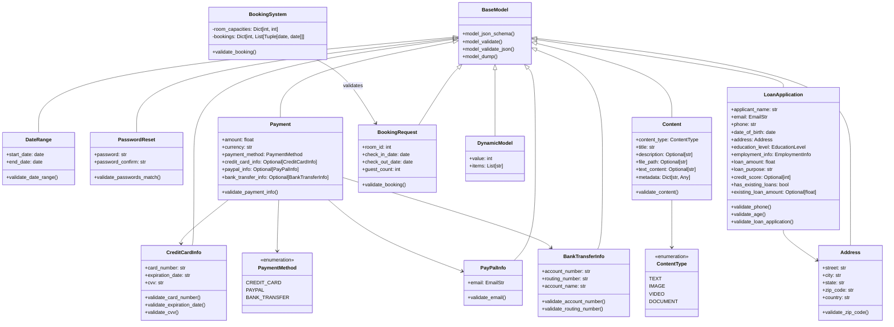

# Validation Patterns

This diagram illustrates the different validation patterns implemented in Module 3.

```mermaid
classDiagram
    class BaseModel {
        +model_json_schema()
        +model_validate()
        +model_validate_json()
        +model_dump()
    }
    
    %% Cross-Field Validation
    class DateRange {
        +start_date: date
        +end_date: date
        +validate_date_range()
    }
    
    class PasswordReset {
        +password: str
        +password_confirm: str
        +validate_passwords_match()
    }
    
    %% Conditional Validation
    class PaymentMethod {
        <<enumeration>>
        CREDIT_CARD
        PAYPAL
        BANK_TRANSFER
    }
    
    class CreditCardInfo {
        +card_number: str
        +expiration_date: str
        +cvv: str
        +validate_card_number()
        +validate_expiration_date()
        +validate_cvv()
    }
    
    class PayPalInfo {
        +email: EmailStr
        +validate_email()
    }
    
    class BankTransferInfo {
        +account_number: str
        +routing_number: str
        +account_name: str
        +validate_account_number()
        +validate_routing_number()
    }
    
    class Payment {
        +amount: float
        +currency: str
        +payment_method: PaymentMethod
        +credit_card_info: Optional[CreditCardInfo]
        +paypal_info: Optional[PayPalInfo]
        +bank_transfer_info: Optional[BankTransferInfo]
        +validate_payment_info()
    }
    
    %% Content-Based Validation
    class ContentType {
        <<enumeration>>
        TEXT
        IMAGE
        VIDEO
        DOCUMENT
    }
    
    class Content {
        +content_type: ContentType
        +title: str
        +description: Optional[str]
        +file_path: Optional[str]
        +text_content: Optional[str]
        +metadata: Dict[str, Any]
        +validate_content()
    }
    
    %% Context-Dependent Validation
    class BookingRequest {
        +room_id: int
        +check_in_date: date
        +check_out_date: date
        +guest_count: int
        +validate_booking()
    }
    
    class BookingSystem {
        -room_capacities: Dict[int, int]
        -bookings: Dict[int, List[Tuple[date, date]]]
        +validate_booking()
    }
    
    %% Dynamic Validation
    class DynamicModel {
        +value: int
        +items: List[str]
    }
    
    %% Advanced Form Validation
    class Address {
        +street: str
        +city: str
        +state: str
        +zip_code: str
        +country: str
        +validate_zip_code()
    }
    
    class LoanApplication {
        +applicant_name: str
        +email: EmailStr
        +phone: str
        +date_of_birth: date
        +address: Address
        +education_level: EducationLevel
        +employment_info: EmploymentInfo
        +loan_amount: float
        +loan_purpose: str
        +credit_score: Optional[int]
        +has_existing_loans: bool
        +existing_loan_amount: Optional[float]
        +validate_phone()
        +validate_age()
        +validate_loan_application()
    }
    
    BaseModel <|-- DateRange
    BaseModel <|-- PasswordReset
    BaseModel <|-- CreditCardInfo
    BaseModel <|-- PayPalInfo
    BaseModel <|-- BankTransferInfo
    BaseModel <|-- Payment
    BaseModel <|-- Content
    BaseModel <|-- BookingRequest
    BaseModel <|-- DynamicModel
    BaseModel <|-- Address
    BaseModel <|-- LoanApplication
    
    Payment --> PaymentMethod
    Payment --> CreditCardInfo
    Payment --> PayPalInfo
    Payment --> BankTransferInfo
    
    Content --> ContentType
    
    BookingSystem --> BookingRequest : validates
    
    LoanApplication --> Address
```
