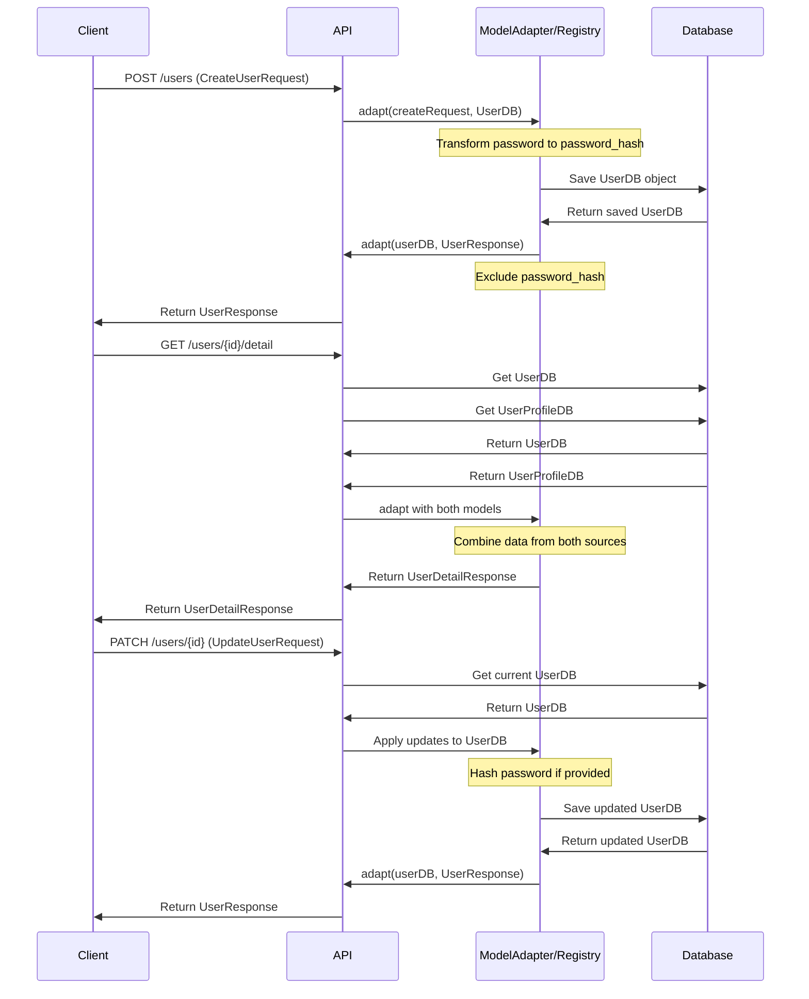
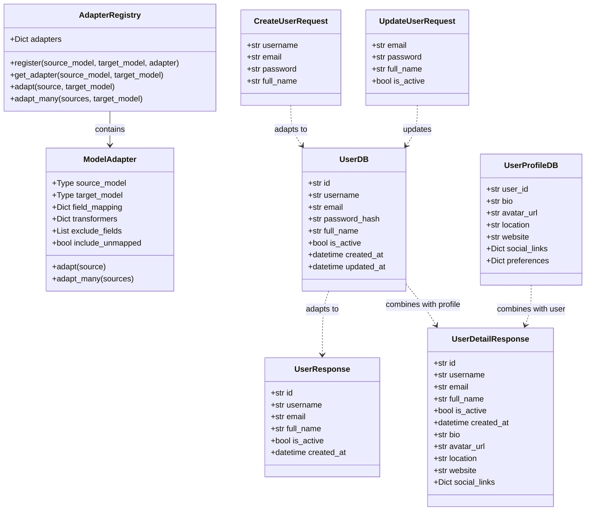
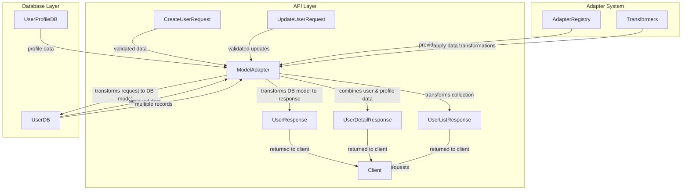

# Real-World API Flows with the Model Adapter Pattern

This lesson demonstrates how the Model Adapter pattern works in real-world API scenarios through sequence diagrams.

## Common API Flows

The following sequence diagram illustrates three common API flows using the Model Adapter pattern:
1. Creating a user
2. Getting detailed user information
3. Updating a user

## Understanding the Flows

### Create User Flow

1. The client sends a POST request to `/users` with a `CreateUserRequest` object
2. The API passes this request to the adapter to transform it into a `UserDB` object
3. During this transformation, the adapter hashes the password for security
4. The `UserDB` object is saved to the database
5. The saved object is returned to the adapter
6. The adapter transforms the `UserDB` into a `UserResponse` object, excluding sensitive data like the password hash
7. The API returns the `UserResponse` to the client

### Get User Detail Flow

1. The client requests detailed user information via GET `/users/{id}/detail`
2. The API retrieves both the `UserDB` and `UserProfileDB` objects from the database
3. The adapter combines data from both sources into a single `UserDetailResponse`
4. The API returns the combined response to the client

### Update User Flow

1. The client sends a PATCH request to `/users/{id}` with an `UpdateUserRequest`
2. The API retrieves the current `UserDB` from the database
3. The adapter applies the updates to the `UserDB`, including hashing a new password if provided
4. The updated `UserDB` is saved to the database
5. The adapter transforms the updated `UserDB` into a `UserResponse`
6. The API returns the `UserResponse` to the client

## Benefits of This Approach

Using the Model Adapter pattern in these API flows provides several advantages:

1. **Clear separation of concerns** - Each model has a specific purpose (request, database, response)
2. **Security by design** - Sensitive data like password hashes are automatically excluded from responses
3. **Flexible data transformation** - Complex transformations like password hashing are encapsulated in adapters
4. **Composable responses** - Easy to combine data from multiple sources into unified responses
5. **Consistent API behavior** - The same transformation rules apply across all endpoints

## Implementation Considerations

When implementing these flows:

1. Register all necessary adapters in your adapter registry at application startup
2. Use dependency injection to provide the adapter registry to your API endpoints
3. Consider creating specialized adapter functions for complex scenarios like the user detail endpoint
4. Ensure proper error handling at each step of the process
5. Add logging to track the transformation process for debugging

## Class Diagram: Model Adapter System

The following class diagram illustrates the structure of the Model Adapter pattern and the relationships between different components:

## Data Flow Diagram

The following flowchart illustrates how data flows through the different layers of the application when using the Model Adapter pattern:

