# Module 4: Progressive Journey Diagrams

This document presents a progressive journey through the key components of Module 4, showing how document processing and RAG systems are built step by step.

## 1. Document Processing Pipeline

### Stage 1: Basic Document Loading
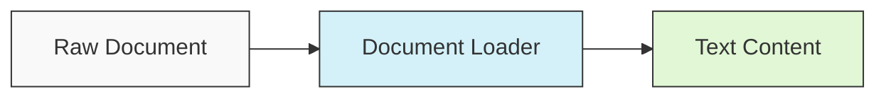

### Stage 2: Multi-Format Document Processing
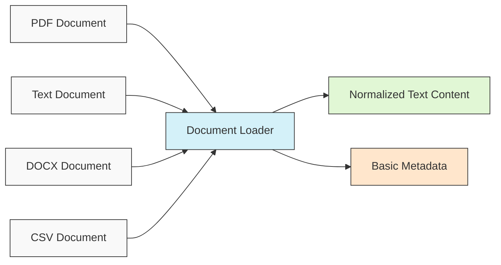

### Stage 3: Document Processing with Error Handling
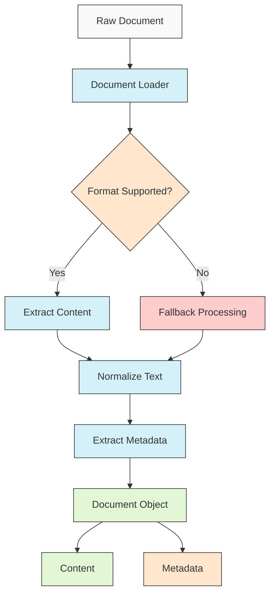

### Stage 4: Complete Document Processing Pipeline
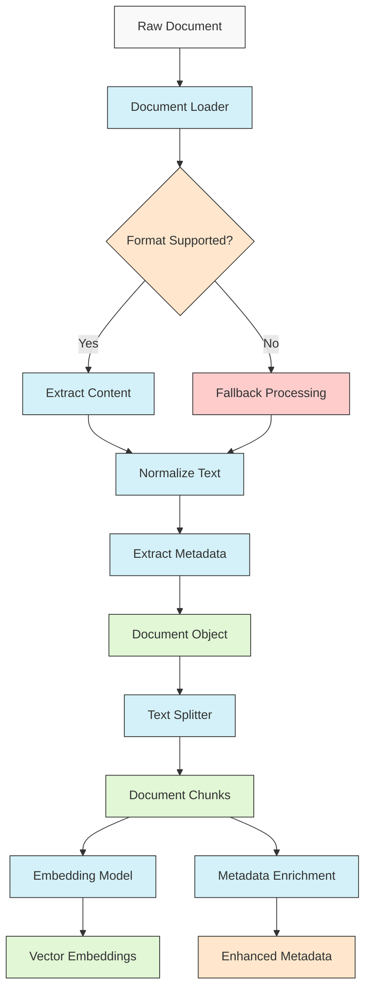

## 2. Chunking Strategies

### Stage 1: Simple Size-Based Chunking
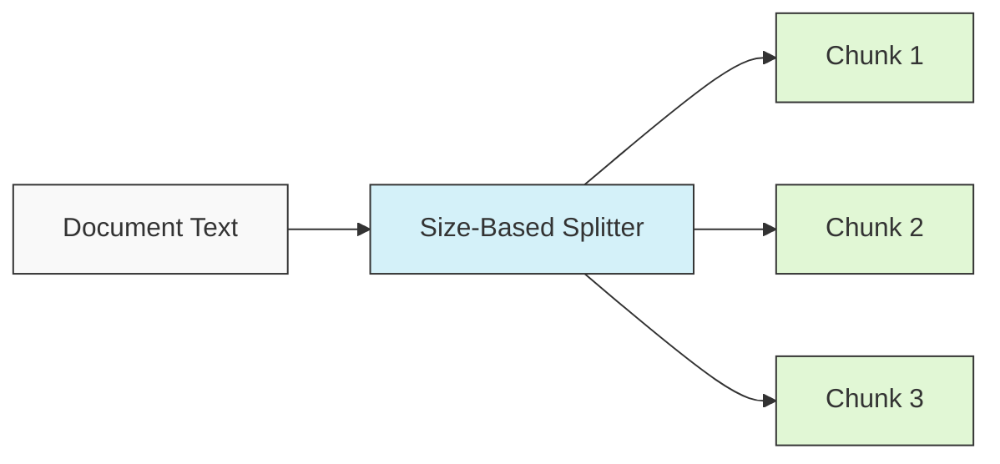

### Stage 2: Overlap-Based Chunking
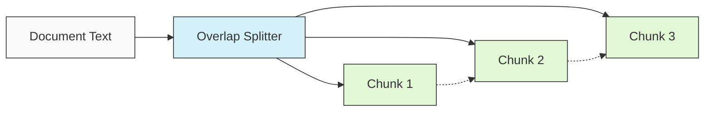

### Stage 3: Semantic Chunking
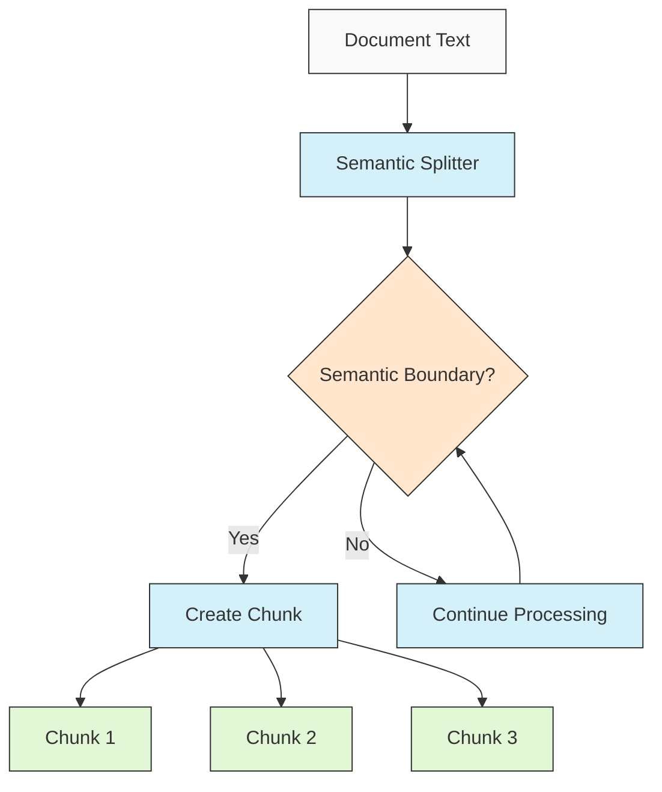

### Stage 4: Recursive Chunking
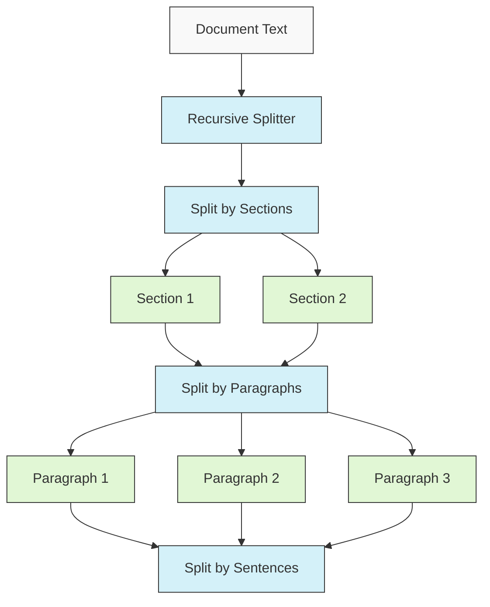

### Stage 5: Token-Aware Chunking
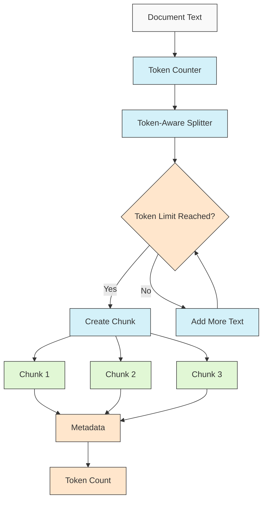

## 3. Embedding Generation

### Stage 1: Basic Embedding Pipeline

### Stage 2: Embedding Pipeline with Preprocessing
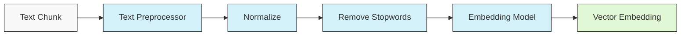

### Stage 3: Advanced Embedding Pipeline
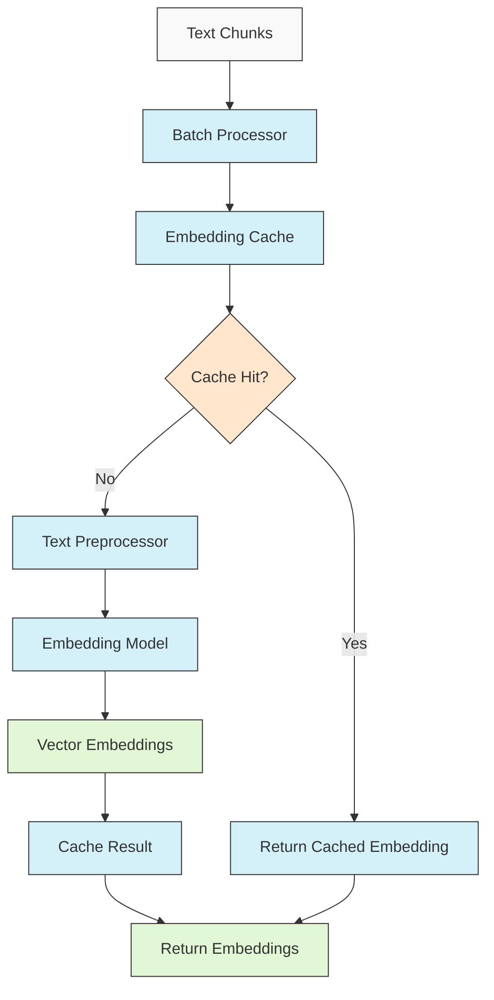

## 4. RAG System Architecture

### Stage 1: Basic RAG System
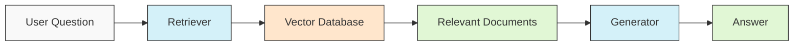

### Stage 2: RAG with Query Processing
```mermaid
flowchart LR
    A[User Question] --> B[Query Analyzer]
    B --> C[Query Expansion]
    C --> D[Retriever]
    D --> E[Vector Database]
    E --> F[Relevant Documents]
    F --> G[Generator]
    G --> H[Answer]
    style A fill:#f9f9f9,stroke:#333,stroke-width:1px
    style B fill:#d4f1f9,stroke:#333,stroke-width:1px
    style C fill:#d4f1f9,stroke:#333,stroke-width:1px
    style D fill:#d4f1f9,stroke:#333,stroke-width:1px
    style E fill:#ffe6cc,stroke:#333,stroke-width:1px
    style F fill:#e1f7d5,stroke:#333,stroke-width:1px
    style G fill:#d4f1f9,stroke:#333,stroke-width:1px
    style H fill:#e1f7d5,stroke:#333,stroke-width:1px
```

### Stage 3: Hybrid RAG System
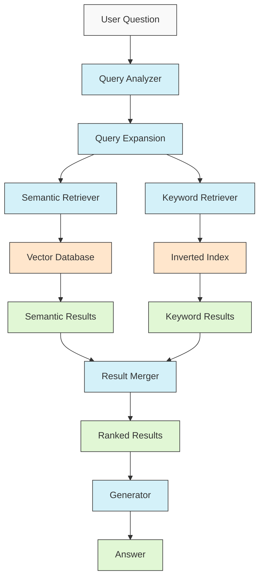

### Stage 4: RAG with Confidence Assessment
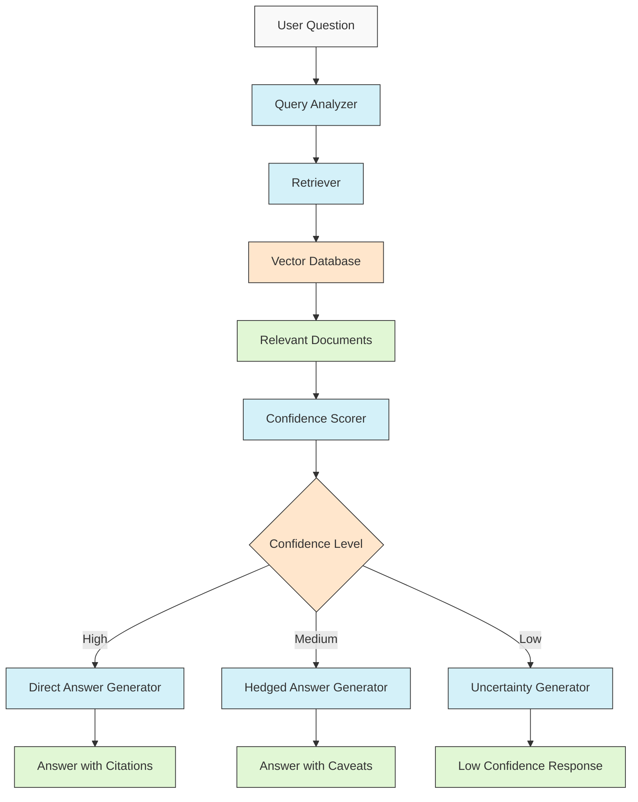

### Stage 5: Complete Document Q&A System
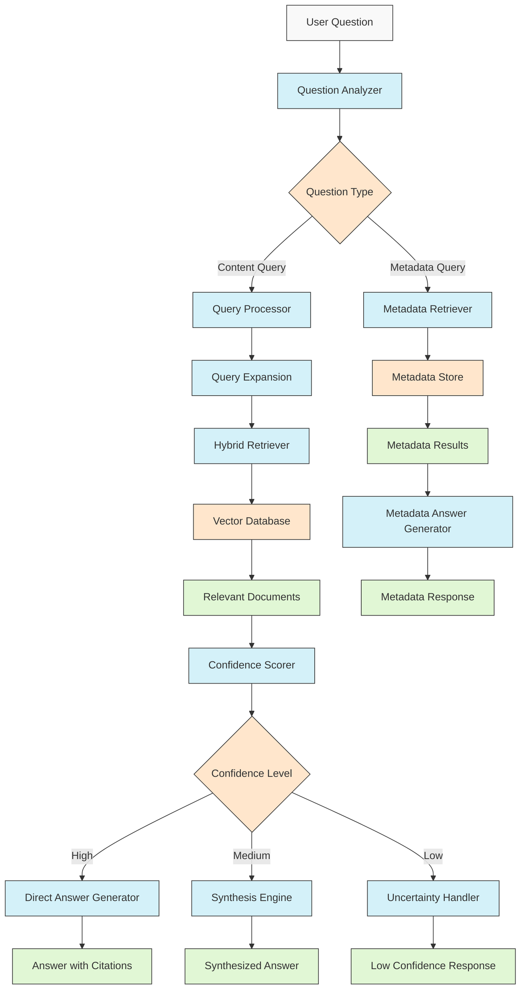

## 5. Streamlit App Architecture

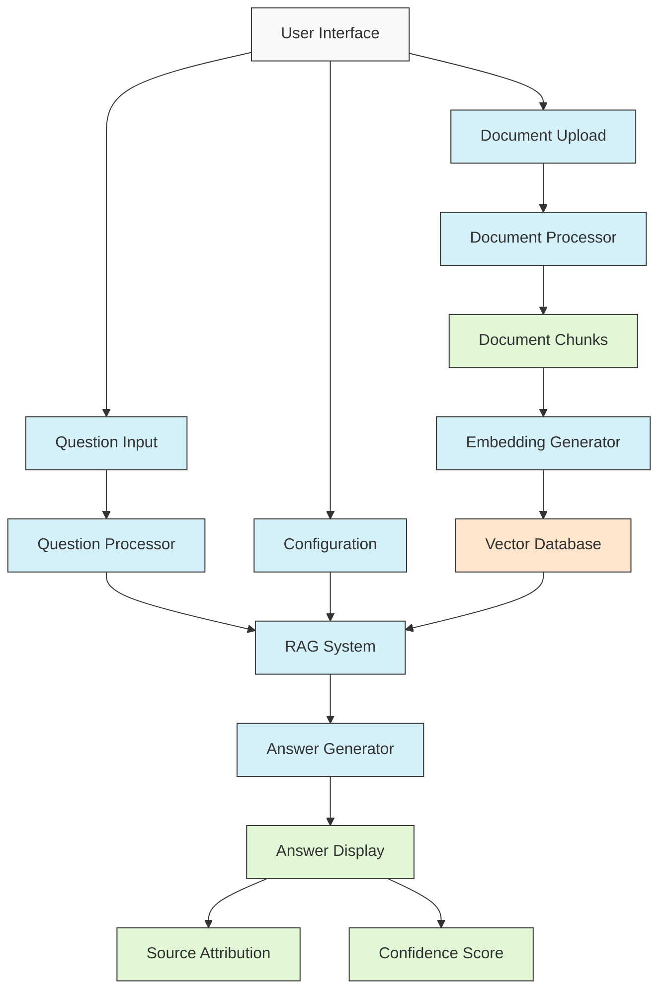
