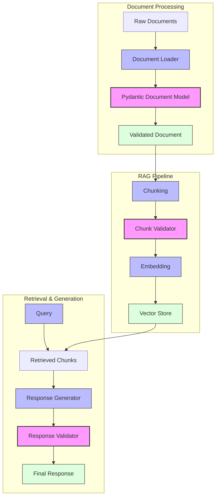

# 📄 Module 4: Document Processing & RAG Foundations - Lesson 1.1: Structured Data Management in RAG Systems 🏗️

## 🔄 RAG-Pydantic Integration Flow

## 🎯 Lesson Objectives

By the end of this lesson, you will:
- 🔄 Understand how to integrate Pydantic with RAG systems
- 🏗️ Learn to build validated document processing pipelines
- ✅ Master data validation at each RAG stage
- 🛠️ Implement robust error handling and recovery

## 🌉 Why Combine Pydantic with RAG?

### 1. Document Structure Validation
- Enforce consistent document schemas across your knowledge base
- Validate metadata before storage
- Ensure required fields are present
- Type-check content attributes

### 2. Retrieval Result Validation
- Validate chunks before embedding
- Ensure retrieved content meets quality standards
- Standardize output formats
- Handle partial or corrupted retrievals

### 3. LLM Output Parsing
- Parse structured responses from LLMs
- Validate generated content against expected schemas
- Handle multi-format outputs
- Maintain consistency in response structures

## 🏗️ Common Use Cases

1. **Document Processing Pipeline**
   - Metadata validation
   - Content structure verification
   - Error handling and reporting
   - Quality checks

2. **Retrieval Enhancement**
   - Query validation
   - Result formatting
   - Context window optimization
   - Source attribution

3. **Response Generation**
   - Output template enforcement
   - Format validation
   - Citation structure
   - Confidence scoring

## 💡 Implementation Guidelines

### 1. Document Models
- Define base models for different document types
- Include metadata validation
- Implement content structure checks
- Add custom validators for domain-specific rules

### 2. Chunk Validation
- Validate chunk size and content
- Ensure semantic completeness
- Check for required context
- Implement overlap validation

### 3. Response Validation
- Enforce response structure
- Validate citations and sources
- Check content quality
- Implement format specifications

## 🔍 Best Practices

1. **Schema Design**
   - Keep models focused and single-purpose
   - Use inheritance for shared attributes
   - Implement clear validation rules
   - Document all model fields

2. **Error Handling**
   - Graceful degradation
   - Clear error messages
   - Recovery strategies
   - Logging and monitoring

3. **Performance Optimization**
   - Lazy validation where appropriate
   - Caching validated results
   - Batch processing
   - Async validation

## 🎯 Key Takeaways

1. Pydantic provides robust validation for RAG pipelines
2. Structured data improves retrieval quality
3. Consistent schemas enhance maintainability
4. Error handling becomes more manageable
5. Output quality increases with validation

## 🔄 Hands-on Exercise

1. Create a basic document processing pipeline with Pydantic validation
2. Implement chunk validation for your RAG system
3. Add response validation to your LLM outputs
4. Test error handling and recovery
5. Optimize validation performance

## 📚 Additional Resources

1. Documentation
   - Pydantic documentation
   - RAG best practices
   - Validation patterns
   - Schema examples

2. Code Examples
   - Basic implementation templates
   - Advanced validation scenarios
   - Error handling patterns
   - Performance optimization examples

## 🎓 Knowledge Check

1. What are the key benefits of using Pydantic in a RAG system?
2. How does chunk validation improve retrieval quality?
3. Why is response validation important for LLM outputs?
4. What are common error handling strategies?
5. How can you optimize validation performance?

## 🔄 Next Steps

1. Review your existing RAG pipeline
2. Identify validation points
3. Design appropriate schemas
4. Implement gradual validation
5. Monitor and adjust

> 💡 **Pro Tip**: Start with basic validation and gradually add more sophisticated rules as you understand your data better.

---

Next Lesson: Document Chunking Strategies ➡️