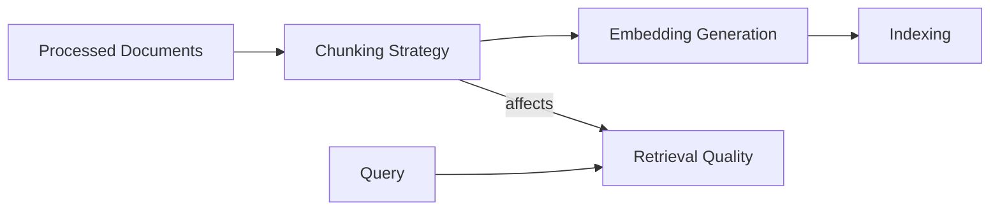
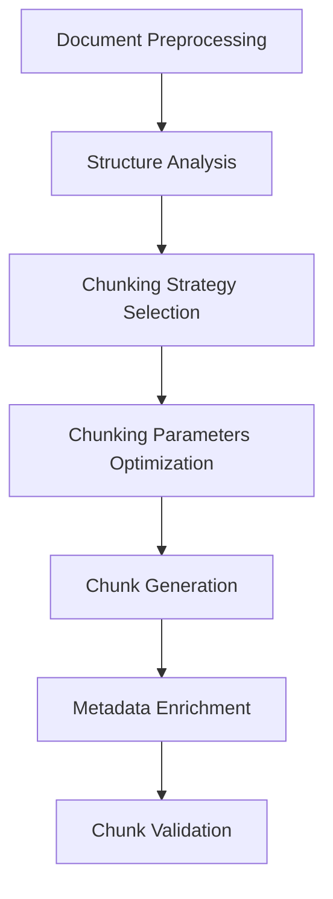

# 📄 Module 4: Document Processing & RAG Foundations - Lesson 2: Chunking Strategies for Optimal Retrieval ✂️

## 🎯 Lesson Objectives

By the end of this lesson, you will:
- 🧩 Understand why chunking is critical for effective retrieval
- ✂️ Master different chunking strategies and their trade-offs
- 📏 Learn how to determine optimal chunk sizes for different use cases
- 🔄 Implement overlap techniques to maintain context
- 🧠 Develop semantic-aware chunking for improved relevance
- 🔍 Create a chunking pipeline that preserves document structure

---

## 🧩 Why Chunking Matters in RAG Systems


### The Chunking Challenge

After processing documents, the next critical step in a RAG system is to divide them into smaller, retrievable pieces called "chunks." This process might seem straightforward, but it's actually one of the most important factors determining the quality of your retrieval results.

> 💡 **Key Insight**: The way you chunk your documents directly impacts what information can be retrieved and how relevant it will be to user queries. Poor chunking can break semantic connections and lead to incomplete or irrelevant retrievals.

### Why We Need Chunking

1. **Context Window Limitations**: LLMs have a maximum context window size (e.g., 8K, 16K, or 32K tokens). Documents often exceed this limit.

2. **Retrieval Granularity**: Retrieving entire documents is inefficient when only specific sections are relevant to a query.

3. **Relevance Precision**: Smaller chunks allow for more precise matching between queries and relevant content.

4. **Computational Efficiency**: Processing smaller chunks is more efficient for embedding generation and similarity search.

### The Impact of Chunking on RAG Performance



Poor chunking can lead to several problems:

1. **Lost Context**: Important context might be split across chunks
2. **Semantic Disruption**: Breaking text at the wrong points can disrupt meaning
3. **Retrieval Failures**: Relevant information might not be retrieved if it's split across chunks
4. **Redundancy**: Overlapping chunks can lead to duplicate information in results
5. **Inconsistency**: Inconsistent chunk sizes can bias retrieval toward certain document sections

---

## ✂️ Chunking Strategies Overview

Let's explore the main chunking strategies and their appropriate use cases:

### 1. Size-Based Chunking

The simplest approach is to split documents based on a fixed size (characters, words, or tokens).

```python
def size_based_chunking(text, chunk_size=1000, overlap=0):
    """Split text into chunks of approximately equal size."""
    chunks = []
    for i in range(0, len(text), chunk_size - overlap):
        chunk = text[i:i + chunk_size]
        chunks.append(chunk)
    return chunks
```

**Advantages**:
- Simple to implement
- Predictable chunk sizes
- Works with any text

**Disadvantages**:
- Ignores semantic boundaries
- May split sentences or paragraphs
- Can break logical connections

**Best for**:
- Homogeneous documents with consistent structure
- When processing speed is a priority
- Simple use cases with less complex documents

### 2. Delimiter-Based Chunking

This strategy splits text based on specific delimiters like paragraphs, sections, or custom markers.

```python
def delimiter_based_chunking(text, delimiter="\n\n", max_chunk_size=1000):
    """Split text based on delimiters while respecting maximum chunk size."""
    sections = text.split(delimiter)
    chunks = []
    current_chunk = []
    current_size = 0

    for section in sections:
        section_size = len(section)
        if current_size + section_size > max_chunk_size and current_chunk:
            chunks.append(delimiter.join(current_chunk))
            current_chunk = [section]
            current_size = section_size
        else:
            current_chunk.append(section)
            current_size += section_size

    if current_chunk:
        chunks.append(delimiter.join(current_chunk))

    return chunks
```

**Advantages**:
- Respects natural document boundaries
- Preserves paragraph or section integrity
- More semantically coherent chunks

**Disadvantages**:
- Can result in very uneven chunk sizes
- Depends on consistent document formatting
- May create chunks that exceed context window limits

**Best for**:
- Well-structured documents with clear section boundaries
- Content where paragraph integrity is important
- Documents with natural breaking points

### 3. Recursive Chunking

This advanced strategy tries multiple delimiters in sequence, starting with larger semantic units and progressively moving to smaller ones.

```python
def recursive_chunking(text, delimiters=["\n\n", "\n", ". ", " "], max_chunk_size=1000):
    """Split text recursively using a hierarchy of delimiters."""
    # Base case: text is small enough or we've run out of delimiters
    if len(text) <= max_chunk_size or not delimiters:
        return [text]

    # Try splitting with the current delimiter
    delimiter = delimiters[0]
    if delimiter in text:
        sections = text.split(delimiter)
        chunks = []
        current_chunk = []
        current_size = 0

        for section in sections:
            section_size = len(section)

            if current_size + section_size > max_chunk_size and current_chunk:
                # Current chunk is full, process it recursively with next delimiter
                combined_text = delimiter.join(current_chunk)
                if len(combined_text) > max_chunk_size and len(delimiters) > 1:
                    chunks.extend(recursive_chunking(combined_text, delimiters[1:], max_chunk_size))
                else:
                    chunks.append(combined_text)
                current_chunk = [section]
                current_size = section_size
            else:
                current_chunk.append(section)
                current_size += section_size

        # Process the final chunk
        if current_chunk:
            combined_text = delimiter.join(current_chunk)
            if len(combined_text) > max_chunk_size and len(delimiters) > 1:
                chunks.extend(recursive_chunking(combined_text, delimiters[1:], max_chunk_size))
            else:
                chunks.append(combined_text)

        return chunks

    # If current delimiter not found, try the next one
    return recursive_chunking(text, delimiters[1:], max_chunk_size)
```

**Advantages**:
- Highly adaptive to document structure
- Preserves semantic units when possible
- Handles varying document formats well

**Disadvantages**:
- More complex to implement
- Can be computationally expensive
- May still create uneven chunks

**Best for**:
- Mixed document types with varying structures
- Complex documents with nested sections
- When semantic coherence is a priority

### 4. Semantic Chunking

This strategy uses semantic understanding to identify logical boundaries for chunking.

```python
def semantic_chunking(text, max_chunk_size=1000):
    """Split text based on semantic units like paragraphs and sentences."""
    # Split into paragraphs
    paragraphs = text.split("\n\n")
    chunks = []
    current_chunk = []
    current_size = 0

    for paragraph in paragraphs:
        paragraph_size = len(paragraph)

        # If paragraph fits in current chunk, add it
        if current_size + paragraph_size <= max_chunk_size:
            current_chunk.append(paragraph)
            current_size += paragraph_size
        else:
            # If paragraph is too large, split into sentences
            if paragraph_size > max_chunk_size:
                sentences = paragraph.split(". ")
                for sentence in sentences:
                    sentence_size = len(sentence)

                    if current_size + sentence_size <= max_chunk_size:
                        current_chunk.append(sentence)
                        current_size += sentence_size
                    else:
                        # Finalize current chunk
                        if current_chunk:
                            chunks.append("\n\n".join(current_chunk))

                        # Start new chunk with this sentence
                        if sentence_size > max_chunk_size:
                            # If sentence is still too large, split arbitrarily
                            for i in range(0, sentence_size, max_chunk_size):
                                chunks.append(sentence[i:i + max_chunk_size])
                        else:
                            current_chunk = [sentence]
                            current_size = sentence_size
            else:
                # Finalize current chunk
                if current_chunk:
                    chunks.append("\n\n".join(current_chunk))

                # Start new chunk with this paragraph
                current_chunk = [paragraph]
                current_size = paragraph_size

    # Add the final chunk
    if current_chunk:
        chunks.append("\n\n".join(current_chunk))

    return chunks
```

**Advantages**:
- Preserves semantic meaning
- Respects natural language boundaries
- Improves retrieval relevance

**Disadvantages**:
- Requires more sophisticated processing
- Can be slower than simpler methods
- May require language-specific rules

**Best for**:
- Natural language documents where meaning is critical
- Question-answering systems requiring precise context
- Documents with complex semantic relationships

### 5. Token-Aware Chunking

This strategy counts tokens rather than characters, ensuring chunks fit within LLM context windows.

```python
def token_aware_chunking(text, tokenizer, max_tokens=500, overlap_tokens=50):
    """Split text based on token count rather than character count."""
    # This is a simplified example - a real implementation would use
    # a tokenizer like tiktoken, transformers, or spaCy
    tokens = tokenizer.encode(text)
    chunks = []

    for i in range(0, len(tokens), max_tokens - overlap_tokens):
        chunk_tokens = tokens[i:i + max_tokens]
        chunk_text = tokenizer.decode(chunk_tokens)
        chunks.append(chunk_text)

    return chunks
```

**Advantages**:
- Directly aligns with LLM token limits
- More accurate size estimation
- Prevents context window overflows

**Disadvantages**:
- Requires a tokenizer matching your LLM
- Slower than character-based methods
- May still break semantic units

**Best for**:
- Direct integration with specific LLMs
- When precise token counting is critical
- Systems with strict context window constraints

---

## 📏 Determining Optimal Chunk Size

Finding the right chunk size involves balancing several factors:

### Factors to Consider

1. **Query Specificity**: More specific queries work better with smaller chunks
2. **Document Type**: Different document types have different optimal chunk sizes
3. **Content Density**: Information-dense text may need smaller chunks
4. **Retrieval Goals**: Different applications have different retrieval needs

### General Guidelines

| Document Type | Recommended Chunk Size | Rationale |
|---------------|------------------------|-----------|
| Technical documentation | 300-500 tokens | Dense, specific information |
| Articles/Blog posts | 500-800 tokens | Moderate information density |
| Books/Long-form content | 800-1000 tokens | Narrative requires more context |
| Code/Structured data | 200-400 tokens | Very specific, dense information |
| Legal documents | 400-600 tokens | Precise language with specific clauses |

### Testing Approach

The best way to determine optimal chunk size is through empirical testing:

1. **Create test queries** representative of your use case
2. **Generate chunks** at different sizes (e.g., 256, 512, 1024 tokens)
3. **Evaluate retrieval quality** for each chunk size
4. **Analyze results** to identify the optimal range
5. **Fine-tune** based on specific document characteristics

---

## 🔄 Chunk Overlap Techniques

Overlap between chunks helps maintain context and improves retrieval quality.

### Why Overlap Matters


Without overlap, important context can be lost at chunk boundaries:

```
Chunk 1: "The new AI model demonstrates remarkable capabilities in understanding context. It can process"
Chunk 2: "complex instructions and generate appropriate responses based on minimal input."
```

With overlap, context is preserved:

```
Chunk 1: "The new AI model demonstrates remarkable capabilities in understanding context. It can process"
Chunk 2: "It can process complex instructions and generate appropriate responses based on minimal input."
```

### Implementing Overlap

```python
class OverlappingChunker:
    def __init__(self, chunk_size=1000, overlap=200):
        self.chunk_size = chunk_size
        self.overlap = overlap

    def chunk_text(self, text):
        chunks = []
        start = 0

        while start < len(text):
            # Calculate end position
            end = min(start + self.chunk_size, len(text))

            # Extract chunk
            chunk = text[start:end]
            chunks.append(chunk)

            # Move start position for next chunk, accounting for overlap
            start = end - self.overlap

        return chunks
```

### Optimal Overlap Strategies

1. **Fixed Overlap**: Simple approach with a constant overlap size (e.g., 10% of chunk size)
2. **Adaptive Overlap**: Varies overlap based on content characteristics
3. **Semantic Overlap**: Ensures overlap contains complete semantic units
4. **Sentence-Aware Overlap**: Adjusts overlap to avoid breaking sentences

### Recommended Overlap Ratios

| Chunk Size | Recommended Overlap | Rationale |
|------------|---------------------|-----------|
| Small (<500 tokens) | 15-20% | Smaller chunks need proportionally more overlap |
| Medium (500-1000 tokens) | 10-15% | Balanced approach for most content |
| Large (>1000 tokens) | 5-10% | Large chunks already contain substantial context |

---

## 🧠 Semantic-Aware Chunking

Advanced chunking strategies can use semantic understanding to create more meaningful chunks.

### Semantic Boundary Detection

Instead of arbitrary splitting, semantic chunking identifies natural boundaries:

```python
def find_semantic_boundaries(text):
    """Identify semantic boundaries in text."""
    boundaries = []

    # Section headers (simplified example)
    section_pattern = r"^#+\s+.+$|^.+\n[=\-]+$"
    for match in re.finditer(section_pattern, text, re.MULTILINE):
        boundaries.append(match.start())

    # Paragraph boundaries
    for match in re.finditer(r"\n\s*\n", text):
        boundaries.append(match.start())

    # Topic shifts (would require more sophisticated NLP in practice)
    # This is a placeholder for where you might use topic modeling or
    # other NLP techniques to identify semantic shifts

    return sorted(boundaries)

def semantic_aware_chunking(text, max_chunk_size=1000):
    """Create chunks based on semantic boundaries."""
    boundaries = find_semantic_boundaries(text)
    chunks = []
    start = 0

    for boundary in boundaries:
        if boundary - start > max_chunk_size:
            # If distance to next boundary exceeds max size,
            # we need to create an intermediate chunk
            chunks.append(text[start:start + max_chunk_size])
            start = start + max_chunk_size

            # Continue creating chunks until we reach the boundary
            while boundary - start > max_chunk_size:
                chunks.append(text[start:start + max_chunk_size])
                start = start + max_chunk_size

        # Add chunk up to this boundary
        chunks.append(text[start:boundary])
        start = boundary

    # Add final chunk if needed
    if start < len(text):
        chunks.append(text[start:])

    return chunks
```

### Topic-Based Chunking

For longer documents, chunking based on topic shifts can improve retrieval relevance:

```python
def topic_based_chunking(text, max_chunk_size=1000):
    """
    Split text based on topic changes.

    Note: This is a simplified example. A real implementation would use
    topic modeling techniques like LDA, NMF, or embedding-based clustering.
    """
    # Placeholder for topic detection logic
    # In practice, you would:
    # 1. Split text into sentences or paragraphs
    # 2. Generate embeddings for each unit
    # 3. Detect shifts in embedding similarity
    # 4. Use these shifts as chunk boundaries

    # For this example, we'll use a simple heuristic based on keyword shifts
    paragraphs = text.split("\n\n")
    chunks = []
    current_chunk = []
    current_size = 0
    current_keywords = set()

    for paragraph in paragraphs:
        # Extract keywords (simplified)
        words = paragraph.lower().split()
        keywords = set([word for word in words if len(word) > 5 and word.isalpha()])

        paragraph_size = len(paragraph)

        # Check for topic shift (simplified heuristic)
        if current_keywords and len(keywords.intersection(current_keywords)) < len(keywords) * 0.3:
            # Topic shift detected
            if current_chunk:
                chunks.append("\n\n".join(current_chunk))
                current_chunk = []
                current_size = 0

        # Check size constraints
        if current_size + paragraph_size > max_chunk_size and current_chunk:
            chunks.append("\n\n".join(current_chunk))
            current_chunk = []
            current_size = 0

        # Add paragraph to current chunk
        current_chunk.append(paragraph)
        current_size += paragraph_size
        current_keywords = keywords

    # Add final chunk
    if current_chunk:
        chunks.append("\n\n".join(current_chunk))

    return chunks
```

### Entity-Based Chunking

For documents with named entities, keeping related entities together can improve retrieval:

```python
def entity_based_chunking(text, max_chunk_size=1000):
    """
    Create chunks that keep mentions of the same entities together.

    Note: This is a simplified example. A real implementation would use
    named entity recognition (NER) from libraries like spaCy or Stanza.
    """
    # Placeholder for entity detection
    # In practice, you would:
    # 1. Use NER to identify entities in the text
    # 2. Track entity mentions and their locations
    # 3. Try to keep mentions of the same entity in the same chunk

    # For this example, we'll use a simple regex-based approach
    paragraphs = text.split("\n\n")
    chunks = []
    current_chunk = []
    current_size = 0
    current_entities = set()

    for paragraph in paragraphs:
        # Simple entity detection (looking for capitalized words)
        entity_pattern = r'\b[A-Z][a-z]+\b'
        entities = set(re.findall(entity_pattern, paragraph))

        paragraph_size = len(paragraph)

        # If this paragraph shares entities with the current chunk, try to keep them together
        if entities.intersection(current_entities) and current_size + paragraph_size <= max_chunk_size * 1.2:
            # Allow slightly larger chunks to keep related entities together
            current_chunk.append(paragraph)
            current_size += paragraph_size
            current_entities.update(entities)
        elif current_size + paragraph_size <= max_chunk_size:
            # Add to current chunk if it fits
            current_chunk.append(paragraph)
            current_size += paragraph_size
            current_entities.update(entities)
        else:
            # Finalize current chunk and start a new one
            if current_chunk:
                chunks.append("\n\n".join(current_chunk))
            current_chunk = [paragraph]
            current_size = paragraph_size
            current_entities = entities

    # Add final chunk
    if current_chunk:
        chunks.append("\n\n".join(current_chunk))

    return chunks
```

---

## 🔍 Building a Complete Chunking Pipeline

Let's put everything together to create a comprehensive chunking pipeline that preserves document structure.

### Pipeline Architecture



### Implementation Example

```python
class DocumentChunkingPipeline:
    """Complete pipeline for document chunking with structure preservation."""

    def __init__(self, default_chunk_size=1000, default_overlap=200):
        self.default_chunk_size = default_chunk_size
        self.default_overlap = default_overlap

    def process_document(self, document):
        """Process a document through the chunking pipeline."""
        # 1. Analyze document structure
        doc_type, structure_info = self._analyze_structure(document)

        # 2. Select appropriate chunking strategy
        chunker = self._select_chunking_strategy(doc_type, structure_info)

        # 3. Optimize chunking parameters
        chunk_size, overlap = self._optimize_parameters(doc_type, structure_info)

        # 4. Generate chunks
        raw_chunks = chunker.chunk_document(document, chunk_size, overlap)

        # 5. Enrich chunks with metadata
        enriched_chunks = self._enrich_with_metadata(raw_chunks, document, structure_info)

        # 6. Validate chunks
        valid_chunks = self._validate_chunks(enriched_chunks)

        return valid_chunks

    def _analyze_structure(self, document):
        """Analyze document structure to inform chunking decisions."""
        # Determine document type
        if 'document_type' in document:
            doc_type = document['document_type']
        else:
            # Infer document type from content and structure
            doc_type = self._infer_document_type(document)

        # Extract structural information
        structure_info = {
            'has_sections': self._has_sections(document),
            'has_tables': self._has_tables(document),
            'has_code_blocks': self._has_code_blocks(document),
            'avg_paragraph_length': self._get_avg_paragraph_length(document),
            'section_headers': self._extract_section_headers(document)
        }

        return doc_type, structure_info

    def _select_chunking_strategy(self, doc_type, structure_info):
        """Select the most appropriate chunking strategy based on document analysis."""
        if doc_type == 'code' or structure_info['has_code_blocks']:
            # Code needs special handling to preserve syntax
            return CodeAwareChunker()
        elif structure_info['has_sections'] and len(structure_info['section_headers']) > 3:
            # Documents with clear sections benefit from section-based chunking
            return SectionBasedChunker()
        elif structure_info['has_tables']:
            # Documents with tables need special handling
            return TableAwareChunker()
        elif structure_info['avg_paragraph_length'] < 100:
            # Documents with short paragraphs work well with semantic chunking
            return SemanticChunker()
        else:
            # Default to recursive chunking for general documents
            return RecursiveChunker()

    def _optimize_parameters(self, doc_type, structure_info):
        """Optimize chunking parameters based on document characteristics."""
        # Base values
        chunk_size = self.default_chunk_size
        overlap = self.default_overlap

        # Adjust based on document type
        if doc_type == 'technical':
            chunk_size = 800  # Technical docs benefit from smaller chunks
        elif doc_type == 'narrative':
            chunk_size = 1200  # Narrative content needs more context

        # Adjust based on structure
        if structure_info['has_sections']:
            # With clear sections, we can use larger chunks
            chunk_size *= 1.2

        if structure_info['avg_paragraph_length'] > 200:
            # Long paragraphs need more overlap
            overlap = int(chunk_size * 0.25)
        else:
            overlap = int(chunk_size * 0.15)

        return int(chunk_size), overlap

    def _enrich_with_metadata(self, chunks, document, structure_info):
        """Add metadata to chunks to improve retrieval and context."""
        enriched_chunks = []

        for i, chunk in enumerate(chunks):
            # Basic metadata
            metadata = {
                'chunk_index': i,
                'chunk_count': len(chunks),
                'document_id': document.get('id', ''),
                'document_title': document.get('title', ''),
                'document_type': document.get('document_type', '')
            }

            # Add structural context
            if structure_info['has_sections']:
                metadata['section'] = self._determine_section(chunk, structure_info['section_headers'])

            # Add semantic metadata
            metadata['keywords'] = self._extract_keywords(chunk)

            # Add position context
            if i == 0:
                metadata['position'] = 'beginning'
            elif i == len(chunks) - 1:
                metadata['position'] = 'end'
            else:
                metadata['position'] = 'middle'

            enriched_chunks.append({
                'content': chunk,
                'metadata': metadata
            })

        return enriched_chunks

    def _validate_chunks(self, chunks):
        """Validate chunks to ensure quality and consistency."""
        valid_chunks = []

        for chunk in chunks:
            # Skip empty or very short chunks
            if not chunk['content'] or len(chunk['content']) < 50:
                continue

            # Ensure chunk has minimum semantic value
            if not self._has_semantic_value(chunk['content']):
                continue

            valid_chunks.append(chunk)

        return valid_chunks

    # Helper methods (simplified implementations)
    def _infer_document_type(self, document):
        # Simplified type inference
        return 'general'

    def _has_sections(self, document):
        # Check for section markers
        return True

    def _has_tables(self, document):
        # Check for table structures
        return False

    def _has_code_blocks(self, document):
        # Check for code blocks
        return False

    def _get_avg_paragraph_length(self, document):
        # Calculate average paragraph length
        return 150

    def _extract_section_headers(self, document):
        # Extract section headers
        return []

    def _determine_section(self, chunk, section_headers):
        # Determine which section a chunk belongs to
        return "Unknown Section"

    def _extract_keywords(self, chunk):
        # Extract keywords from chunk
        return []

    def _has_semantic_value(self, content):
        # Check if content has semantic value
        return len(content) > 50
```

---

## 💪 Practice Exercises

1. **Implement a Token-Aware Chunker**: Create a chunker that uses a tokenizer to ensure chunks don't exceed token limits for a specific LLM.

2. **Build a Section-Aware Chunker**: Develop a chunker that respects section boundaries in structured documents like academic papers or technical documentation.

3. **Create an Adaptive Overlap System**: Implement a system that dynamically adjusts overlap based on content characteristics and semantic boundaries.

4. **Develop a Chunking Evaluation Framework**: Build a framework to compare different chunking strategies using metrics like retrieval precision, recall, and semantic coherence.

5. **Implement a Multi-Strategy Chunker**: Create a chunker that can switch between different strategies based on document type and content analysis.

---

## 🔍 Key Takeaways

1. **Chunking Strategy Matters**: The way you divide documents significantly impacts retrieval quality and relevance.

2. **Context Preservation**: Good chunking preserves semantic context and maintains the coherence of information.

3. **Adaptive Approaches**: Different document types and content structures benefit from different chunking strategies.

4. **Overlap is Essential**: Strategic overlap between chunks helps maintain context and improves retrieval quality.

5. **Metadata Enrichment**: Adding structural and semantic metadata to chunks enhances retrieval capabilities.

---

## 📚 Resources

- [LangChain Text Splitters](https://python.langchain.com/docs/modules/data_connection/document_transformers/)
- [Pinecone Chunking Strategies](https://www.pinecone.io/learn/chunking-strategies/)
- [Semantic Chunking for RAG](https://towardsdatascience.com/semantic-chunking-for-rag-9e484e2d9e32)
- [Token-Aware Chunking with tiktoken](https://github.com/openai/tiktoken)
- [LlamaIndex Chunking Guide](https://docs.llamaindex.ai/en/stable/module_guides/loading/node_parsers/node_parser_examples.html)

---

## 🚀 Next Steps

In the next lesson, we'll explore **Embedding Selection & Generation**, focusing on how to convert text chunks into vector representations for efficient retrieval. We'll cover embedding models, dimensionality considerations, and techniques for generating high-quality embeddings that capture semantic meaning.

---
