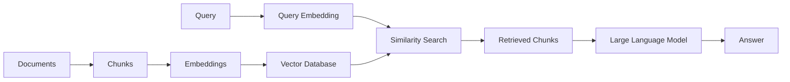
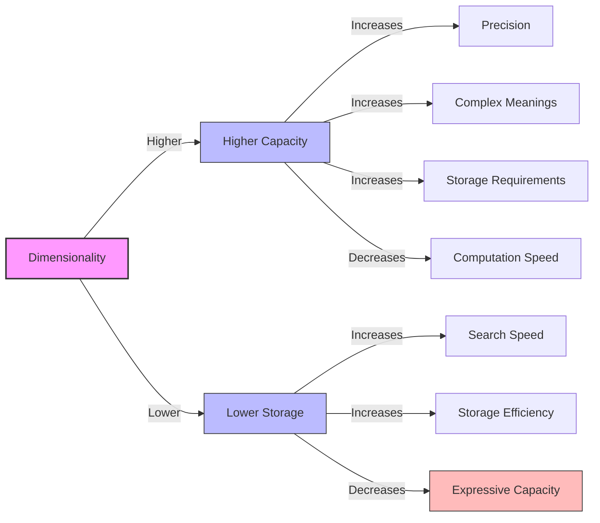
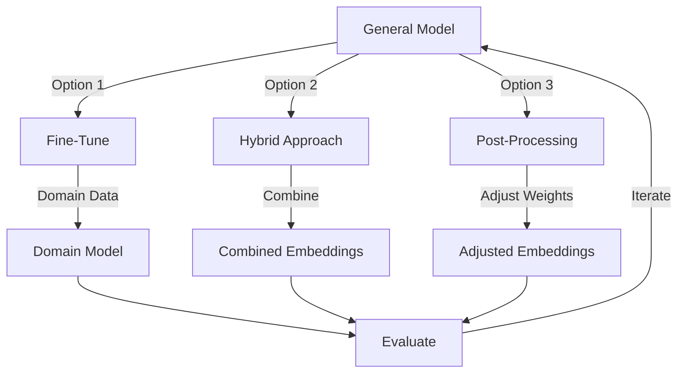
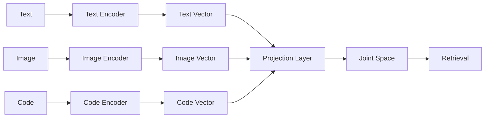
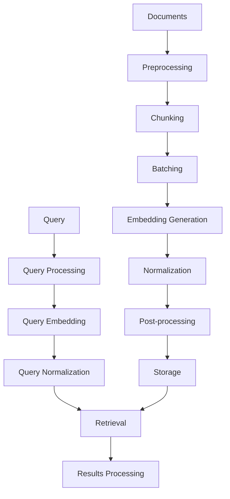

# 📄 Module 4: Document Processing & RAG Foundations - Lesson 3: Embedding Selection & Generation 🔢

## 🎯 Lesson Objectives

By the end of this lesson, you will:
- 🧠 Understand what embeddings are and why they're critical for RAG systems
- 🔍 Compare different embedding models and their trade-offs
- 📏 Learn how to select appropriate embedding dimensions for your use case
- 🎯 Master domain-specific embedding adaptation techniques
- 🖼️ Explore multi-modal embeddings for different content types
- 🔄 Build robust embedding pipelines for production RAG systems
- 📊 Implement techniques to evaluate embedding quality

---

## 🧠 Understanding Embeddings in RAG Systems


### What Are Embeddings?

Embeddings are dense vector representations of text (or other data) that capture semantic meaning in a high-dimensional space. In simpler terms, they're a way to convert words, sentences, or documents into lists of numbers that computers can process efficiently while preserving their meaning.

> 💡 **Key Insight**: Embeddings allow us to measure semantic similarity between texts by calculating the distance between their vectors. This is the foundation of retrieval in RAG systems.

### The Role of Embeddings in RAG



In a RAG system, embeddings serve several critical functions:

1. **Semantic Search**: They enable finding relevant information based on meaning, not just keywords.
2. **Dimensionality Reduction**: They compress complex semantic information into manageable vector representations.
3. **Cross-Modal Connections**: They can connect text with other modalities like images or code.
4. **Efficient Retrieval**: They allow for fast similarity searches in large document collections.

### The Embedding Process

The process of generating embeddings typically involves:

1. **Tokenization**: Breaking text into tokens (words, subwords, or characters)
2. **Encoding**: Passing tokens through a neural network
3. **Vector Generation**: Producing a fixed-size vector representation
4. **Normalization**: Often normalizing vectors to have unit length for consistent similarity calculations

```python
# Simple example using sentence-transformers
from sentence_transformers import SentenceTransformer

model = SentenceTransformer('all-MiniLM-L6-v2')
text = "Embeddings are numerical representations of text."
embedding = model.encode(text)

print(f"Embedding dimension: {len(embedding)}")
print(f"First few values: {embedding[:5]}")
```

---

## 🔍 Comparing Embedding Models

There are numerous embedding models available, each with different characteristics, strengths, and weaknesses.

### Popular Embedding Models

| Model | Dimensions | Context Length | Strengths | Weaknesses | Best For |
|-------|------------|----------------|-----------|------------|----------|
| OpenAI text-embedding-3-small | 1536 | 8191 tokens | High quality, good for general use | Closed source, API cost | Production systems with budget |
| OpenAI text-embedding-3-large | 3072 | 8191 tokens | State-of-the-art quality | Higher cost, closed source | High-value applications |
| all-MiniLM-L6-v2 | 384 | 256 tokens | Fast, compact, open source | Limited context length | Resource-constrained environments |
| all-mpnet-base-v2 | 768 | 384 tokens | Good quality-speed balance | Moderate context length | Balanced applications |
| BGE-large-en | 1024 | 512 tokens | Strong performance, open source | Larger model size | Open source production systems |
| E5-large-v2 | 1024 | 512 tokens | Strong on information retrieval | Larger model size | Research and specialized retrieval |
| GTE-large | 1024 | 512 tokens | Strong cross-lingual capabilities | Larger model size | Multilingual applications |
| Cohere embed-english-v3.0 | 1024 | 512 tokens | High quality, API access | API cost | Enterprise applications |

### Embedding Model Selection Factors

When choosing an embedding model, consider:

1. **Quality vs. Speed**: Higher-quality embeddings generally come from larger models that are slower to run.
2. **Dimensionality**: Higher dimensions can capture more information but require more storage and computation.
3. **Context Length**: Maximum text length the model can process at once.
4. **Domain Relevance**: Some models perform better for specific domains (legal, medical, code, etc.).
5. **Licensing**: Open source vs. proprietary considerations.
6. **Deployment Constraints**: On-device vs. cloud, memory limitations, etc.
7. **Cost**: API costs for hosted models vs. computational costs for self-hosted models.


### Benchmarking Embedding Models

It's often valuable to benchmark embedding models on your specific data and tasks:

```python
from sentence_transformers import SentenceTransformer, util
import numpy as np
import time

# Sample data
documents = ["Document about artificial intelligence and machine learning.",
             "Information about natural language processing and transformers.",
             "Guide to vector databases and similarity search.",
             "Tutorial on building RAG systems with embeddings."]

queries = ["What is AI?", 
           "How do transformers work?",
           "What are vector databases?",
           "How to build a RAG system?"]

# Models to compare
models = {
    "all-MiniLM-L6-v2": SentenceTransformer("all-MiniLM-L6-v2"),
    "all-mpnet-base-v2": SentenceTransformer("all-mpnet-base-v2"),
    # Add other models as needed
}

# Benchmark results
results = {}

for model_name, model in models.items():
    # Measure encoding speed
    start_time = time.time()
    doc_embeddings = model.encode(documents)
    query_embeddings = model.encode(queries)
    encoding_time = time.time() - start_time
    
    # Measure retrieval quality (using cosine similarity)
    similarities = []
    for i, query_emb in enumerate(query_embeddings):
        # Calculate similarity to all documents
        sims = util.cos_sim(query_emb, doc_embeddings)[0].numpy()
        # Get index of most similar document
        top_idx = np.argmax(sims)
        # Store similarity score
        similarities.append((i, top_idx, sims[top_idx]))
    
    # Store results
    results[model_name] = {
        "encoding_time": encoding_time,
        "similarities": similarities,
        "dimension": len(doc_embeddings[0])
    }

# Print results
for model_name, result in results.items():
    print(f"Model: {model_name}")
    print(f"Dimension: {result['dimension']}")
    print(f"Encoding time: {result['encoding_time']:.4f} seconds")
    print("Query-Document Similarities:")
    for query_idx, doc_idx, sim in result['similarities']:
        print(f"  Query '{queries[query_idx]}' → Doc '{documents[doc_idx]}': {sim:.4f}")
    print()
```

---

## 📏 Dimensionality Considerations

The dimensionality of embeddings is a critical factor that affects both performance and quality.

### Impact of Dimensionality



### Choosing the Right Dimensionality

1. **Information Density**: More complex or nuanced content may benefit from higher dimensions.
2. **Dataset Size**: Larger datasets often require higher dimensions to avoid collisions.
3. **Retrieval Precision**: Higher dimensions can improve precision but with diminishing returns.
4. **Storage Constraints**: Lower dimensions reduce storage requirements and improve search speed.
5. **Curse of Dimensionality**: Very high dimensions can lead to sparse data and less effective similarity measures.

### Dimensionality Reduction Techniques

Sometimes it's beneficial to reduce the dimensionality of embeddings:

```python
# Example of dimensionality reduction with PCA
from sklearn.decomposition import PCA
import numpy as np

# Original high-dimensional embeddings
original_embeddings = np.random.random((100, 1536))  # 100 documents, 1536 dimensions

# Reduce to 384 dimensions
pca = PCA(n_components=384)
reduced_embeddings = pca.fit_transform(original_embeddings)

print(f"Original shape: {original_embeddings.shape}")
print(f"Reduced shape: {reduced_embeddings.shape}")
print(f"Explained variance ratio: {sum(pca.explained_variance_ratio_):.4f}")
```

### Recommended Dimensions by Use Case

| Use Case | Recommended Dimensions | Rationale |
|----------|------------------------|-----------|
| Simple keyword search | 128-256 | Basic semantic relationships only |
| General document retrieval | 384-768 | Good balance of quality and efficiency |
| Specialized domain knowledge | 768-1024 | Capture domain-specific nuances |
| Complex semantic relationships | 1024-1536 | Preserve subtle meaning differences |
| Research applications | 1536+ | Maximum information preservation |

---

## 🎯 Domain-Specific Embedding Adaptation

General-purpose embeddings may not perform optimally for specialized domains. Adapting embeddings to your specific domain can significantly improve retrieval quality.

### Domain Adaptation Techniques

1. **Fine-tuning**: Further training embedding models on domain-specific data.
2. **Domain-specific models**: Using models pre-trained on relevant domains.
3. **Hybrid approaches**: Combining general and domain-specific embeddings.
4. **Post-processing**: Adjusting embeddings after generation to emphasize domain-relevant features.

### Fine-Tuning Example

```python
# Simplified example of fine-tuning a sentence transformer model
from sentence_transformers import SentenceTransformer, InputExample, losses
from torch.utils.data import DataLoader

# Load base model
model = SentenceTransformer('all-mpnet-base-v2')

# Prepare domain-specific training data
train_examples = [
    InputExample(texts=['domain specific term', 'related domain concept']),
    InputExample(texts=['technical jargon', 'technical explanation']),
    # Add more domain-specific pairs
]

# Create data loader
train_dataloader = DataLoader(train_examples, shuffle=True, batch_size=16)

# Use cosine similarity loss
train_loss = losses.CosineSimilarityLoss(model)

# Train the model
model.fit(
    train_objectives=[(train_dataloader, train_loss)],
    epochs=10,
    warmup_steps=100
)

# Save the fine-tuned model
model.save('domain-adapted-model')
```

### Domain-Specific Embedding Strategies



### Domain Adaptation for Common Fields

| Domain | Adaptation Strategy | Example Models/Techniques |
|--------|---------------------|---------------------------|
| Legal | Fine-tune on legal corpus | Legal-BERT, CaseLaw-BERT |
| Medical | Use biomedical embeddings | BioBERT, ClinicalBERT |
| Code/Programming | Code-specific models | CodeBERT, GraphCodeBERT |
| Finance | Fine-tune on financial texts | FinBERT |
| Scientific | Scientific paper embeddings | SciBERT, SPECTER |

### Measuring Domain Adaptation Success

To evaluate if domain adaptation improved your embeddings:

1. **Intrinsic evaluation**: Measure clustering of domain concepts, separation of unrelated concepts
2. **Extrinsic evaluation**: Test retrieval performance on domain-specific queries
3. **A/B testing**: Compare retrieval results between general and domain-adapted embeddings

---

## 🖼️ Multi-Modal Embeddings

Modern RAG systems often need to handle multiple types of content beyond just text.

### Types of Multi-Modal Embeddings

1. **Text-Image**: Connect text descriptions with visual content
2. **Text-Code**: Link natural language with programming code
3. **Text-Audio**: Associate text with speech or sound
4. **Text-Structured Data**: Connect text with tabular or structured information

### Multi-Modal Embedding Architecture



### Text-Image Embedding Example

```python
# Example using CLIP for text-image embeddings
import torch
from PIL import Image
import requests
from transformers import CLIPProcessor, CLIPModel

# Load model and processor
model = CLIPModel.from_pretrained("openai/clip-vit-base-patch32")
processor = CLIPProcessor.from_pretrained("openai/clip-vit-base-patch32")

# Sample data
image_url = "http://images.cocodataset.org/val2017/000000039769.jpg"
image = Image.open(requests.get(image_url, stream=True).raw)
texts = ["a photo of a cat", "a photo of a dog", "a photo of a building"]

# Process inputs
inputs = processor(text=texts, images=image, return_tensors="pt", padding=True)

# Get embeddings
with torch.no_grad():
    outputs = model(**inputs)
    text_embeddings = outputs.text_embeds
    image_embeddings = outputs.image_embeds

# Calculate similarities
similarities = (image_embeddings @ text_embeddings.T).softmax(dim=1)

# Print results
for i, text in enumerate(texts):
    print(f"Similarity with '{text}': {similarities[0][i].item():.4f}")
```

### Text-Code Embedding

For RAG systems that need to retrieve code snippets:

```python
# Example using CodeBERT for text-code embeddings
from transformers import AutoTokenizer, AutoModel
import torch

# Load model and tokenizer
tokenizer = AutoTokenizer.from_pretrained("microsoft/codebert-base")
model = AutoModel.from_pretrained("microsoft/codebert-base")

# Sample data
natural_language = "Function to calculate fibonacci numbers"
code_snippet = """
def fibonacci(n):
    if n <= 1:
        return n
    else:
        return fibonacci(n-1) + fibonacci(n-2)
"""

# Tokenize inputs
nl_tokens = tokenizer(natural_language, return_tensors="pt", padding=True, truncation=True)
code_tokens = tokenizer(code_snippet, return_tensors="pt", padding=True, truncation=True)

# Get embeddings
with torch.no_grad():
    nl_output = model(**nl_tokens)
    code_output = model(**code_tokens)
    
    # Use CLS token embedding as the representation
    nl_embedding = nl_output.last_hidden_state[:, 0, :]
    code_embedding = code_output.last_hidden_state[:, 0, :]

# Calculate similarity
similarity = torch.nn.functional.cosine_similarity(nl_embedding, code_embedding)
print(f"Similarity between text and code: {similarity.item():.4f}")
```

### Multi-Modal RAG Applications

| Application | Modalities | Example Use Case |
|-------------|------------|------------------|
| Visual QA | Text + Image | "What's in this image of my refrigerator?" |
| Code Assistant | Text + Code | "Find me a sorting algorithm implementation" |
| Audio Search | Text + Audio | "Find podcast segments about climate change" |
| Data Analysis | Text + Tables | "Summarize the trends in this spreadsheet" |

---

## 🔄 Building Embedding Pipelines

In production RAG systems, you need robust pipelines to generate, store, and retrieve embeddings efficiently.

### Embedding Pipeline Architecture



### Implementing a Robust Embedding Pipeline

```python
class EmbeddingPipeline:
    """A robust pipeline for generating and managing embeddings."""
    
    def __init__(self, model_name="all-MiniLM-L6-v2", batch_size=32, cache_dir=None):
        """Initialize the embedding pipeline.
        
        Args:
            model_name: Name of the embedding model to use
            batch_size: Number of texts to embed in each batch
            cache_dir: Directory to cache embeddings (optional)
        """
        self.model = SentenceTransformer(model_name)
        self.batch_size = batch_size
        self.cache_dir = cache_dir
        self.embedding_dim = self.model.get_sentence_embedding_dimension()
        
    def preprocess(self, text):
        """Preprocess text before embedding."""
        # Remove excessive whitespace
        text = re.sub(r'\s+', ' ', text).strip()
        # Truncate if too long (model-specific)
        max_length = 512  # Example limit
        if len(text.split()) > max_length:
            text = ' '.join(text.split()[:max_length])
        return text
        
    def generate_embeddings(self, texts, show_progress=True):
        """Generate embeddings for a list of texts.
        
        Args:
            texts: List of text strings to embed
            show_progress: Whether to show a progress bar
            
        Returns:
            numpy array of embeddings
        """
        # Preprocess texts
        processed_texts = [self.preprocess(text) for text in texts]
        
        # Generate embeddings in batches
        embeddings = self.model.encode(
            processed_texts,
            batch_size=self.batch_size,
            show_progress_bar=show_progress,
            normalize_embeddings=True  # L2 normalization
        )
        
        return embeddings
    
    def generate_query_embedding(self, query):
        """Generate embedding for a single query."""
        processed_query = self.preprocess(query)
        embedding = self.model.encode(processed_query, normalize_embeddings=True)
        return embedding
    
    def save_embeddings(self, embeddings, file_path):
        """Save embeddings to disk."""
        np.save(file_path, embeddings)
        
    def load_embeddings(self, file_path):
        """Load embeddings from disk."""
        return np.load(file_path)
    
    def similarity_search(self, query_embedding, document_embeddings, top_k=5):
        """Find most similar documents to a query.
        
        Args:
            query_embedding: Embedding of the query
            document_embeddings: Matrix of document embeddings
            top_k: Number of results to return
            
        Returns:
            Indices of top_k most similar documents and their scores
        """
        # Calculate cosine similarities
        similarities = np.dot(document_embeddings, query_embedding)
        
        # Get indices of top_k highest similarities
        top_indices = np.argsort(similarities)[-top_k:][::-1]
        top_scores = similarities[top_indices]
        
        return list(zip(top_indices, top_scores))
```

### Optimizing Embedding Pipelines

1. **Batching**: Process multiple texts at once to maximize GPU utilization.
2. **Caching**: Store embeddings to avoid regenerating them.
3. **Asynchronous Processing**: Use async operations for better throughput.
4. **Quantization**: Reduce precision to save memory and speed up retrieval.
5. **Sharding**: Distribute embedding computation across multiple machines.

### Embedding Pipeline Considerations

| Consideration | Options | Trade-offs |
|---------------|---------|------------|
| Hosting | Self-hosted vs. API | Control vs. simplicity |
| Batch Size | Small vs. large | Memory usage vs. throughput |
| Caching Strategy | In-memory vs. disk | Speed vs. persistence |
| Preprocessing | Minimal vs. extensive | Speed vs. quality |
| Quantization | FP32 vs. FP16 vs. INT8 | Precision vs. efficiency |

---

## 📊 Evaluating Embedding Quality

The quality of your embeddings directly impacts the performance of your RAG system. Here are techniques to evaluate and improve embedding quality.

### Evaluation Metrics

1. **Retrieval Precision**: How often the retrieved documents are relevant
2. **Retrieval Recall**: How many of the relevant documents are retrieved
3. **Mean Reciprocal Rank (MRR)**: Average position of the first relevant result
4. **Normalized Discounted Cumulative Gain (NDCG)**: Measures ranking quality
5. **Semantic Similarity Correlation**: How well embedding similarities match human judgments

### Implementing a Simple Evaluation Framework

```python
def evaluate_embeddings(model, query_doc_pairs, k=5):
    """Evaluate embedding model on query-document pairs.
    
    Args:
        model: SentenceTransformer model
        query_doc_pairs: List of (query, [relevant_docs], [all_docs]) tuples
        k: Number of results to consider
        
    Returns:
        Dictionary of evaluation metrics
    """
    results = {
        "precision@k": [],
        "recall@k": [],
        "mrr": []
    }
    
    for query, relevant_docs, all_docs in query_doc_pairs:
        # Generate embeddings
        query_emb = model.encode(query, normalize_embeddings=True)
        doc_embs = model.encode(all_docs, normalize_embeddings=True)
        
        # Calculate similarities
        similarities = np.dot(doc_embs, query_emb)
        
        # Get top k results
        top_indices = np.argsort(similarities)[-k:][::-1]
        top_docs = [all_docs[i] for i in top_indices]
        
        # Calculate metrics
        # Precision@k
        relevant_retrieved = len(set(top_docs) & set(relevant_docs))
        precision = relevant_retrieved / k
        results["precision@k"].append(precision)
        
        # Recall@k
        recall = relevant_retrieved / len(relevant_docs) if relevant_docs else 1.0
        results["recall@k"].append(recall)
        
        # MRR
        for i, doc in enumerate(top_docs):
            if doc in relevant_docs:
                results["mrr"].append(1.0 / (i + 1))
                break
        else:
            results["mrr"].append(0.0)
    
    # Average the metrics
    for metric in results:
        results[metric] = sum(results[metric]) / len(results[metric])
        
    return results
```

### Visualizing Embedding Quality

Visualizing embeddings can help identify issues and understand their structure:

```python
# Example of visualizing embeddings with t-SNE
from sklearn.manifold import TSNE
import matplotlib.pyplot as plt
import numpy as np

def visualize_embeddings(embeddings, labels, title="Embedding Visualization"):
    """Visualize embeddings using t-SNE."""
    # Reduce dimensions to 2D
    tsne = TSNE(n_components=2, random_state=42)
    reduced_embeddings = tsne.fit_transform(embeddings)
    
    # Plot
    plt.figure(figsize=(10, 8))
    
    # Get unique labels and assign colors
    unique_labels = list(set(labels))
    colors = plt.cm.rainbow(np.linspace(0, 1, len(unique_labels)))
    
    for i, label in enumerate(unique_labels):
        indices = [j for j, l in enumerate(labels) if l == label]
        plt.scatter(
            reduced_embeddings[indices, 0],
            reduced_embeddings[indices, 1],
            c=[colors[i]],
            label=label,
            alpha=0.7
        )
    
    plt.title(title)
    plt.legend()
    plt.grid(True, linestyle='--', alpha=0.7)
    plt.tight_layout()
    plt.show()
```

### Common Embedding Issues and Solutions

| Issue | Symptoms | Solutions |
|-------|----------|-----------|
| Semantic Collapse | Similar embeddings for different concepts | Use higher dimensions, fine-tune model |
| Poor Domain Alignment | Low retrieval precision for domain terms | Fine-tune on domain data |
| Outlier Embeddings | Some embeddings far from others | Improve preprocessing, handle special cases |
| Embedding Drift | Performance degrades over time | Regularly update embeddings, monitor quality |
| Curse of Dimensionality | Similarity scores too uniform | Reduce dimensions, use better similarity metrics |

---

## 💪 Practice Exercises

1. **Compare Embedding Models**: Implement a benchmark to compare at least three different embedding models on a sample dataset. Measure both performance (speed) and quality (retrieval precision).

2. **Build a Domain Adapter**: Create a system that fine-tunes a general embedding model on a specific domain (e.g., legal, medical, or technical documentation).

3. **Implement Dimensionality Reduction**: Experiment with reducing embedding dimensions while preserving semantic similarity. Compare PCA, t-SNE, and UMAP approaches.

4. **Create a Multi-Modal Embedding System**: Build a simple system that can embed both text and images (or text and code) in a shared vector space.

5. **Develop an Embedding Evaluation Framework**: Create a comprehensive framework to evaluate embedding quality using multiple metrics (precision, recall, MRR, etc.).

---

## 🔍 Key Takeaways

1. **Embedding Selection Matters**: The choice of embedding model significantly impacts RAG system performance.

2. **Dimensionality Trade-offs**: Higher dimensions capture more information but require more resources; find the right balance for your use case.

3. **Domain Adaptation**: Fine-tuning embeddings to your specific domain can dramatically improve retrieval quality.

4. **Multi-Modal Capabilities**: Modern RAG systems can benefit from embeddings that connect text with other modalities like images or code.

5. **Robust Pipelines**: Production RAG systems need well-designed embedding pipelines with batching, caching, and optimization.

6. **Continuous Evaluation**: Regularly evaluate embedding quality to identify and address issues.

---

## 📚 Resources

- [Sentence Transformers Documentation](https://www.sbert.net/)
- [HuggingFace Embeddings Guide](https://huggingface.co/blog/getting-started-with-embeddings)
- [OpenAI Embeddings Documentation](https://platform.openai.com/docs/guides/embeddings)
- [Pinecone Embedding Guide](https://www.pinecone.io/learn/vector-embeddings/)
- [MTEB Embedding Benchmark](https://huggingface.co/spaces/mteb/leaderboard)
- [LangChain Embeddings Guide](https://python.langchain.com/docs/modules/data_connection/text_embedding/)

---

## 🚀 Next Steps

In the next lesson, we'll explore **Metadata Extraction & Management**, focusing on how to enrich your document chunks with structured metadata to improve retrieval relevance and enable more sophisticated filtering. We'll cover automatic metadata extraction, custom tagging systems, and techniques for using metadata to enhance RAG system performance.

---
