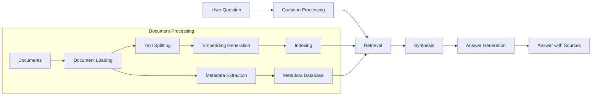

# 📄 Module 4: Document Processing & RAG Foundations - Lesson 5: Building a Document Q&A System 🔍

## 🎯 Lesson Objectives

By the end of this lesson, you will:
- 🏗️ Understand the architecture of a complete Document Q&A system
- 🔄 Implement a RAG system with vector database integration
- 💬 Create question processing and reformulation mechanisms
- 🧩 Build multi-document retrieval and synthesis capabilities
- 📝 Design answer generation with source attribution
- 🔍 Develop confidence scoring for responses
- 🏷️ Implement handling of metadata-specific queries

---

## 🏗️ Document Q&A System Architecture


### The Complete RAG Pipeline

A Document Q&A system combines all the components we've learned so far into a cohesive pipeline:



### Key Components

1. **Document Processing Pipeline**: Converts raw documents into indexed chunks with metadata
2. **Question Processing**: Analyzes and reformulates user questions for optimal retrieval
3. **Retrieval System**: Finds the most relevant document chunks for a given question
4. **Synthesis Engine**: Combines information from multiple chunks when needed
5. **Answer Generation**: Creates coherent answers with source attribution
6. **Confidence Scoring**: Assesses the reliability of generated answers

---

## 🔄 Implementing a RAG System

The core of a Document Q&A system is the Retrieval-Augmented Generation (RAG) component, which combines retrieval and generation:

### Vector Database Integration

```python
class SimpleRAGSystem:
    """A simple RAG system with vector database integration."""
    
    def __init__(self, documents, embeddings, vector_store_type="faiss"):
        """
        Initialize the RAG system.
        
        Args:
            documents: List of document chunks
            embeddings: List of embedding vectors for the chunks
            vector_store_type: Type of vector database to use ("faiss" or "chroma")
        """
        self.documents = documents
        self.vector_store_type = vector_store_type
        
        # Initialize vector database
        if vector_store_type == "faiss":
            self.vector_db = self._init_faiss(documents, embeddings)
        elif vector_store_type == "chroma":
            self.vector_db = self._init_chroma(documents, embeddings)
        else:
            raise ValueError(f"Unsupported vector store type: {vector_store_type}")
    
    def _init_faiss(self, documents, embeddings):
        """Initialize a FAISS vector database."""
        import faiss
        import numpy as np
        
        # Convert embeddings to numpy array
        embeddings_array = np.array(embeddings).astype('float32')
        
        # Create FAISS index
        dimension = embeddings_array.shape[1]
        index = faiss.IndexFlatL2(dimension)
        index.add(embeddings_array)
        
        return {
            "index": index,
            "documents": documents,
            "embeddings": embeddings_array
        }
    
    def _init_chroma(self, documents, embeddings):
        """Initialize a ChromaDB vector database."""
        import chromadb
        
        # Create ChromaDB client
        client = chromadb.Client()
        collection = client.create_collection("documents")
        
        # Add documents to collection
        for i, (doc, embedding) in enumerate(zip(documents, embeddings)):
            collection.add(
                ids=[f"doc_{i}"],
                embeddings=[embedding],
                metadatas=[doc.get("metadata", {})]
            )
        
        return {
            "collection": collection,
            "documents": documents
        }
```

### Retrieval Mechanisms

The retrieval component finds the most relevant document chunks for a given question:

```python
def retrieve(self, query, embedding_model, top_k=5, use_hybrid=False):
    """
    Retrieve relevant documents for a query.
    
    Args:
        query: User question
        embedding_model: Model to generate query embedding
        top_k: Number of documents to retrieve
        use_hybrid: Whether to use hybrid retrieval (semantic + keyword)
        
    Returns:
        List of relevant document chunks
    """
    # Generate query embedding
    query_embedding = embedding_model.embed_text(query)
    
    # Semantic search
    if self.vector_store_type == "faiss":
        results = self._faiss_search(query_embedding, top_k)
    else:
        results = self._chroma_search(query_embedding, top_k)
    
    # Hybrid search (combine with keyword search)
    if use_hybrid:
        keyword_results = self._keyword_search(query, top_k)
        results = self._merge_results(results, keyword_results)
    
    return results[:top_k]
```

### Context Augmentation

Context augmentation enhances the query with additional information:

```python
def augment_query(self, query, context=None):
    """
    Augment the query with additional context.
    
    Args:
        query: Original user question
        context: Additional context (e.g., conversation history)
        
    Returns:
        Augmented query
    """
    if not context:
        return query
    
    # Simple augmentation: combine query with context
    augmented_query = f"Context: {context}\n\nQuestion: {query}"
    
    return augmented_query
```

### Generation with Retrieved Context

The generation component creates answers based on retrieved information:

```python
def generate_answer(self, query, retrieved_chunks, llm_client):
    """
    Generate an answer based on retrieved chunks.
    
    Args:
        query: User question
        retrieved_chunks: Relevant document chunks
        llm_client: LLM client for text generation
        
    Returns:
        Generated answer
    """
    # Prepare context from retrieved chunks
    context = "\n\n".join([chunk["content"] for chunk in retrieved_chunks])
    
    # Create prompt for the LLM
    prompt = f"""
    Answer the following question based on the provided context.
    If the context doesn't contain relevant information, say "I don't have enough information to answer this question."
    
    Context:
    {context}
    
    Question: {query}
    
    Answer:
    """
    
    # Generate answer
    answer = llm_client.generate_text(prompt)
    
    return answer
```

---

## 💬 Question Processing and Reformulation

Effective question processing improves retrieval quality:

### Question Analysis

```python
def analyze_question(self, question):
    """
    Analyze a question to identify its type and key entities.
    
    Args:
        question: User question
        
    Returns:
        Dictionary with question analysis
    """
    # Identify question type
    question_types = {
        "what": "definition",
        "who": "person",
        "when": "time",
        "where": "location",
        "why": "reason",
        "how": "process"
    }
    
    question_lower = question.lower()
    question_type = "general"
    
    for q_word, q_type in question_types.items():
        if question_lower.startswith(q_word):
            question_type = q_type
            break
    
    # Extract key entities (simplified)
    words = question_lower.split()
    stop_words = {"what", "who", "when", "where", "why", "how", "is", "are", "the", "a", "an"}
    entities = [word for word in words if word not in stop_words and len(word) > 3]
    
    return {
        "type": question_type,
        "entities": entities,
        "is_metadata_query": self._is_metadata_query(question)
    }
```

### Query Expansion

```python
def expand_query(self, question, analysis):
    """
    Expand a query to improve retrieval.
    
    Args:
        question: Original question
        analysis: Question analysis
        
    Returns:
        List of expanded queries
    """
    expanded_queries = [question]  # Start with original question
    
    # Add variations based on question type
    if analysis["type"] == "definition":
        expanded_queries.append(f"definition of {' '.join(analysis['entities'])}")
        expanded_queries.append(f"what is {' '.join(analysis['entities'])}")
    elif analysis["type"] == "process":
        expanded_queries.append(f"steps for {' '.join(analysis['entities'])}")
        expanded_queries.append(f"process of {' '.join(analysis['entities'])}")
    
    # Add entity-focused queries
    for entity in analysis["entities"]:
        expanded_queries.append(entity)
    
    return expanded_queries
```

---

## 🧩 Multi-Document Retrieval and Synthesis

When information is spread across multiple documents, synthesis is crucial:

### Cross-Document Information Retrieval

```python
def retrieve_from_multiple_documents(self, query, embedding_model, top_k=3, docs_per_source=2):
    """
    Retrieve information from multiple documents.
    
    Args:
        query: User question
        embedding_model: Model to generate query embedding
        top_k: Number of total chunks to retrieve
        docs_per_source: Maximum chunks per document source
        
    Returns:
        List of relevant chunks from different documents
    """
    # Get all relevant chunks
    all_chunks = self.retrieve(query, embedding_model, top_k=top_k*2)
    
    # Group by document source
    chunks_by_source = {}
    for chunk in all_chunks:
        source = chunk.get("metadata", {}).get("source", "unknown")
        if source not in chunks_by_source:
            chunks_by_source[source] = []
        chunks_by_source[source].append(chunk)
    
    # Select top chunks from each source
    balanced_chunks = []
    for source, chunks in chunks_by_source.items():
        balanced_chunks.extend(chunks[:docs_per_source])
    
    # Sort by relevance and limit to top_k
    balanced_chunks.sort(key=lambda x: x.get("score", 0), reverse=True)
    return balanced_chunks[:top_k]
```

### Information Synthesis

```python
def synthesize_information(self, query, chunks, llm_client):
    """
    Synthesize information from multiple chunks.
    
    Args:
        query: User question
        chunks: Retrieved chunks
        llm_client: LLM client for text generation
        
    Returns:
        Synthesized information
    """
    # Prepare context from chunks
    contexts = []
    for i, chunk in enumerate(chunks):
        source = chunk.get("metadata", {}).get("source", f"Source {i+1}")
        contexts.append(f"[{source}]: {chunk['content']}")
    
    context_text = "\n\n".join(contexts)
    
    # Create synthesis prompt
    prompt = f"""
    Synthesize information from the following sources to answer the question.
    If the sources contain conflicting information, acknowledge the differences.
    
    Question: {query}
    
    Sources:
    {context_text}
    
    Synthesized Answer:
    """
    
    # Generate synthesized answer
    answer = llm_client.generate_text(prompt)
    
    return answer
```

---

## 📝 Answer Generation with Source Attribution

Proper source attribution is essential for trustworthy answers:

### Source Tracking

```python
def track_sources(self, chunks):
    """
    Track sources for retrieved chunks.
    
    Args:
        chunks: Retrieved document chunks
        
    Returns:
        Dictionary mapping content to sources
    """
    source_map = {}
    
    for chunk in chunks:
        content = chunk["content"]
        metadata = chunk.get("metadata", {})
        
        source = {
            "document": metadata.get("source", "Unknown"),
            "page": metadata.get("page"),
            "section": metadata.get("section"),
            "score": chunk.get("score", 0)
        }
        
        if content in source_map:
            source_map[content].append(source)
        else:
            source_map[content] = [source]
    
    return source_map
```

### Citation Generation

```python
def generate_answer_with_citations(self, query, chunks, llm_client):
    """
    Generate an answer with citations.
    
    Args:
        query: User question
        chunks: Retrieved chunks
        llm_client: LLM client for text generation
        
    Returns:
        Answer with citations
    """
    # Track sources
    source_map = self.track_sources(chunks)
    
    # Prepare context with source identifiers
    contexts = []
    for i, chunk in enumerate(chunks):
        contexts.append(f"[{i+1}] {chunk['content']}")
    
    context_text = "\n\n".join(contexts)
    
    # Create prompt for answer with citations
    prompt = f"""
    Answer the following question based on the provided sources.
    Use citation numbers [1], [2], etc. to indicate which source supports each part of your answer.
    
    Question: {query}
    
    Sources:
    {context_text}
    
    Answer with citations:
    """
    
    # Generate answer
    answer = llm_client.generate_text(prompt)
    
    # Add source details at the end
    sources_text = "\n\nSources:\n"
    for i, chunk in enumerate(chunks):
        metadata = chunk.get("metadata", {})
        source = metadata.get("source", "Unknown")
        page = metadata.get("page", "")
        page_info = f", page {page}" if page else ""
        sources_text += f"[{i+1}] {source}{page_info}\n"
    
    return answer + sources_text
```

---

## 🔍 Confidence Scoring and Uncertainty Handling

Not all answers can be given with the same confidence:

### Confidence Assessment

```python
def assess_confidence(self, query, chunks):
    """
    Assess confidence in the answer.
    
    Args:
        query: User question
        chunks: Retrieved chunks
        
    Returns:
        Confidence score (0-1)
    """
    if not chunks:
        return 0.0
    
    # Factors affecting confidence
    factors = {
        "relevance": self._calculate_relevance(query, chunks),
        "consistency": self._calculate_consistency(chunks),
        "coverage": self._calculate_coverage(query, chunks),
        "source_quality": self._calculate_source_quality(chunks)
    }
    
    # Weighted average of factors
    weights = {
        "relevance": 0.4,
        "consistency": 0.2,
        "coverage": 0.3,
        "source_quality": 0.1
    }
    
    confidence = sum(score * weights[factor] for factor, score in factors.items())
    
    return min(1.0, max(0.0, confidence))
```

### Uncertainty Communication

```python
def generate_response_with_uncertainty(self, query, chunks, confidence, llm_client):
    """
    Generate a response that communicates uncertainty appropriately.
    
    Args:
        query: User question
        chunks: Retrieved chunks
        confidence: Confidence score (0-1)
        llm_client: LLM client for text generation
        
    Returns:
        Response with appropriate uncertainty language
    """
    # Determine confidence level
    if confidence >= 0.8:
        confidence_level = "high"
        prefix = "Based on the available information, "
    elif confidence >= 0.5:
        confidence_level = "medium"
        prefix = "The information suggests that "
    else:
        confidence_level = "low"
        prefix = "I'm not entirely certain, but based on limited information, "
    
    # Generate base answer
    base_answer = self.generate_answer(query, chunks, llm_client)
    
    # Add confidence prefix
    if confidence < 0.3 and "I don't have enough information" not in base_answer:
        response = f"{prefix}{base_answer}\n\nPlease note that the available information on this topic is limited."
    elif confidence < 0.8 and "I don't have enough information" not in base_answer:
        response = f"{prefix}{base_answer}"
    else:
        response = base_answer
    
    return response
```

---

## 🏷️ Handling Metadata-Specific Queries

Some questions are about document metadata rather than content:

### Metadata Query Detection

```python
def _is_metadata_query(self, question):
    """
    Determine if a question is about document metadata.
    
    Args:
        question: User question
        
    Returns:
        Boolean indicating if this is a metadata query
    """
    metadata_keywords = {
        "author", "wrote", "written", "published", "publication", 
        "date", "year", "when was", "how old", "recent",
        "title", "called", "named", "file", "document",
        "type", "format", "source", "where from", "origin"
    }
    
    question_lower = question.lower()
    
    return any(keyword in question_lower for keyword in metadata_keywords)
```

### Metadata Retrieval

```python
def retrieve_metadata(self, query, metadata_fields=None):
    """
    Retrieve document metadata based on a query.
    
    Args:
        query: User question about metadata
        metadata_fields: Specific metadata fields to search
        
    Returns:
        List of relevant metadata entries
    """
    # Default metadata fields to search
    if metadata_fields is None:
        metadata_fields = ["author", "title", "date", "source", "type"]
    
    # Extract key terms from query
    query_terms = set(query.lower().split())
    stop_words = {"what", "who", "when", "where", "why", "how", "is", "are", "the", "a", "an"}
    query_terms = query_terms - stop_words
    
    # Search for documents with matching metadata
    results = []
    
    for i, doc in enumerate(self.documents):
        metadata = doc.get("metadata", {})
        
        # Calculate a simple relevance score
        score = 0
        matched_fields = []
        
        for field in metadata_fields:
            if field in metadata:
                field_value = str(metadata[field]).lower()
                
                # Check if any query term is in the metadata value
                for term in query_terms:
                    if term in field_value:
                        score += 1
                        matched_fields.append(field)
        
        if score > 0:
            results.append({
                "document_id": i,
                "metadata": metadata,
                "score": score,
                "matched_fields": matched_fields
            })
    
    # Sort by score
    results.sort(key=lambda x: x["score"], reverse=True)
    
    return results
```

### Metadata Answer Generation

```python
def answer_metadata_query(self, query, metadata_results, llm_client):
    """
    Generate an answer for a metadata query.
    
    Args:
        query: User question about metadata
        metadata_results: Retrieved metadata
        llm_client: LLM client for text generation
        
    Returns:
        Answer about document metadata
    """
    if not metadata_results:
        return "I couldn't find any documents with metadata matching your query."
    
    # Prepare metadata context
    metadata_context = []
    for i, result in enumerate(metadata_results[:5]):  # Limit to top 5
        metadata = result["metadata"]
        metadata_str = ", ".join(f"{k}: {v}" for k, v in metadata.items())
        metadata_context.append(f"Document {i+1}: {metadata_str}")
    
    metadata_text = "\n".join(metadata_context)
    
    # Create prompt for metadata answer
    prompt = f"""
    Answer the following question about document metadata.
    
    Question: {query}
    
    Document Metadata:
    {metadata_text}
    
    Answer:
    """
    
    # Generate answer
    answer = llm_client.generate_text(prompt)
    
    return answer
```

---

## 🔄 Putting It All Together: The Complete Document Q&A System

Now let's combine all these components into a complete Document Q&A system:

```python
class DocumentQASystem:
    """Complete Document Q&A system."""
    
    def __init__(self, rag_system, embedding_model, llm_client):
        """
        Initialize the Document Q&A system.
        
        Args:
            rag_system: RAG system for retrieval
            embedding_model: Model for generating embeddings
            llm_client: Client for LLM text generation
        """
        self.rag_system = rag_system
        self.embedding_model = embedding_model
        self.llm_client = llm_client
    
    def answer_question(self, question, k=5):
        """
        Answer a user question.
        
        Args:
            question: User question
            k: Number of chunks to retrieve
            
        Returns:
            Answer with sources and confidence information
        """
        # Analyze the question
        analysis = self.rag_system.analyze_question(question)
        
        # Handle metadata queries differently
        if analysis["is_metadata_query"]:
            metadata_results = self.rag_system.retrieve_metadata(question)
            answer = self.rag_system.answer_metadata_query(
                question, metadata_results, self.llm_client
            )
            return {
                "answer": answer,
                "sources": [r["metadata"] for r in metadata_results[:3]],
                "is_metadata_query": True,
                "confidence": 0.9 if metadata_results else 0.1
            }
        
        # Expand the query
        expanded_queries = self.rag_system.expand_query(question, analysis)
        
        # Retrieve from multiple documents
        chunks = self.rag_system.retrieve_from_multiple_documents(
            expanded_queries[0], self.embedding_model, top_k=k
        )
        
        # Assess confidence
        confidence = self.rag_system.assess_confidence(question, chunks)
        
        # Generate answer with citations
        if confidence >= 0.5:
            answer = self.rag_system.generate_answer_with_citations(
                question, chunks, self.llm_client
            )
        else:
            # For low confidence, use uncertainty handling
            answer = self.rag_system.generate_response_with_uncertainty(
                question, chunks, confidence, self.llm_client
            )
        
        return {
            "answer": answer,
            "sources": [chunk.get("metadata", {}) for chunk in chunks],
            "is_metadata_query": False,
            "confidence": confidence
        }
```

---

## 💪 Practice Exercises

1. **Implement a Complete RAG System**: Create a RAG system that integrates with a vector database (FAISS or ChromaDB) and includes retrieval, context augmentation, and generation components.

2. **Build a Question Processing System**: Develop a system that analyzes questions, identifies their type, extracts key entities, and generates query variations for improved retrieval.

3. **Create a Multi-Document Synthesis Engine**: Implement a system that can retrieve information from multiple documents and synthesize it into a coherent answer.

4. **Design a Source Attribution System**: Build a system that tracks the sources of information and generates answers with proper citations.

5. **Implement Confidence Scoring**: Develop a confidence scoring system that assesses the reliability of answers and communicates uncertainty appropriately.

---

## 🔍 Key Takeaways

1. **Complete Pipeline**: A Document Q&A system combines document processing, chunking, embedding, retrieval, and generation into a cohesive pipeline.

2. **Question Processing**: Effective question analysis and reformulation improve retrieval quality.

3. **Multi-Document Synthesis**: Information often needs to be combined from multiple sources to provide complete answers.

4. **Source Attribution**: Proper citation of sources is essential for trustworthy answers.

5. **Confidence Assessment**: Not all answers can be given with the same confidence, and uncertainty should be communicated appropriately.

6. **Metadata Handling**: Some questions are about document metadata rather than content and require specialized handling.

---

## 📚 Resources

- [LangChain RAG Documentation](https://python.langchain.com/docs/use_cases/question_answering/)
- [Pinecone RAG Guide](https://www.pinecone.io/learn/retrieval-augmented-generation/)
- [FAISS Documentation](https://github.com/facebookresearch/faiss)
- [ChromaDB Documentation](https://docs.trychroma.com/)
- [LlamaIndex RAG Tutorial](https://docs.llamaindex.ai/en/stable/getting_started/concepts.html)
- [Hugging Face RAG Systems](https://huggingface.co/blog/rag-systems)

---

## 🚀 Next Steps

Congratulations on completing Module 4: Document Processing & RAG Foundations! You now have a solid understanding of how to build document-aware AI systems that can retrieve and use information from external sources.

In the next module, we'll explore advanced RAG techniques, including:
- Hybrid search strategies
- Contextual compression
- Reranking mechanisms
- Self-querying retrieval
- Multi-hop reasoning
- Evaluation frameworks for RAG systems

These advanced techniques will help you build even more powerful and effective knowledge-based AI applications.
