# Module 5: Advanced RAG Systems - Progressive Journey

This document presents a progressive journey through the key concepts of Module 5, breaking down complex architectures into stages that build upon each other.

## 1. Advanced Retrieval Strategies

### Stage 1: Basic Vector Search

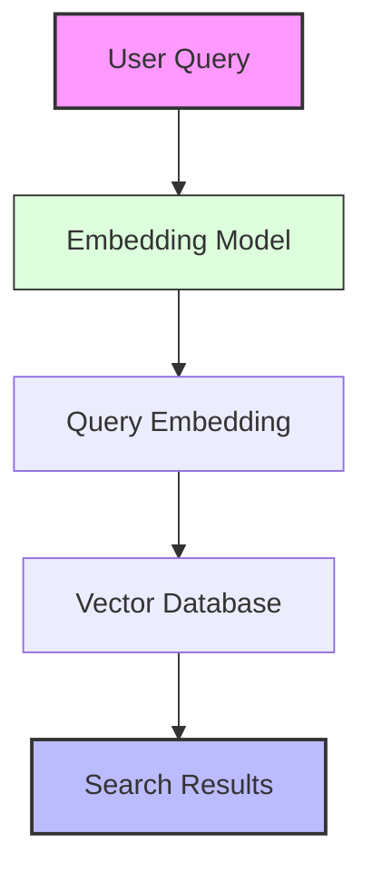
```mermaid
graph TD
    Query[User Query] --> EmbeddingModel[Embedding Model]
    EmbeddingModel --> QueryEmbedding[Query Embedding]
    QueryEmbedding --> VectorDB[Vector Database]
    VectorDB --> Results[Search Results]
    
    style Query fill:#f9f,stroke:#333,stroke-width:2px
    style Results fill:#bbf,stroke:#333,stroke-width:2px
    style EmbeddingModel fill:#dfd,stroke:#333,stroke-width:1px
```

### Stage 2: Hybrid Search

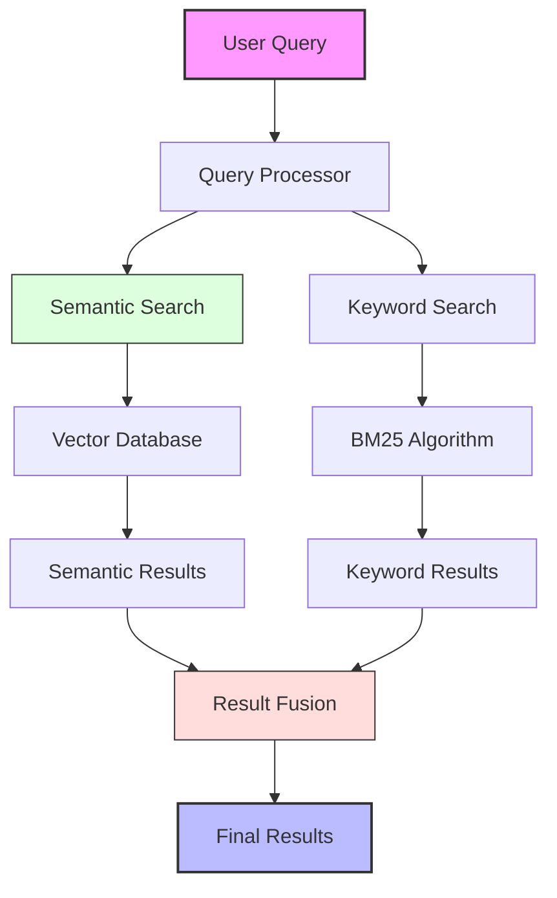
```mermaid
graph TD
    Query[User Query] --> QueryProcessor[Query Processor]
    QueryProcessor --> SemanticSearch[Semantic Search]
    QueryProcessor --> KeywordSearch[Keyword Search]
    
    SemanticSearch --> VectorDB[Vector Database]
    KeywordSearch --> BM25[BM25 Algorithm]
    
    VectorDB --> SemanticResults[Semantic Results]
    BM25 --> KeywordResults[Keyword Results]
    
    SemanticResults --> ResultFusion[Result Fusion]
    KeywordResults --> ResultFusion
    
    ResultFusion --> FinalResults[Final Results]
    
    style Query fill:#f9f,stroke:#333,stroke-width:2px
    style FinalResults fill:#bbf,stroke:#333,stroke-width:2px
    style SemanticSearch fill:#dfd,stroke:#333,stroke-width:1px
    style ResultFusion fill:#fdd,stroke:#333,stroke-width:1px
```

### Stage 3: Multi-Index Retrieval

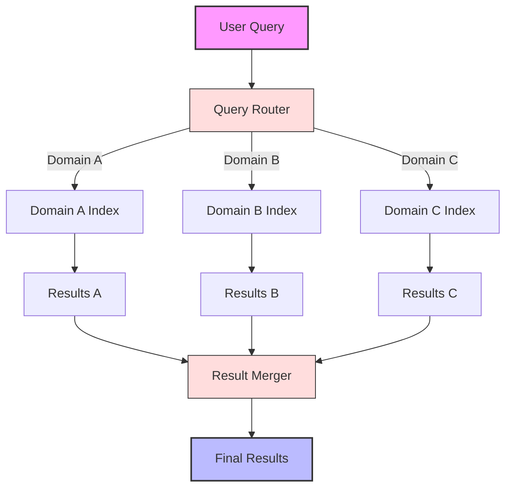
```mermaid
graph TD
    Query[User Query] --> QueryRouter[Query Router]
    
    QueryRouter -->|Domain A| IndexA[Domain A Index]
    QueryRouter -->|Domain B| IndexB[Domain B Index]
    QueryRouter -->|Domain C| IndexC[Domain C Index]
    
    IndexA --> ResultsA[Results A]
    IndexB --> ResultsB[Results B]
    IndexC --> ResultsC[Results C]
    
    ResultsA --> ResultMerger[Result Merger]
    ResultsB --> ResultMerger
    ResultsC --> ResultMerger
    
    ResultMerger --> FinalResults[Final Results]
    
    style Query fill:#f9f,stroke:#333,stroke-width:2px
    style FinalResults fill:#bbf,stroke:#333,stroke-width:2px
    style QueryRouter fill:#fdd,stroke:#333,stroke-width:1px
    style ResultMerger fill:#fdd,stroke:#333,stroke-width:1px
```

### Stage 4: Complete Advanced Retrieval System

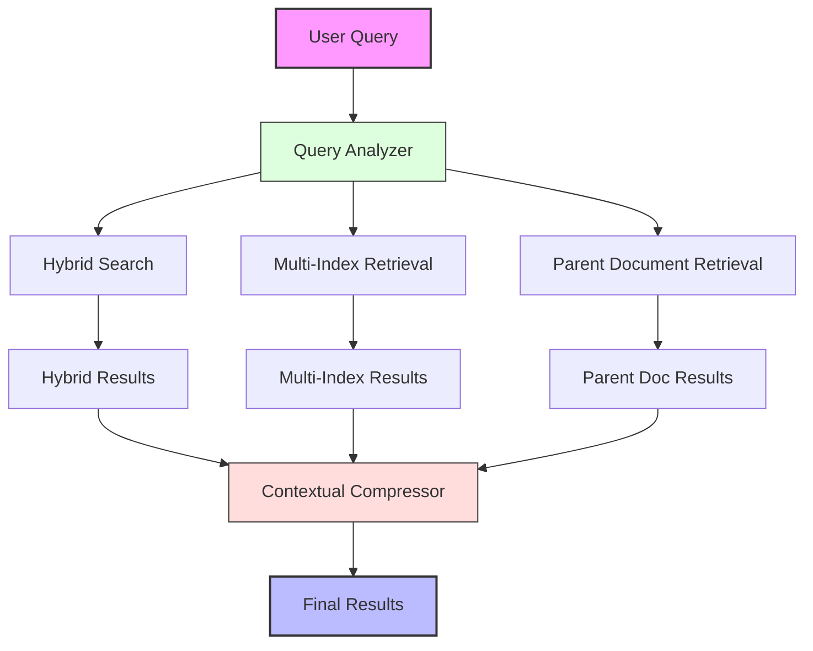
```mermaid
graph TD
    Query[User Query] --> QueryAnalyzer[Query Analyzer]
    
    QueryAnalyzer --> HybridSearch[Hybrid Search]
    QueryAnalyzer --> MultiIndex[Multi-Index Retrieval]
    QueryAnalyzer --> ParentDoc[Parent Document Retrieval]
    
    HybridSearch --> ResultsH[Hybrid Results]
    MultiIndex --> ResultsM[Multi-Index Results]
    ParentDoc --> ResultsP[Parent Doc Results]
    
    ResultsH --> ContextualCompressor[Contextual Compressor]
    ResultsM --> ContextualCompressor
    ResultsP --> ContextualCompressor
    
    ContextualCompressor --> FinalResults[Final Results]
    
    style Query fill:#f9f,stroke:#333,stroke-width:2px
    style FinalResults fill:#bbf,stroke:#333,stroke-width:2px
    style QueryAnalyzer fill:#dfd,stroke:#333,stroke-width:1px
    style ContextualCompressor fill:#fdd,stroke:#333,stroke-width:1px
```

## 2. Query Transformation Techniques

### Stage 1: Basic Query Processing

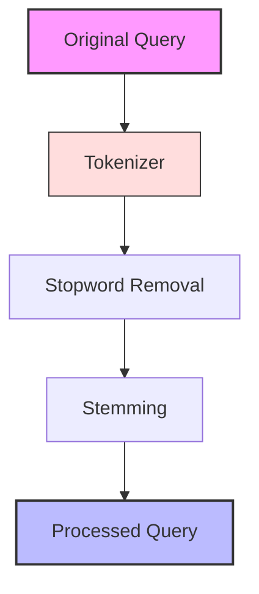
```mermaid
graph TD
    Query[Original Query] --> Tokenizer[Tokenizer]
    Tokenizer --> StopwordRemoval[Stopword Removal]
    StopwordRemoval --> Stemming[Stemming]
    Stemming --> ProcessedQuery[Processed Query]
    
    style Query fill:#f9f,stroke:#333,stroke-width:2px
    style ProcessedQuery fill:#bbf,stroke:#333,stroke-width:2px
    style Tokenizer fill:#fdd,stroke:#333,stroke-width:1px
```

### Stage 2: Query Expansion

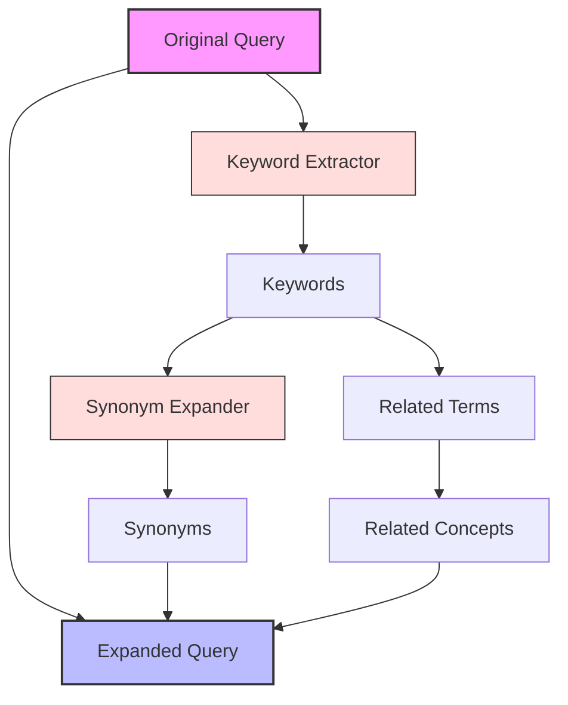
```mermaid
graph TD
    Query[Original Query] --> KeywordExtractor[Keyword Extractor]
    KeywordExtractor --> Keywords[Keywords]
    
    Keywords --> SynonymExpander[Synonym Expander]
    Keywords --> RelatedTerms[Related Terms]
    
    SynonymExpander --> Synonyms[Synonyms]
    RelatedTerms --> Related[Related Concepts]
    
    Query --> ExpandedQuery[Expanded Query]
    Synonyms --> ExpandedQuery
    Related --> ExpandedQuery
    
    style Query fill:#f9f,stroke:#333,stroke-width:2px
    style ExpandedQuery fill:#bbf,stroke:#333,stroke-width:2px
    style KeywordExtractor fill:#fdd,stroke:#333,stroke-width:1px
    style SynonymExpander fill:#fdd,stroke:#333,stroke-width:1px
```

### Stage 3: LLM-Based Query Transformation

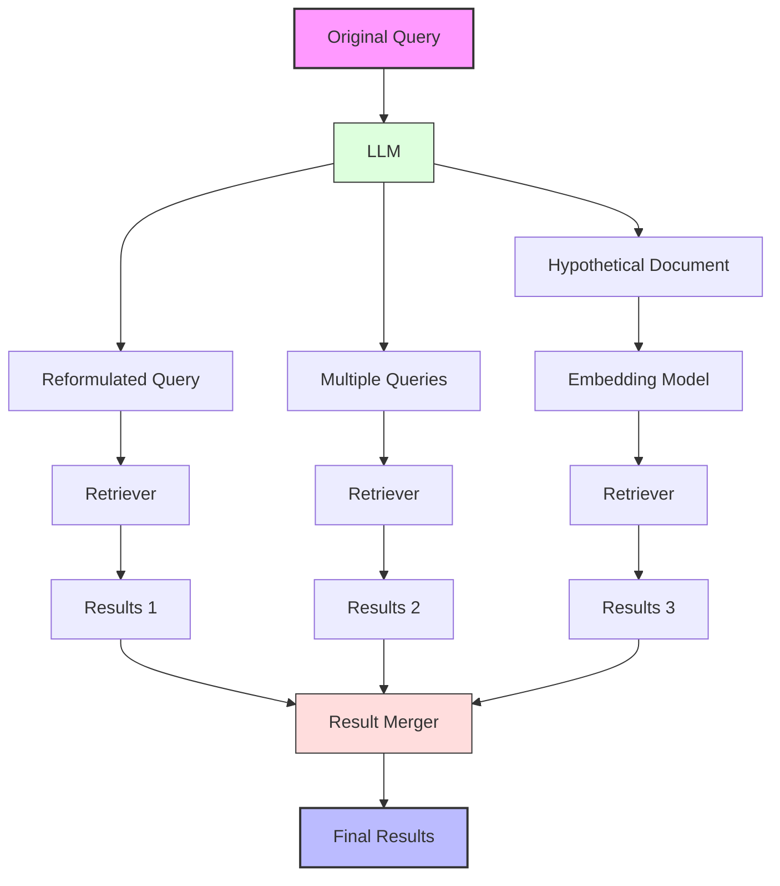
```mermaid
graph TD
    Query[Original Query] --> LLM[LLM]
    
    LLM --> ReformulatedQuery[Reformulated Query]
    LLM --> MultipleQueries[Multiple Queries]
    LLM --> HypotheticalDoc[Hypothetical Document]
    
    ReformulatedQuery --> Retriever1[Retriever]
    MultipleQueries --> Retriever2[Retriever]
    HypotheticalDoc --> EmbeddingModel[Embedding Model]
    EmbeddingModel --> Retriever3[Retriever]
    
    Retriever1 --> Results1[Results 1]
    Retriever2 --> Results2[Results 2]
    Retriever3 --> Results3[Results 3]
    
    Results1 --> ResultMerger[Result Merger]
    Results2 --> ResultMerger
    Results3 --> ResultMerger
    
    ResultMerger --> FinalResults[Final Results]
    
    style Query fill:#f9f,stroke:#333,stroke-width:2px
    style FinalResults fill:#bbf,stroke:#333,stroke-width:2px
    style LLM fill:#dfd,stroke:#333,stroke-width:1px
    style ResultMerger fill:#fdd,stroke:#333,stroke-width:1px
```

### Stage 4: Complete Query Transformation System

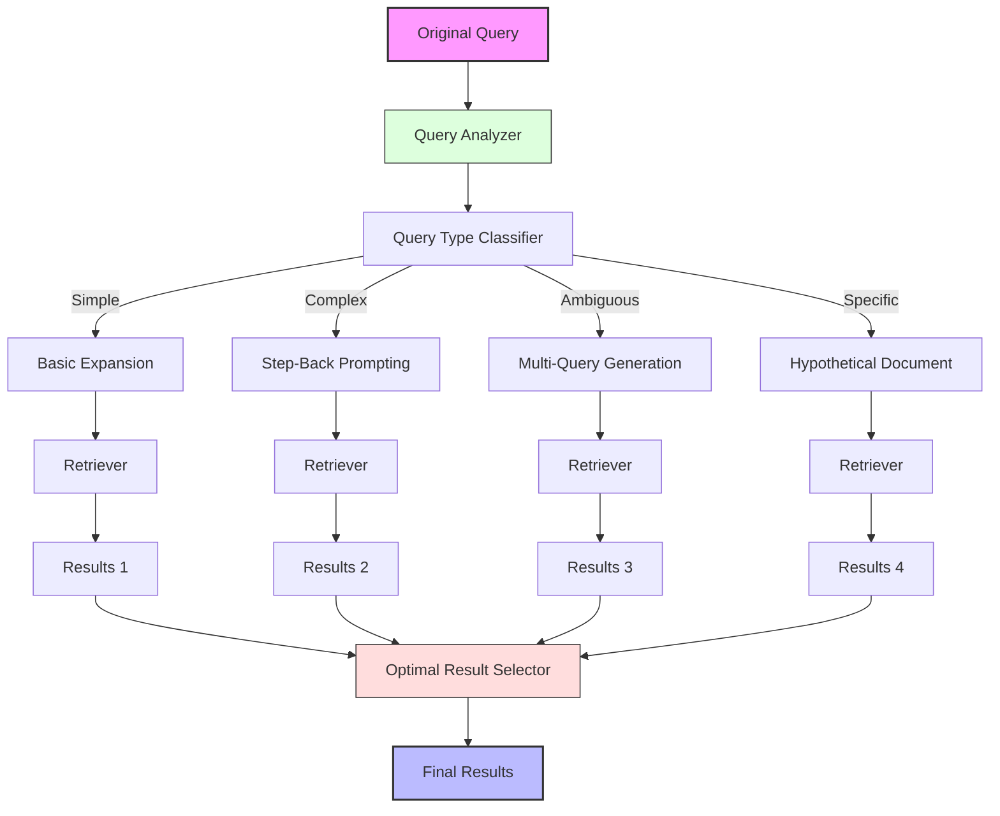
```mermaid
graph TD
    Query[Original Query] --> QueryAnalyzer[Query Analyzer]
    
    QueryAnalyzer --> QueryType[Query Type Classifier]
    QueryType -->|Simple| BasicExpansion[Basic Expansion]
    QueryType -->|Complex| StepBack[Step-Back Prompting]
    QueryType -->|Ambiguous| MultiQuery[Multi-Query Generation]
    QueryType -->|Specific| HyDE[Hypothetical Document]
    
    BasicExpansion --> Retriever1[Retriever]
    StepBack --> Retriever2[Retriever]
    MultiQuery --> Retriever3[Retriever]
    HyDE --> Retriever4[Retriever]
    
    Retriever1 --> Results1[Results 1]
    Retriever2 --> Results2[Results 2]
    Retriever3 --> Results3[Results 3]
    Retriever4 --> Results4[Results 4]
    
    Results1 --> OptimalSelector[Optimal Result Selector]
    Results2 --> OptimalSelector
    Results3 --> OptimalSelector
    Results4 --> OptimalSelector
    
    OptimalSelector --> FinalResults[Final Results]
    
    style Query fill:#f9f,stroke:#333,stroke-width:2px
    style FinalResults fill:#bbf,stroke:#333,stroke-width:2px
    style QueryAnalyzer fill:#dfd,stroke:#333,stroke-width:1px
    style OptimalSelector fill:#fdd,stroke:#333,stroke-width:1px
```

## 3. Reranking Systems

### Stage 1: Basic Retrieval Without Reranking

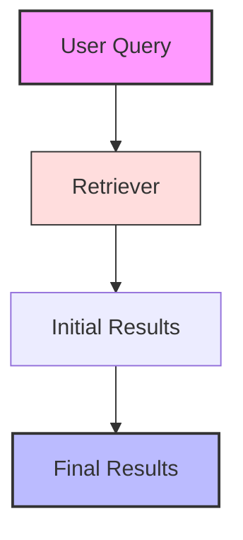
```mermaid
graph TD
    Query[User Query] --> Retriever[Retriever]
    Retriever --> Results[Initial Results]
    Results --> FinalResults[Final Results]
    
    style Query fill:#f9f,stroke:#333,stroke-width:2px
    style FinalResults fill:#bbf,stroke:#333,stroke-width:2px
    style Retriever fill:#fdd,stroke:#333,stroke-width:1px
```

### Stage 2: Simple Reranking

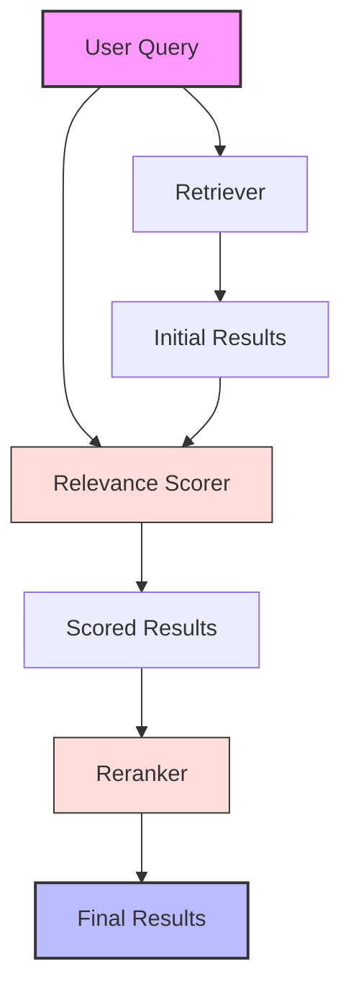
```mermaid
graph TD
    Query[User Query] --> Retriever[Retriever]
    Retriever --> InitialResults[Initial Results]
    
    Query --> RelevanceScorer[Relevance Scorer]
    InitialResults --> RelevanceScorer
    
    RelevanceScorer --> ScoredResults[Scored Results]
    ScoredResults --> Reranker[Reranker]
    
    Reranker --> FinalResults[Final Results]
    
    style Query fill:#f9f,stroke:#333,stroke-width:2px
    style FinalResults fill:#bbf,stroke:#333,stroke-width:2px
    style RelevanceScorer fill:#fdd,stroke:#333,stroke-width:1px
    style Reranker fill:#fdd,stroke:#333,stroke-width:1px
```

### Stage 3: Advanced Reranking Techniques

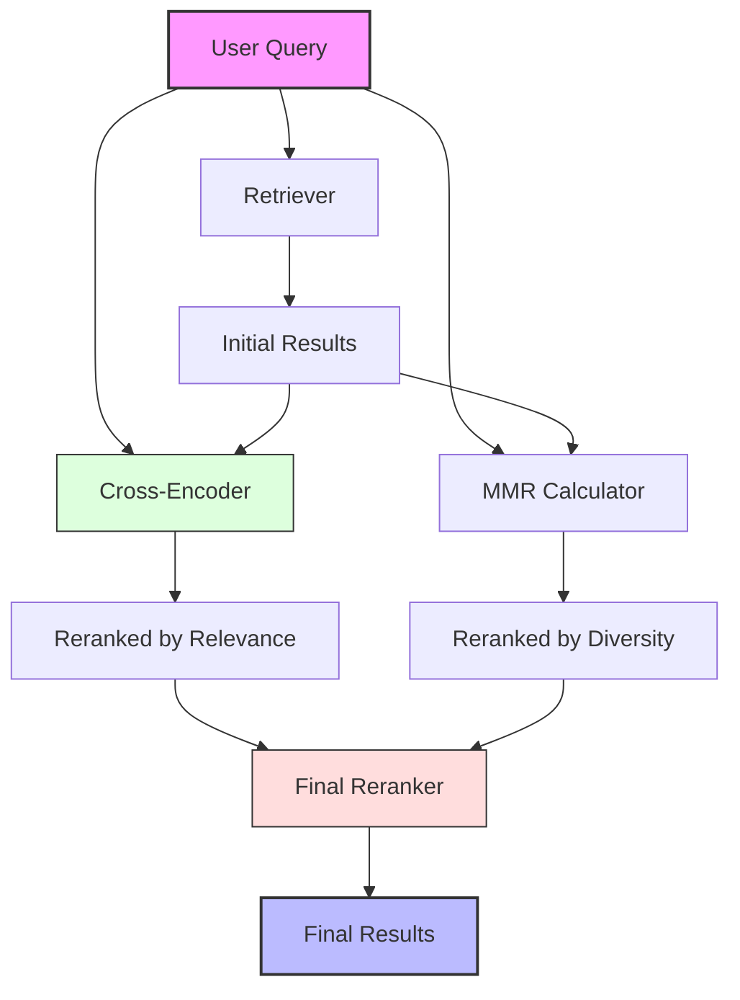
```mermaid
graph TD
    Query[User Query] --> Retriever[Retriever]
    Retriever --> InitialResults[Initial Results]
    
    Query --> CrossEncoder[Cross-Encoder]
    InitialResults --> CrossEncoder
    
    Query --> MMRCalculator[MMR Calculator]
    InitialResults --> MMRCalculator
    
    CrossEncoder --> RerankedByCE[Reranked by Relevance]
    MMRCalculator --> RerankedByMMR[Reranked by Diversity]
    
    RerankedByCE --> FinalReranker[Final Reranker]
    RerankedByMMR --> FinalReranker
    
    FinalReranker --> FinalResults[Final Results]
    
    style Query fill:#f9f,stroke:#333,stroke-width:2px
    style FinalResults fill:#bbf,stroke:#333,stroke-width:2px
    style CrossEncoder fill:#dfd,stroke:#333,stroke-width:1px
    style FinalReranker fill:#fdd,stroke:#333,stroke-width:1px
```

### Stage 4: Complete Reranking System

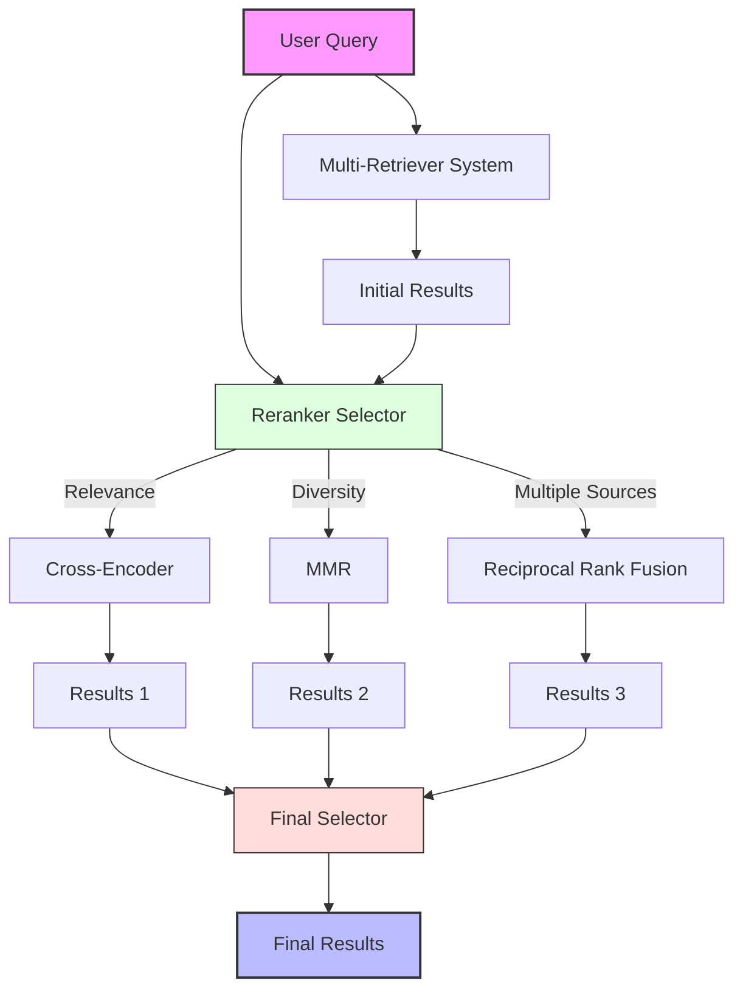
```mermaid
graph TD
    Query[User Query] --> MultiRetriever[Multi-Retriever System]
    MultiRetriever --> InitialResults[Initial Results]
    
    Query --> RerankerSelector[Reranker Selector]
    InitialResults --> RerankerSelector
    
    RerankerSelector -->|Relevance| CrossEncoder[Cross-Encoder]
    RerankerSelector -->|Diversity| MMR[MMR]
    RerankerSelector -->|Multiple Sources| RRF[Reciprocal Rank Fusion]
    
    CrossEncoder --> Results1[Results 1]
    MMR --> Results2[Results 2]
    RRF --> Results3[Results 3]
    
    Results1 --> FinalSelector[Final Selector]
    Results2 --> FinalSelector
    Results3 --> FinalSelector
    
    FinalSelector --> FinalResults[Final Results]
    
    style Query fill:#f9f,stroke:#333,stroke-width:2px
    style FinalResults fill:#bbf,stroke:#333,stroke-width:2px
    style RerankerSelector fill:#dfd,stroke:#333,stroke-width:1px
    style FinalSelector fill:#fdd,stroke:#333,stroke-width:1px
```

## 4. Adaptive RAG Systems

### Stage 1: Basic RAG

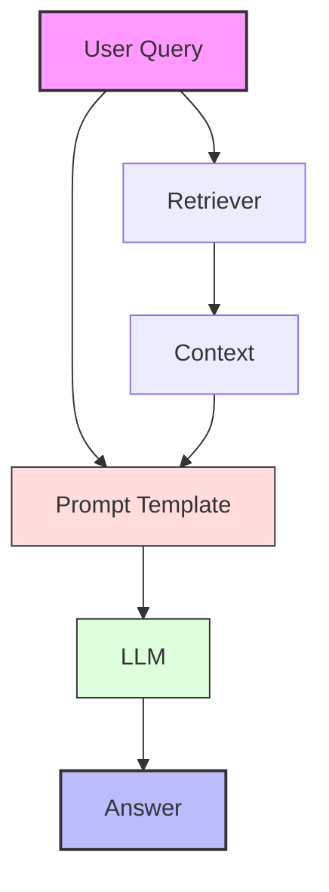
```mermaid
graph TD
    Query[User Query] --> Retriever[Retriever]
    Retriever --> Context[Context]
    
    Query --> PromptTemplate[Prompt Template]
    Context --> PromptTemplate
    
    PromptTemplate --> LLM[LLM]
    LLM --> Answer[Answer]
    
    style Query fill:#f9f,stroke:#333,stroke-width:2px
    style Answer fill:#bbf,stroke:#333,stroke-width:2px
    style LLM fill:#dfd,stroke:#333,stroke-width:1px
    style PromptTemplate fill:#fdd,stroke:#333,stroke-width:1px
```

### Stage 2: Self-Querying Retrieval

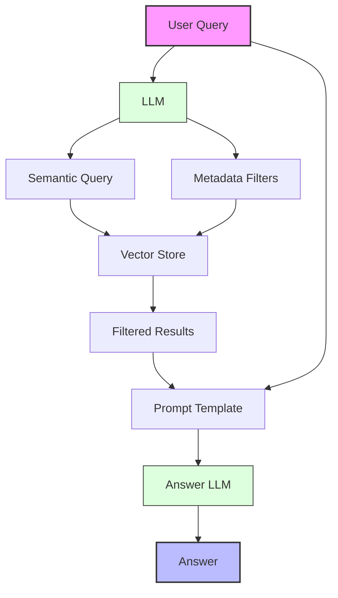
```mermaid
graph TD
    Query[User Query] --> LLM[LLM]
    
    LLM --> SemanticQuery[Semantic Query]
    LLM --> MetadataFilters[Metadata Filters]
    
    SemanticQuery --> VectorStore[Vector Store]
    MetadataFilters --> VectorStore
    
    VectorStore --> FilteredResults[Filtered Results]
    
    FilteredResults --> PromptTemplate[Prompt Template]
    Query --> PromptTemplate
    
    PromptTemplate --> AnswerLLM[Answer LLM]
    AnswerLLM --> Answer[Answer]
    
    style Query fill:#f9f,stroke:#333,stroke-width:2px
    style Answer fill:#bbf,stroke:#333,stroke-width:2px
    style LLM fill:#dfd,stroke:#333,stroke-width:1px
    style AnswerLLM fill:#dfd,stroke:#333,stroke-width:1px
```

### Stage 3: Query Routing

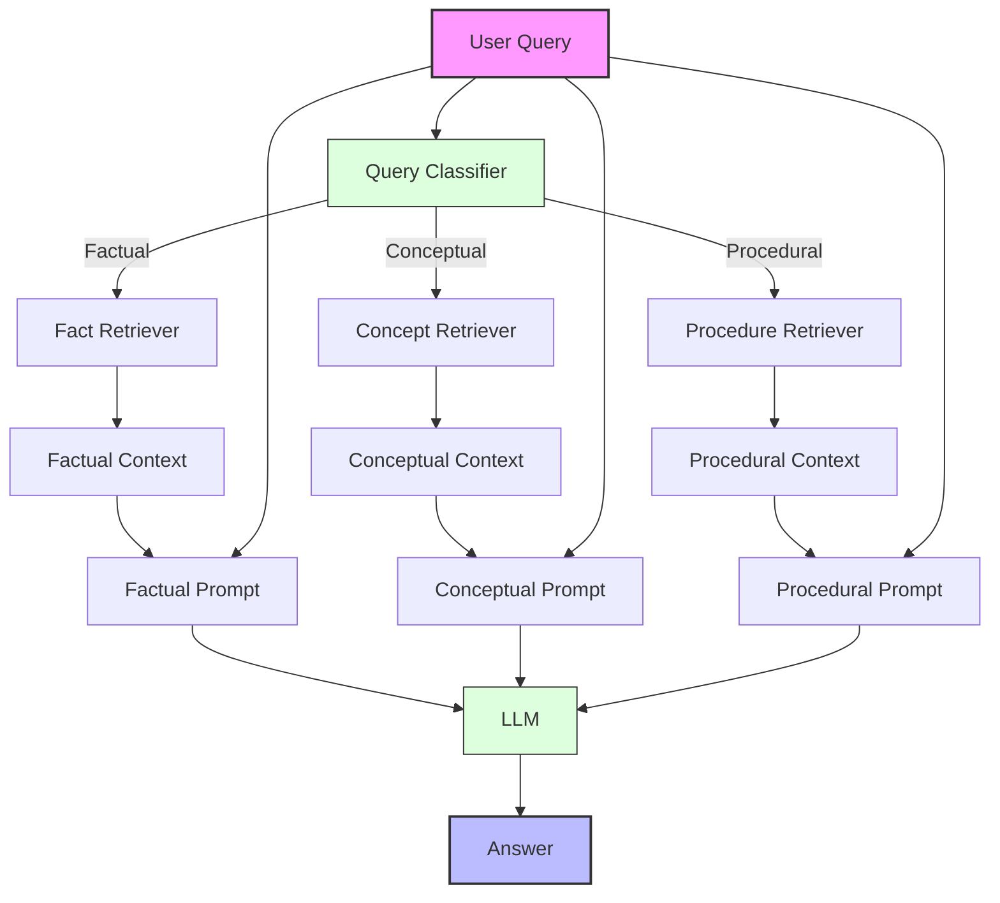
```mermaid
graph TD
    Query[User Query] --> QueryClassifier[Query Classifier]
    
    QueryClassifier -->|Factual| FactRetriever[Fact Retriever]
    QueryClassifier -->|Conceptual| ConceptRetriever[Concept Retriever]
    QueryClassifier -->|Procedural| ProcedureRetriever[Procedure Retriever]
    
    FactRetriever --> FactContext[Factual Context]
    ConceptRetriever --> ConceptContext[Conceptual Context]
    ProcedureRetriever --> ProcedureContext[Procedural Context]
    
    FactContext --> FactPrompt[Factual Prompt]
    ConceptContext --> ConceptPrompt[Conceptual Prompt]
    ProcedureContext --> ProcedurePrompt[Procedural Prompt]
    
    Query --> FactPrompt
    Query --> ConceptPrompt
    Query --> ProcedurePrompt
    
    FactPrompt --> LLM[LLM]
    ConceptPrompt --> LLM
    ProcedurePrompt --> LLM
    
    LLM --> Answer[Answer]
    
    style Query fill:#f9f,stroke:#333,stroke-width:2px
    style Answer fill:#bbf,stroke:#333,stroke-width:2px
    style QueryClassifier fill:#dfd,stroke:#333,stroke-width:1px
    style LLM fill:#dfd,stroke:#333,stroke-width:1px
```

### Stage 4: Complete Adaptive RAG System

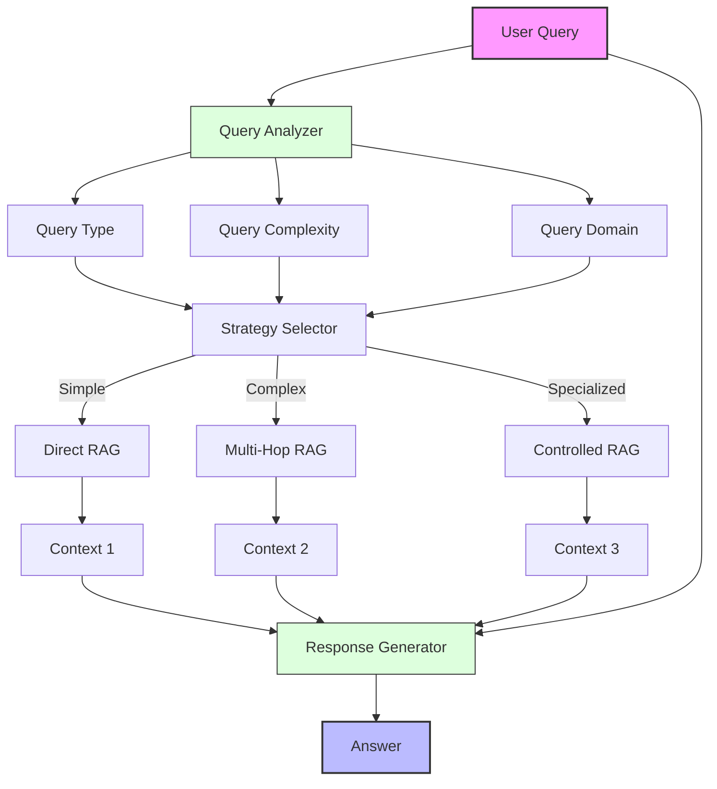
```mermaid
graph TD
    Query[User Query] --> QueryAnalyzer[Query Analyzer]
    
    QueryAnalyzer --> QueryType[Query Type]
    QueryAnalyzer --> QueryComplexity[Query Complexity]
    QueryAnalyzer --> QueryDomain[Query Domain]
    
    QueryType --> StrategySelector[Strategy Selector]
    QueryComplexity --> StrategySelector
    QueryDomain --> StrategySelector
    
    StrategySelector -->|Simple| DirectRAG[Direct RAG]
    StrategySelector -->|Complex| MultiHopRAG[Multi-Hop RAG]
    StrategySelector -->|Specialized| ControlledRAG[Controlled RAG]
    
    DirectRAG --> Context1[Context 1]
    MultiHopRAG --> Context2[Context 2]
    ControlledRAG --> Context3[Context 3]
    
    Context1 --> ResponseGenerator[Response Generator]
    Context2 --> ResponseGenerator
    Context3 --> ResponseGenerator
    
    Query --> ResponseGenerator
    ResponseGenerator --> Answer[Answer]
    
    style Query fill:#f9f,stroke:#333,stroke-width:2px
    style Answer fill:#bbf,stroke:#333,stroke-width:2px
    style QueryAnalyzer fill:#dfd,stroke:#333,stroke-width:1px
    style ResponseGenerator fill:#dfd,stroke:#333,stroke-width:1px
```

## 5. Research Literature Assistant

### Stage 1: Basic Paper Processing

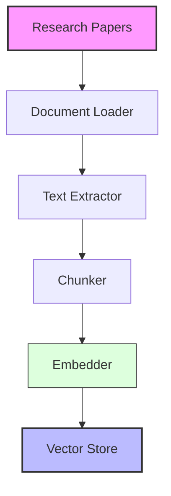
```mermaid
graph TD
    Papers[Research Papers] --> DocumentLoader[Document Loader]
    DocumentLoader --> TextExtractor[Text Extractor]
    TextExtractor --> Chunker[Chunker]
    Chunker --> Embedder[Embedder]
    Embedder --> VectorStore[Vector Store]
    
    style Papers fill:#f9f,stroke:#333,stroke-width:2px
    style VectorStore fill:#bbf,stroke:#333,stroke-width:2px
    style Embedder fill:#dfd,stroke:#333,stroke-width:1px
```

### Stage 2: Enhanced Paper Processing

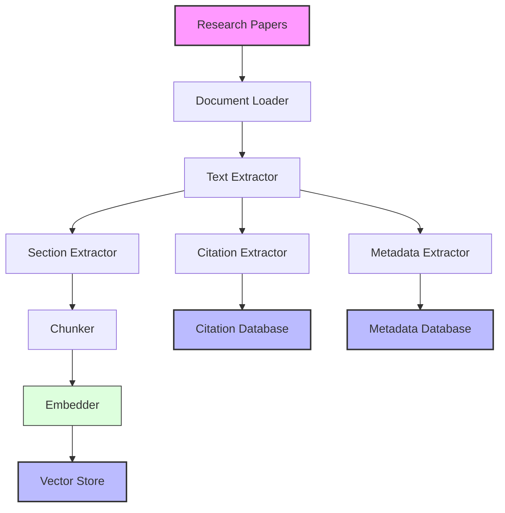
```mermaid
graph TD
    Papers[Research Papers] --> DocumentLoader[Document Loader]
    DocumentLoader --> TextExtractor[Text Extractor]
    
    TextExtractor --> SectionExtractor[Section Extractor]
    TextExtractor --> CitationExtractor[Citation Extractor]
    TextExtractor --> MetadataExtractor[Metadata Extractor]
    
    SectionExtractor --> Chunker[Chunker]
    Chunker --> Embedder[Embedder]
    Embedder --> VectorStore[Vector Store]
    
    CitationExtractor --> CitationDB[Citation Database]
    MetadataExtractor --> MetadataDB[Metadata Database]
    
    style Papers fill:#f9f,stroke:#333,stroke-width:2px
    style VectorStore fill:#bbf,stroke:#333,stroke-width:2px
    style CitationDB fill:#bbf,stroke:#333,stroke-width:2px
    style MetadataDB fill:#bbf,stroke:#333,stroke-width:2px
    style Embedder fill:#dfd,stroke:#333,stroke-width:1px
```

### Stage 3: Research Question Processing

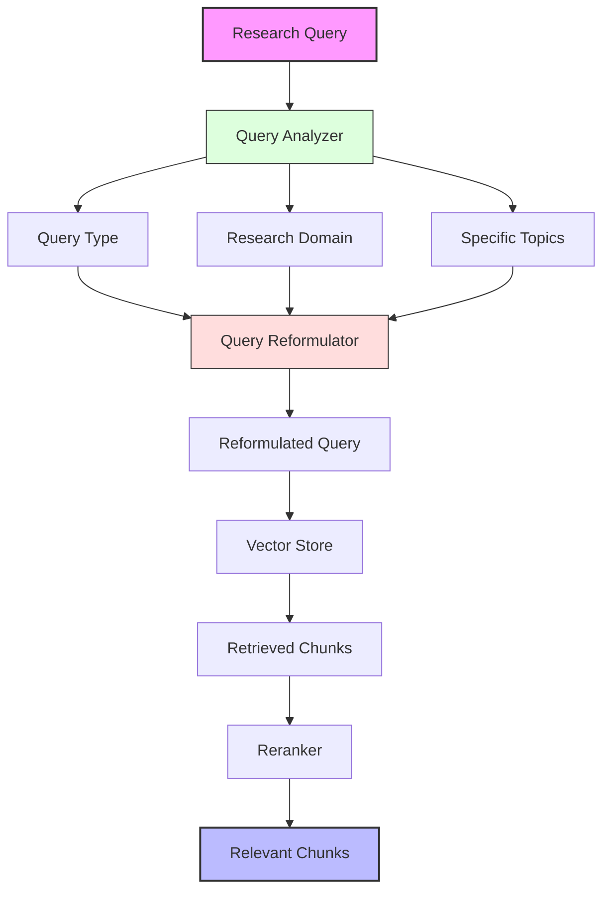
```mermaid
graph TD
    Query[Research Query] --> QueryAnalyzer[Query Analyzer]
    
    QueryAnalyzer --> QueryType[Query Type]
    QueryAnalyzer --> ResearchDomain[Research Domain]
    QueryAnalyzer --> SpecificTopics[Specific Topics]
    
    QueryType --> QueryReformulator[Query Reformulator]
    ResearchDomain --> QueryReformulator
    SpecificTopics --> QueryReformulator
    
    QueryReformulator --> ReformulatedQuery[Reformulated Query]
    
    ReformulatedQuery --> VectorStore[Vector Store]
    VectorStore --> RetrievedChunks[Retrieved Chunks]
    
    RetrievedChunks --> Reranker[Reranker]
    Reranker --> RelevantChunks[Relevant Chunks]
    
    style Query fill:#f9f,stroke:#333,stroke-width:2px
    style RelevantChunks fill:#bbf,stroke:#333,stroke-width:2px
    style QueryAnalyzer fill:#dfd,stroke:#333,stroke-width:1px
    style QueryReformulator fill:#fdd,stroke:#333,stroke-width:1px
```

### Stage 4: Complete Research Literature Assistant

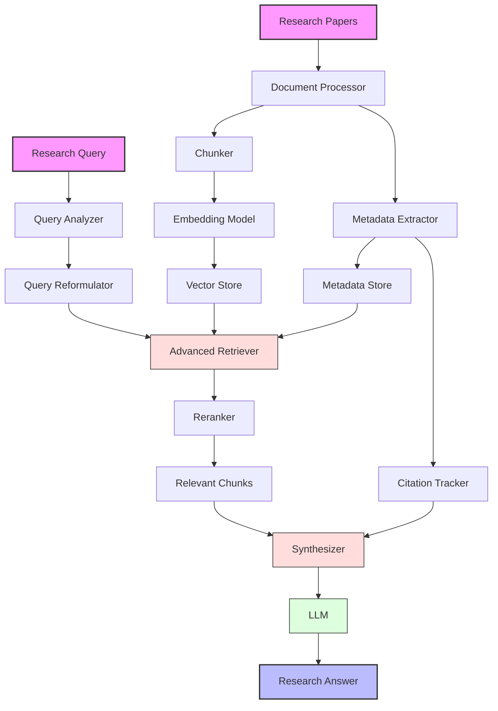
```mermaid
graph TD
    Papers[Research Papers] --> DocumentProcessor[Document Processor]
    DocumentProcessor --> Chunker[Chunker]
    DocumentProcessor --> MetadataExtractor[Metadata Extractor]
    
    Chunker --> EmbeddingModel[Embedding Model]
    EmbeddingModel --> VectorStore[Vector Store]
    
    MetadataExtractor --> CitationTracker[Citation Tracker]
    MetadataExtractor --> MetadataStore[Metadata Store]
    
    Query[Research Query] --> QueryAnalyzer[Query Analyzer]
    QueryAnalyzer --> QueryReformulator[Query Reformulator]
    
    QueryReformulator --> AdvancedRetriever[Advanced Retriever]
    VectorStore --> AdvancedRetriever
    MetadataStore --> AdvancedRetriever
    
    AdvancedRetriever --> Reranker[Reranker]
    Reranker --> RelevantChunks[Relevant Chunks]
    
    RelevantChunks --> Synthesizer[Synthesizer]
    CitationTracker --> Synthesizer
    
    Synthesizer --> LLM[LLM]
    LLM --> Answer[Research Answer]
    
    style Papers fill:#f9f,stroke:#333,stroke-width:2px
    style Query fill:#f9f,stroke:#333,stroke-width:2px
    style Answer fill:#bbf,stroke:#333,stroke-width:2px
    style AdvancedRetriever fill:#fdd,stroke:#333,stroke-width:1px
    style Synthesizer fill:#fdd,stroke:#333,stroke-width:1px
    style LLM fill:#dfd,stroke:#333,stroke-width:1px
```
