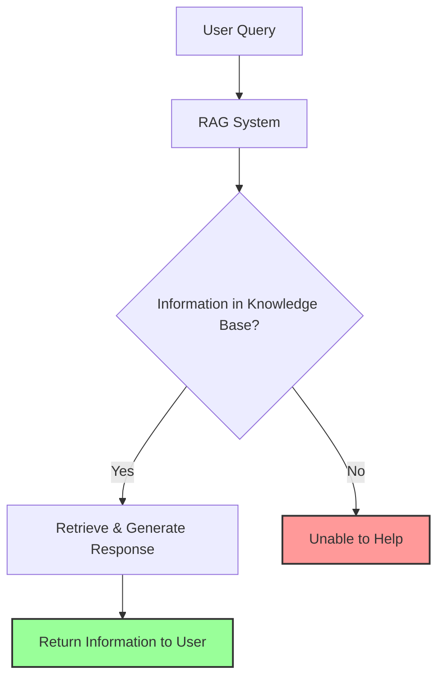
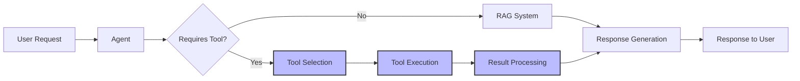
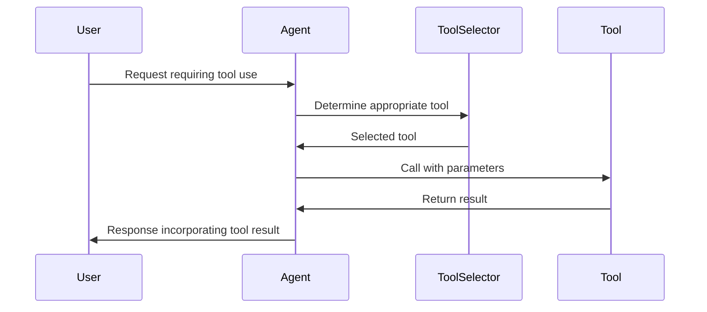
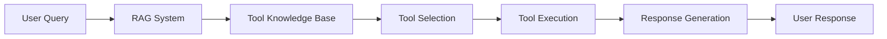
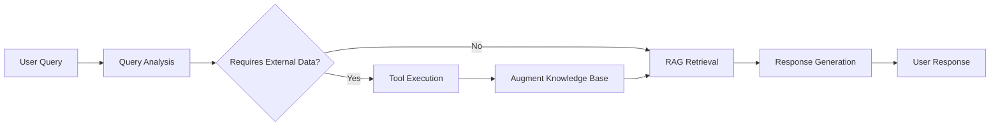
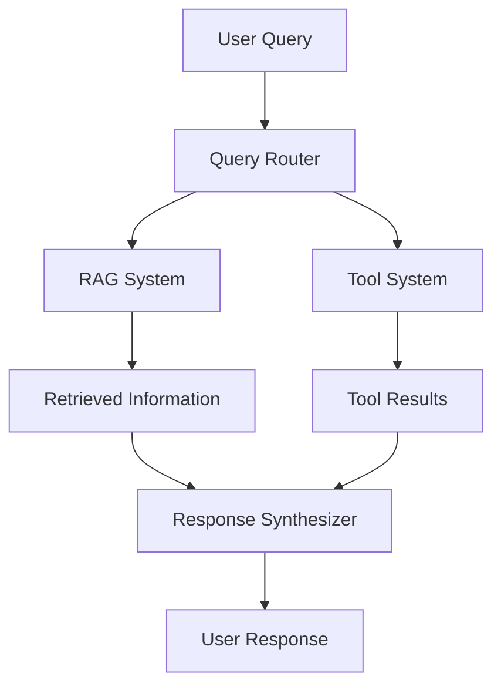

# 🔌 Module 5.5: From RAG to Tools - Expanding Agent Capabilities 🛠️

## 🎯 Learning Objectives

By the end of this lesson, you will be able to:
- 🧠 Understand the limitations of pure RAG systems and why tools are necessary
- 🔄 Recognize the evolution from information retrieval to action execution
- 🛠️ Identify different types of tools and their applications
- 📋 Understand JSON Schema for defining tool interfaces
- 🔌 Grasp basic function calling patterns for tool integration
- 🧩 Conceptualize how tools and RAG systems work together
- 🚀 Prepare for building agents that can take actions in the world

## 📚 Introduction: Beyond Information Retrieval


### The Evolution of AI Assistants

We've come a long way in our journey of building AI systems:

1. **Basic LLM Responses** (Module 1): Simple prompt-response patterns
2. **Memory Systems** (Module 2): Remembering context and past interactions
3. **Structured Outputs** (Module 3): Validating and formatting responses
4. **Document Processing & RAG** (Module 4): Retrieving and using external knowledge
5. **Advanced RAG** (Module 5): Sophisticated information retrieval and synthesis

But there's a fundamental limitation to all these systems: they can only **provide information**. They can't **take actions** in the world.

As the famous AI researcher Yann LeCun noted:
> "Intelligence is not just about knowing, but also about doing."

This is where tools come in.

---

## 🧩 The Limitations of Pure RAG Systems

RAG systems have revolutionized how AI assistants access and use information, but they face several key limitations:

### 1. Information-Only Barrier

RAG systems can only retrieve and present information that exists in their knowledge base or documents. They cannot:
- Perform calculations beyond what's in their training data
- Access real-time information (weather, stock prices, news)
- Interact with external systems (databases, APIs, services)
- Create or modify files
- Execute code

### 2. Static Knowledge

Even with the most advanced retrieval techniques, RAG systems are limited to:
- Information available at indexing time
- Content in formats that can be processed and embedded
- Knowledge that doesn't require specialized tools to interpret

### 3. Lack of Agency

Pure RAG systems cannot:
- Take actions on behalf of users
- Make decisions that require external validation
- Verify information against authoritative sources in real-time
- Adapt to changing environments



---

## 🔌 Why Agents Need Tools: The Motivation

### Bridging the Gap Between Knowledge and Action

Tools transform AI systems from passive information providers to active problem solvers:

| Capability | Without Tools | With Tools |
|------------|---------------|------------|
| Real-time data | ❌ Limited to indexed information | ✅ Can fetch current weather, news, prices |
| Computation | ❌ Limited to training capabilities | ✅ Can perform complex calculations, run simulations |
| System interaction | ❌ Cannot access external systems | ✅ Can query databases, call APIs, use services |
| Content creation | ❌ Limited to text generation | ✅ Can create images, code, documents, spreadsheets |
| Verification | ❌ Cannot verify against external sources | ✅ Can check facts against authoritative sources |
| Persistence | ❌ Cannot save information long-term | ✅ Can store data in databases, files, or services |

### The Agent-Tool Paradigm

The integration of tools transforms our RAG systems into true agents that can:

1. **Sense**: Understand user needs and context (from previous modules)
2. **Think**: Reason about what tools to use and how (new capability)
3. **Act**: Execute tools to accomplish tasks (new capability)

This paradigm shift enables a new generation of AI assistants that can solve complex problems requiring both information and action.



---

## 🧰 Understanding Tools: A Conceptual Framework

### What is a Tool in the Context of AI?

A **tool** is a function or capability that extends an AI system's abilities beyond language generation, allowing it to:
- Access external data or services
- Perform specialized computations
- Create or manipulate content
- Interact with systems or devices

### Anatomy of a Tool

Every tool has these key components:

1. **Name**: A unique identifier for the tool
2. **Description**: What the tool does and when to use it
3. **Parameters**: The inputs the tool requires
4. **Return Value**: What the tool produces as output
5. **Schema**: A formal definition of the tool's interface (often in JSON Schema)

### Tool Selection and Execution Flow



---

## 🛠️ Types of Tools and Their Applications

AI systems can leverage a wide variety of tools:

### 1. Information Access Tools
- **Search engines**: Find information on the web
- **API clients**: Access structured data from services
- **Database queries**: Retrieve specific information from databases
- **RSS feeds**: Get latest news or updates

### 2. Computational Tools
- **Calculators**: Perform mathematical operations
- **Spreadsheets**: Analyze tabular data
- **Statistical analysis**: Process datasets
- **Simulations**: Model complex systems

### 3. Content Creation Tools
- **Image generators**: Create visuals from descriptions
- **Code generators**: Write and execute code
- **Document creators**: Generate formatted documents
- **Email composers**: Draft and send emails

### 4. System Interaction Tools
- **File system operations**: Create, read, update, delete files
- **Application controllers**: Interact with software
- **Device controllers**: Control hardware or IoT devices
- **Workflow automators**: Trigger processes or pipelines

### 5. Specialized Domain Tools
- **Financial calculators**: Compute investment returns, loan payments
- **Legal document analyzers**: Extract information from contracts
- **Medical diagnostic assistants**: Help interpret symptoms
- **Scientific data processors**: Analyze experimental results

---

## 📋 Defining Tool Interfaces with JSON Schema

Tools need clear interfaces so the AI knows how to use them correctly. JSON Schema provides a standard way to define these interfaces.

### What is JSON Schema?

JSON Schema is a vocabulary that allows you to annotate and validate JSON documents. For tools, it defines:
- Required and optional parameters
- Data types for each parameter
- Constraints on parameter values
- Documentation for the tool and its parameters

### Example: Weather Tool Schema

```json
{
  "name": "get_weather",
  "description": "Get the current weather for a location",
  "parameters": {
    "type": "object",
    "properties": {
      "location": {
        "type": "string",
        "description": "The city and state or country (e.g., 'San Francisco, CA')"
      },
      "unit": {
        "type": "string",
        "enum": ["celsius", "fahrenheit"],
        "description": "The temperature unit to use",
        "default": "celsius"
      }
    },
    "required": ["location"]
  }
}
```

### How AI Systems Use Tool Schemas

1. **Tool Discovery**: The AI learns what tools are available
2. **Parameter Validation**: Ensures all required parameters are provided
3. **Type Checking**: Confirms parameters are of the correct type
4. **Documentation**: Understands how and when to use each tool

---

## 🔌 Basic Function Calling Patterns

Function calling is how AI systems invoke tools. There are several patterns for implementing this:

### 1. Direct Function Calling

The AI directly calls a function when it determines a tool is needed:

```python
def get_weather(location, unit="celsius"):
    # Implementation to fetch weather data
    return weather_data

# AI determines it needs weather information
result = get_weather("New York, NY", "fahrenheit")
```

### 2. LLM-Powered Function Calling

Modern LLMs can generate structured function calls based on user requests:

```python
# Define available functions
tools = [
    {
        "name": "get_weather",
        "description": "Get the current weather for a location",
        "parameters": {
            "type": "object",
            "properties": {
                "location": {"type": "string"},
                "unit": {"type": "string", "enum": ["celsius", "fahrenheit"]}
            },
            "required": ["location"]
        }
    }
]

# User request
user_message = "What's the weather like in Tokyo right now?"

# LLM generates a function call
response = llm.generate_function_call(user_message, tools)
# response might be: {"name": "get_weather", "parameters": {"location": "Tokyo", "unit": "celsius"}}

# Execute the function
function_name = response["name"]
parameters = response["parameters"]
result = globals()[function_name](**parameters)
```

### 3. Tool Routing with LCEL

LangChain Expression Language provides elegant patterns for tool routing:

```python
from langchain.agents import Tool
from langchain.agents import AgentExecutor
from langchain.agents.openai_functions_agent.base import OpenAIFunctionsAgent
from langchain.schema.runnable import RunnablePassthrough

# Define tools
tools = [
    Tool(
        name="get_weather",
        func=get_weather,
        description="Get the current weather for a location"
    )
]

# Create prompt
prompt = ChatPromptTemplate.from_messages([
    ("system", "You are a helpful assistant that can use tools to get information."),
    ("human", "{input}")
])

# Create agent
agent = OpenAIFunctionsAgent.from_llm_and_tools(llm=llm, tools=tools, prompt=prompt)
agent_executor = AgentExecutor(agent=agent, tools=tools)

# Create chain
chain = RunnablePassthrough.assign(
    agent_outcome=lambda x: agent_executor.invoke({"input": x["input"]})
) | (lambda x: x["agent_outcome"])

# Run chain
result = chain.invoke({"input": "What's the weather like in Tokyo right now?"})
```

---

## 🧩 Enhancing RAG with Tools: The Best of Both Worlds

RAG systems and tools complement each other perfectly:

### 1. RAG-Enhanced Tool Selection

Use RAG to retrieve information about which tools to use:



### 2. Tool-Enhanced RAG

Use tools to augment RAG capabilities:



### 3. Hybrid Approaches

Combine RAG and tools in sophisticated ways:



---

## 🌐 Real-World Applications: Tools in Action

### 1. Research Assistant with Data Analysis

A research assistant that can:
- Retrieve academic papers (RAG)
- Run statistical analyses on data (Tool)
- Generate visualizations of results (Tool)
- Cite sources properly (RAG)

### 2. Financial Advisor

A financial advisor that can:
- Explain investment concepts (RAG)
- Calculate investment returns (Tool)
- Fetch current market data (Tool)
- Generate personalized recommendations (RAG + Tool)

### 3. Travel Planner

A travel planner that can:
- Provide information about destinations (RAG)
- Check current flight prices (Tool)
- Book reservations (Tool)
- Generate itineraries based on preferences (RAG + Tool)

### 4. Coding Assistant

A coding assistant that can:
- Explain programming concepts (RAG)
- Generate code snippets (RAG)
- Execute and test code (Tool)
- Debug errors (RAG + Tool)

---

## 💪 Practice Exercises

1. **Tool Identification**: Identify five tasks that require tools beyond what a pure RAG system can provide.

2. **Schema Definition**: Write a JSON Schema for a calculator tool that can perform basic arithmetic operations.

3. **Tool Selection Logic**: Design a decision tree for when to use RAG vs. tools vs. both for different types of user queries.

4. **Integration Planning**: Sketch how you would integrate a weather API tool with a travel planning RAG system.

5. **Function Calling Implementation**: Implement a simple function calling mechanism that allows an AI to use a calculator tool.

---

## 🔍 Key Takeaways

1. **Beyond Information**: Tools extend AI capabilities from information retrieval to action execution.

2. **Complementary Approaches**: RAG and tools work together to create more powerful AI systems.

3. **Structured Interfaces**: JSON Schema provides a standard way to define tool interfaces.

4. **Function Calling**: Modern LLMs can generate structured function calls based on user needs.

5. **Hybrid Systems**: The most powerful AI assistants combine RAG and tools in sophisticated ways.

6. **Real-World Impact**: Tool integration enables AI systems to solve complex real-world problems.

---

## 📚 Resources

- [LangChain Tools Documentation](https://python.langchain.com/docs/modules/agents/tools/)
- [OpenAI Function Calling Guide](https://platform.openai.com/docs/guides/function-calling)
- [JSON Schema Specification](https://json-schema.org/specification)
- [Building AI Assistants with Tools](https://www.deeplearning.ai/short-courses/functions-tools-agents/)
- [LangChain Expression Language for Tool Use](https://python.langchain.com/docs/expression_language/how_to/tools)
- [Anthropic's Claude Function Calling](https://docs.anthropic.com/claude/docs/functions)

---

## 🚀 Next Steps

In Module 6, we'll dive deep into tool integration and function calling, exploring:
- Advanced tool use patterns
- Building a tool registry system
- Implementing sophisticated function calling
- Creating tool chains for complex tasks
- Developing tool verification systems

Get ready to transform your AI assistants from information providers to action takers!
