# 📊 Module 5: Advanced RAG Systems - Diagrams

This document contains diagrams illustrating the key concepts and architectures in Module 5.

## 🔍 Advanced Retrieval Strategies

### Hybrid Search Architecture

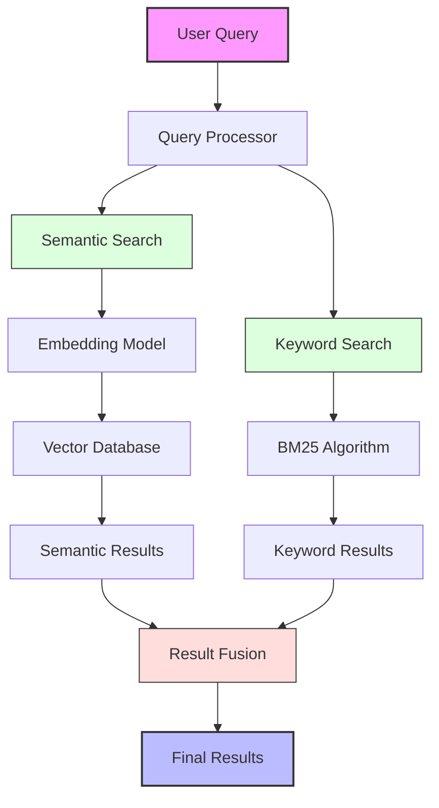

### Multi-Index Retrieval

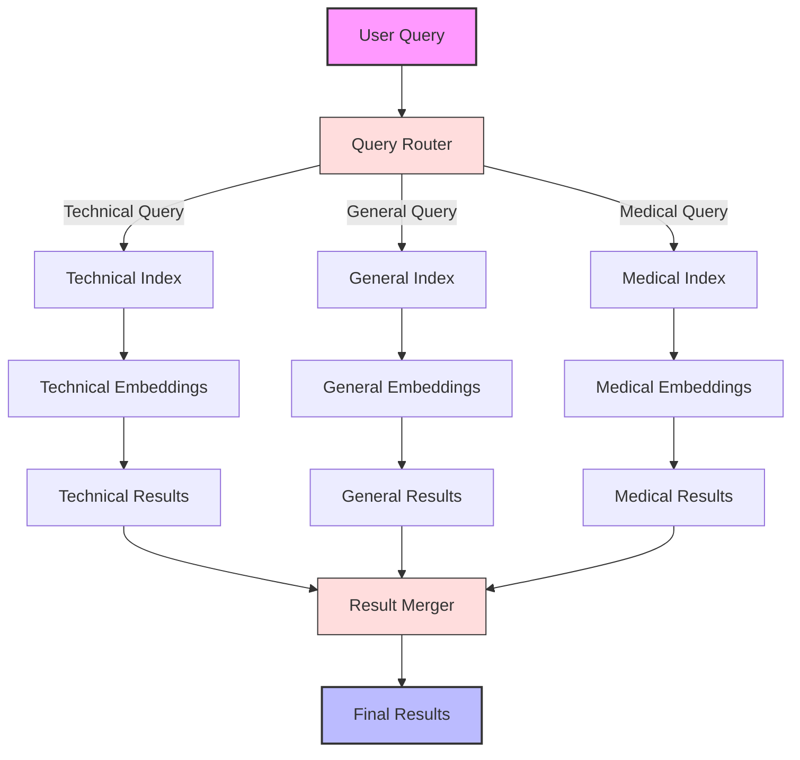

### Parent Document Retrieval

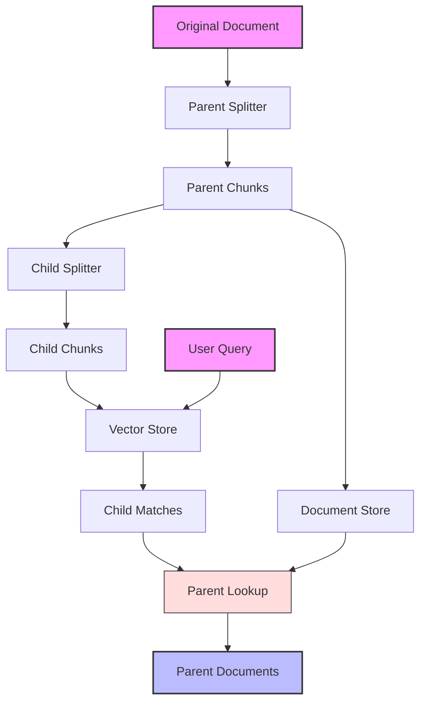

### Contextual Compression

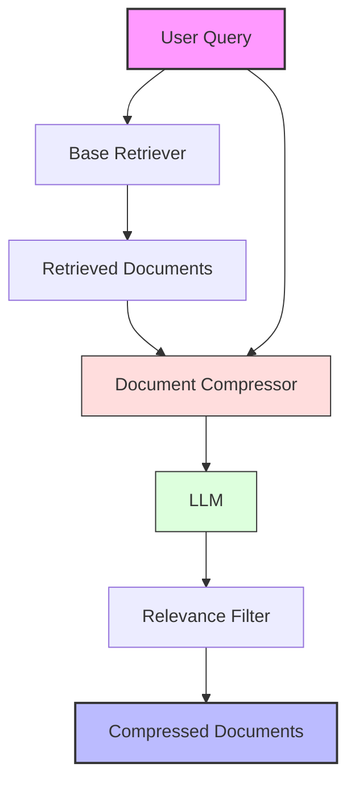

## 🔄 Query Transformation Techniques

### Query Expansion Architecture

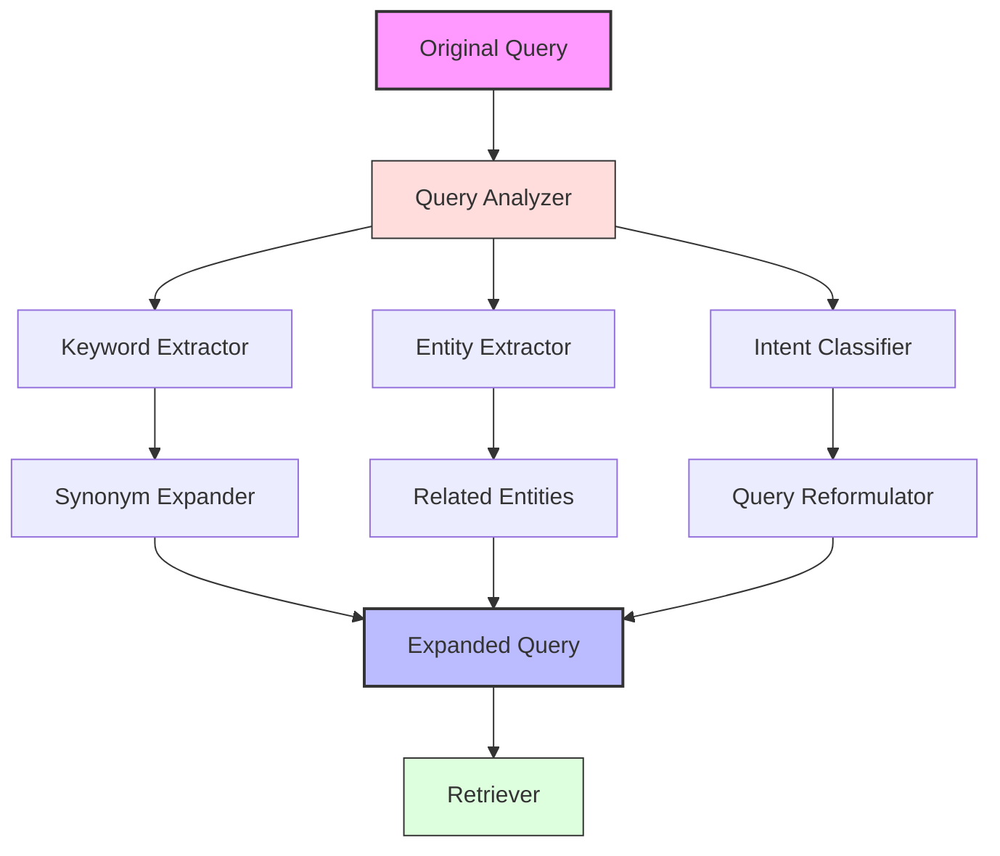

### Multi-Query Retrieval

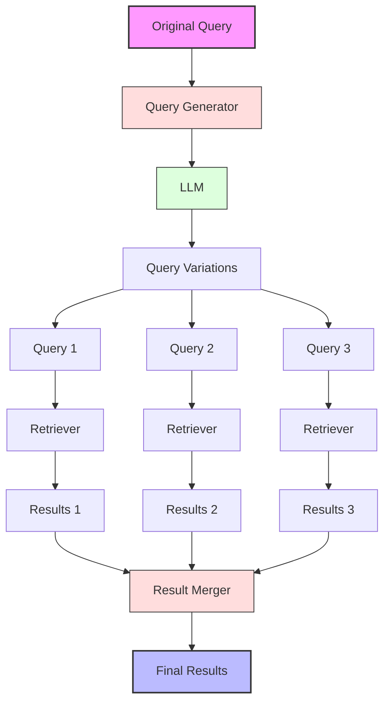

### HyDE (Hypothetical Document Embeddings)

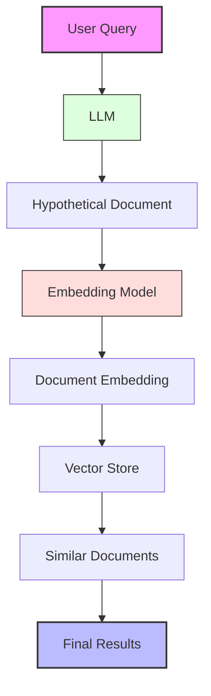

## 📊 Reranking and Result Optimization

### Cross-Encoder Reranking

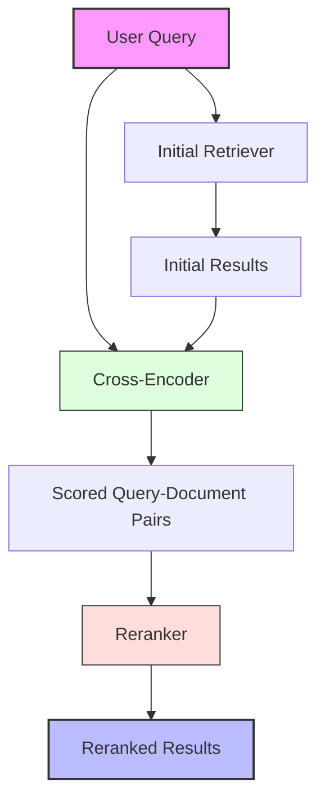

### Reciprocal Rank Fusion

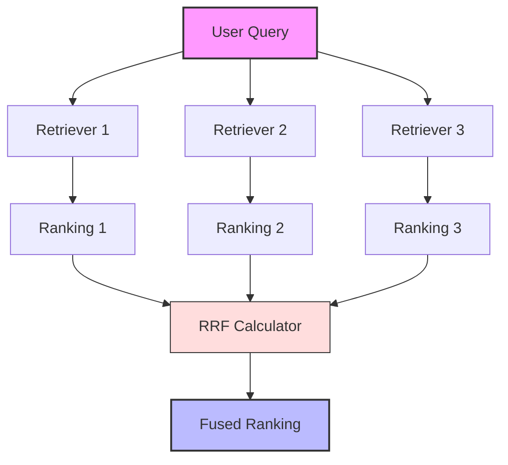

### Maximal Marginal Relevance

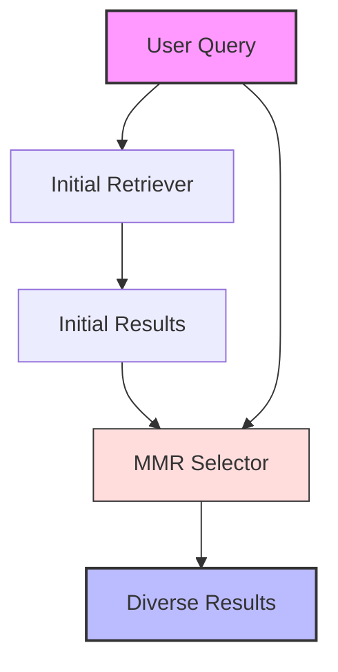

## 🧠 Self-Querying and Adaptive RAG

### Self-Querying Retrieval

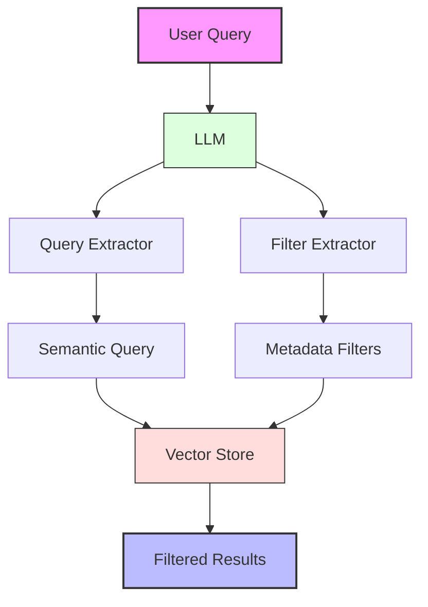

### Query Router

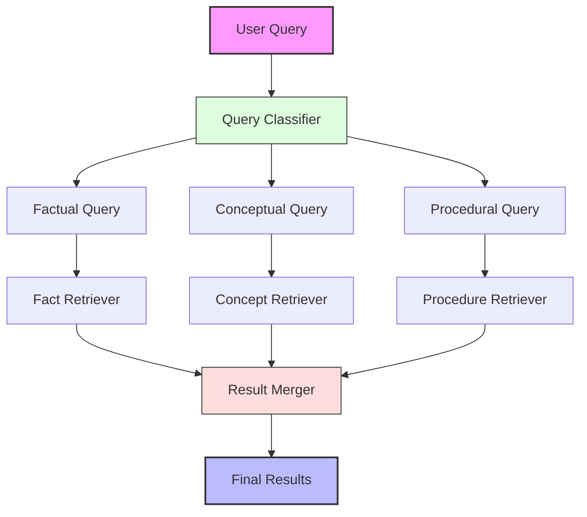

### Multi-Hop Reasoning

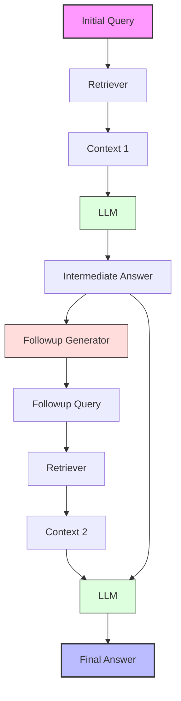

## 📚 Research Literature Assistant

### Complete Architecture

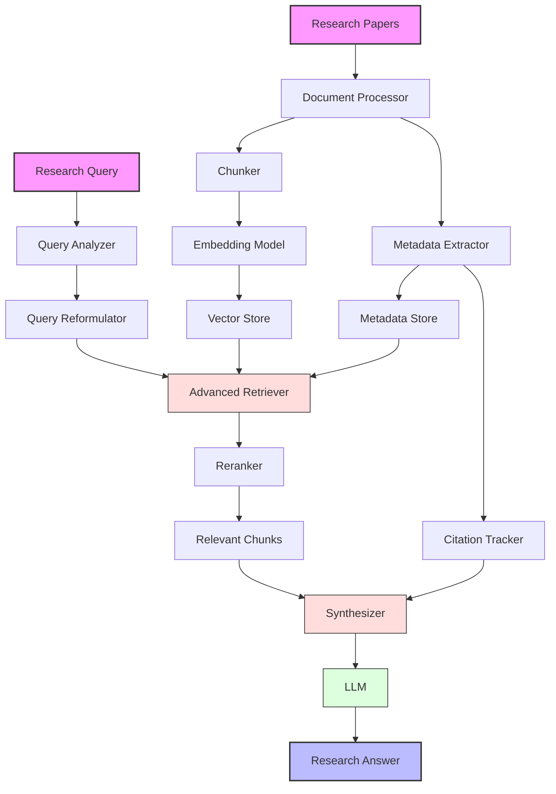

## 🔗 LCEL Implementation

### LCEL Chain Architecture

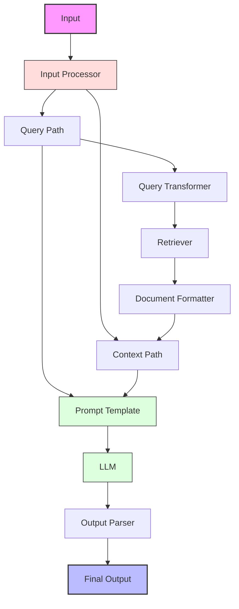

### LCEL Branching Logic

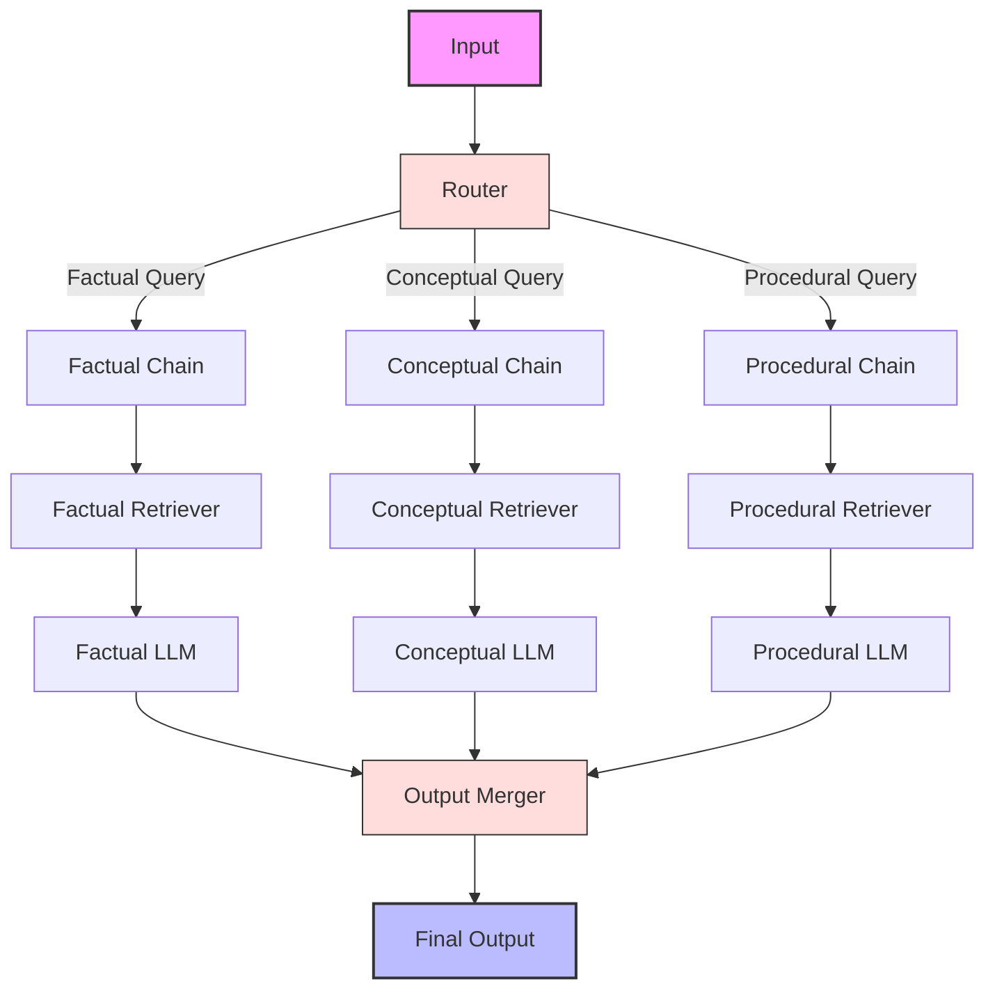
