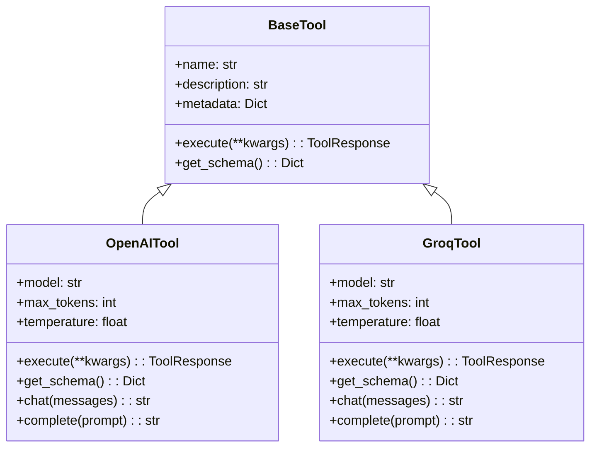

# 📊 Module 6: Diagrams

This directory contains diagrams illustrating the concepts and architecture of the tools and agents in Module 6.

## 📋 Available Diagrams

### Tool Architecture (`tool_architecture.md`)
Diagrams showing the architecture of the tool system, including the base tool interface and how different tools implement it.

### Multi-Tool Agent (`multi_tool_agent.md`)
Diagrams showing how multiple tools can be combined into a single agent.

### Function Calling Patterns (`function_calling_patterns.md`)
Diagrams illustrating different patterns for function calling with language models.

### Tool Selection Logic (`tool_selection_logic.md`)
Diagrams showing how agents can select the appropriate tool for a given task.

## 🎨 Diagram Style Guide

All diagrams use the following style conventions:

- **Blue boxes**: Core components
- **Green boxes**: Tools and utilities
- **Purple boxes**: User inputs and queries
- **Orange boxes**: External systems and APIs
- **Red boxes**: Error handling and validation

## 🔧 Creating New Diagrams

To create a new diagram:

1. Create a new markdown file in this directory
2. Use Mermaid syntax for the diagrams
3. Follow the style guide for consistency
4. Add a description of what the diagram illustrates

Example:

```markdown
# Tool Architecture

This diagram illustrates the architecture of the tool system.


```
