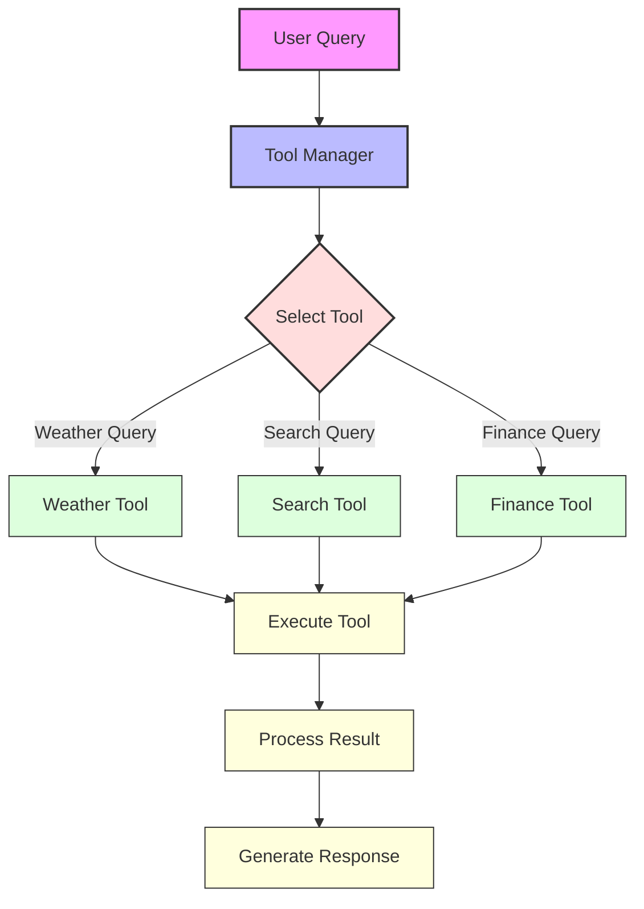
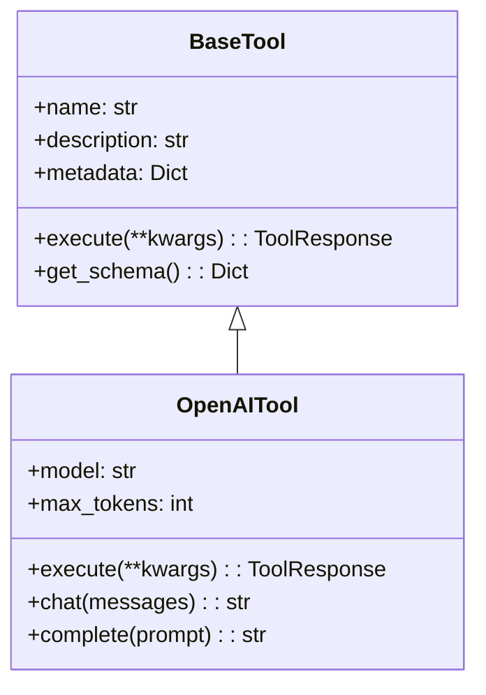

# 📊 Module 6: Diagrams

This directory contains diagrams illustrating the concepts and architecture of the tools and agents in Module 6.

## 📋 Available Diagrams

### [Tool Architecture](tool_architecture.md)
Diagrams showing the architecture of the tool system, including the base tool interface and how different tools implement it.

### [Function Calling Patterns](function_calling_patterns.md)
Diagrams illustrating different patterns for function calling with language models.

### [Tool Registry](tool_registry.md)
Diagrams showing the design and functionality of the tool registry system.

### [Multi-Tool Agent](multi_tool_agent.md)
Diagrams showing how multiple tools can be combined into a single agent.

### [Tool Verification](tool_verification.md)
Diagrams illustrating the verification and validation processes for tools.

### [Module 6 Progressive Journey](module6_progressive_journey.md)
Diagrams showing the progressive journey through Module 6 and how concepts build upon each other.

## 🎨 Diagram Style Guide

All diagrams use the following style conventions:

- **Blue boxes** (`fill:#bbf`): Core components, agents, and registries
- **Green boxes** (`fill:#dfd`): Tools, utilities, and implementations
- **Purple boxes** (`fill:#f9f`): User inputs, queries, and outputs
- **Yellow boxes** (`fill:#ffd`): Processes, steps, and features
- **Orange boxes** (`fill:#fdd`): Decision points, validation, and routing

## 🔧 Creating New Diagrams

To create a new diagram:

1. Create a new markdown file in this directory
2. Use Mermaid syntax for the diagrams
3. Follow the style guide for consistency
4. Add a description of what the diagram illustrates

### Important Styling Guidelines

When styling your diagrams:

1. **Always use classDef instead of style**: The `style` attribute can cause rendering issues in some Mermaid viewers, showing style definitions as separate nodes.

   ```mermaid
   # DON'T use this approach
   style A fill:#bbf,stroke:#333,stroke-width:2px
   style B,C fill:#dfd,stroke:#333,stroke-width:1px

   # DO use this approach instead
   classDef baseNode fill:#bbf,stroke:#333,stroke-width:2px;
   classDef toolNode fill:#dfd,stroke:#333,stroke-width:1px;

   class A baseNode;
   class B,C toolNode;
   ```

2. **Use descriptive class names**: Name your classes based on their function (e.g., `userNode`, `toolNode`) rather than generic names.

3. **Group similar nodes**: Apply the same class to nodes with similar functions to maintain visual consistency.

Example:

```markdown
# Tool Architecture

This diagram illustrates the architecture of the tool system.


```

For class diagrams, use this style:

```markdown

```

## 🔍 Viewing the Diagrams

These diagrams are written in Mermaid syntax, which is supported by many Markdown viewers including GitHub. To view the diagrams:

1. Open the markdown file in a Mermaid-compatible viewer
2. The diagrams will be rendered automatically
3. You can also copy the Mermaid code and paste it into the [Mermaid Live Editor](https://mermaid.live/) for interactive viewing and editing

If you encounter rendering issues:

1. Check for syntax errors in the Mermaid code
2. Ensure you're using `classDef` and `class` for styling instead of `style`
3. Verify that all node references in the `class` statements exist in the diagram
