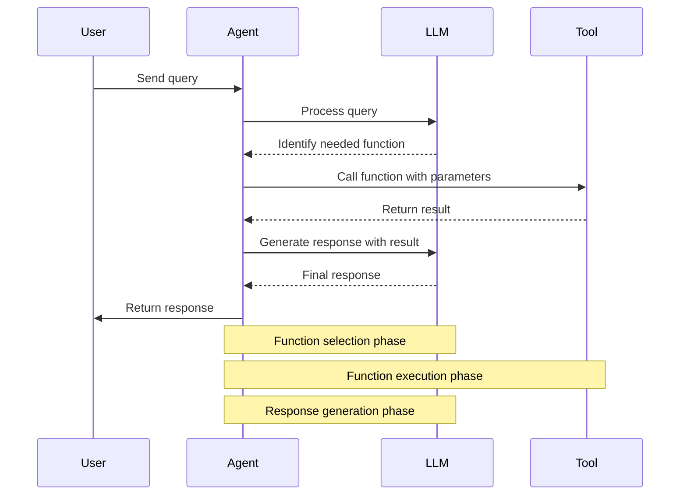
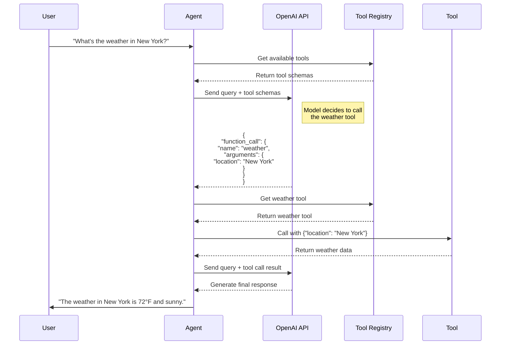
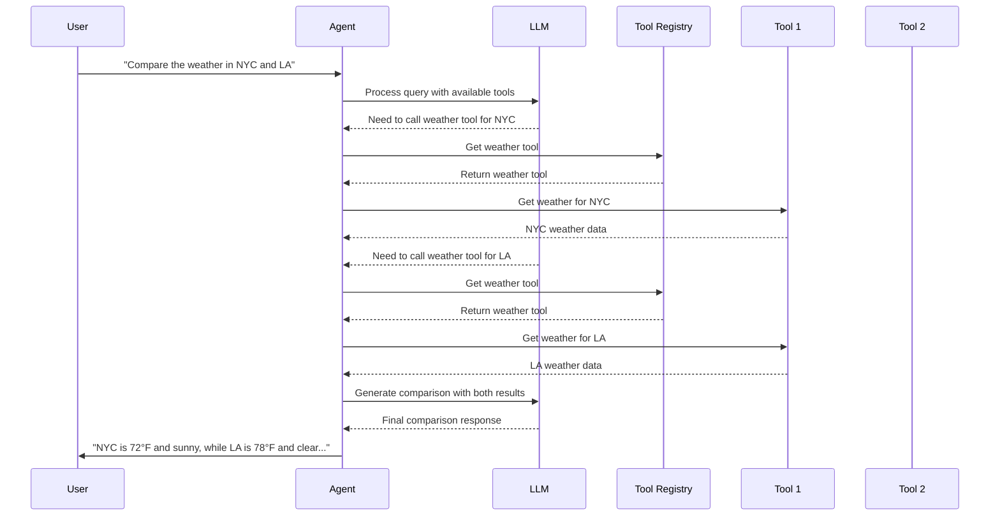
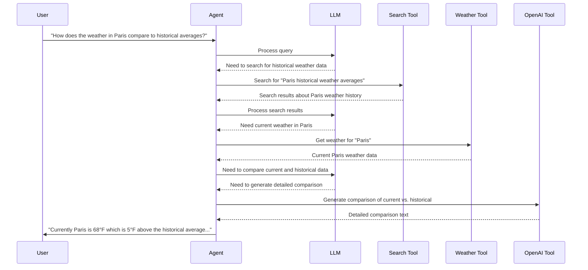
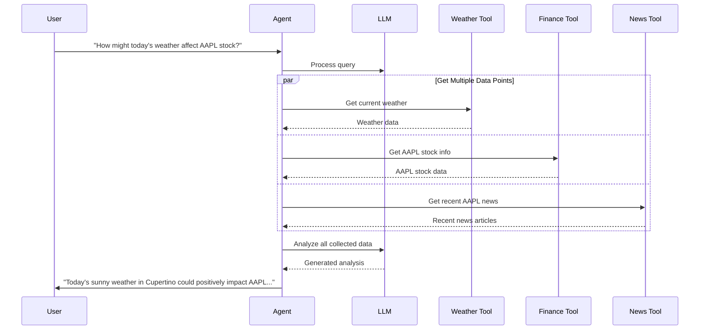
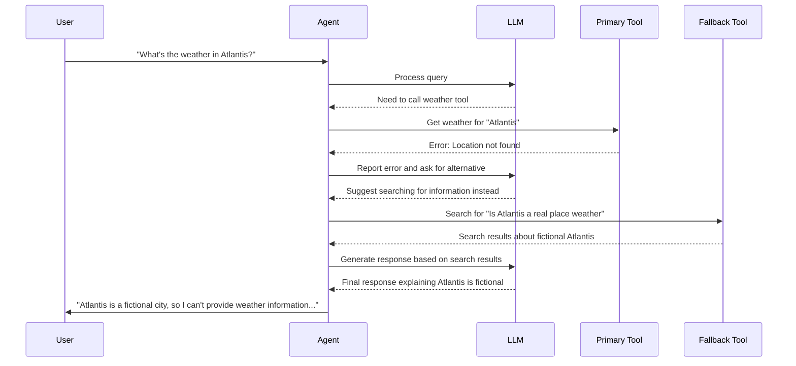

# Function Calling Patterns

This document illustrates different patterns for function calling with language models in Module 6.

## Basic Function Calling Flow

## OpenAI Function Calling

## Multi-Tool Function Calling

## Tool Chain Pattern

## Parallel Function Calling

## Error Handling in Function Calling

