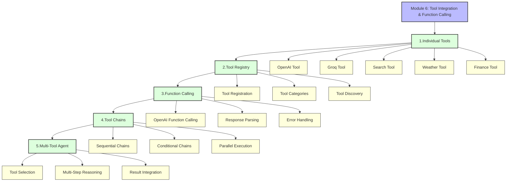
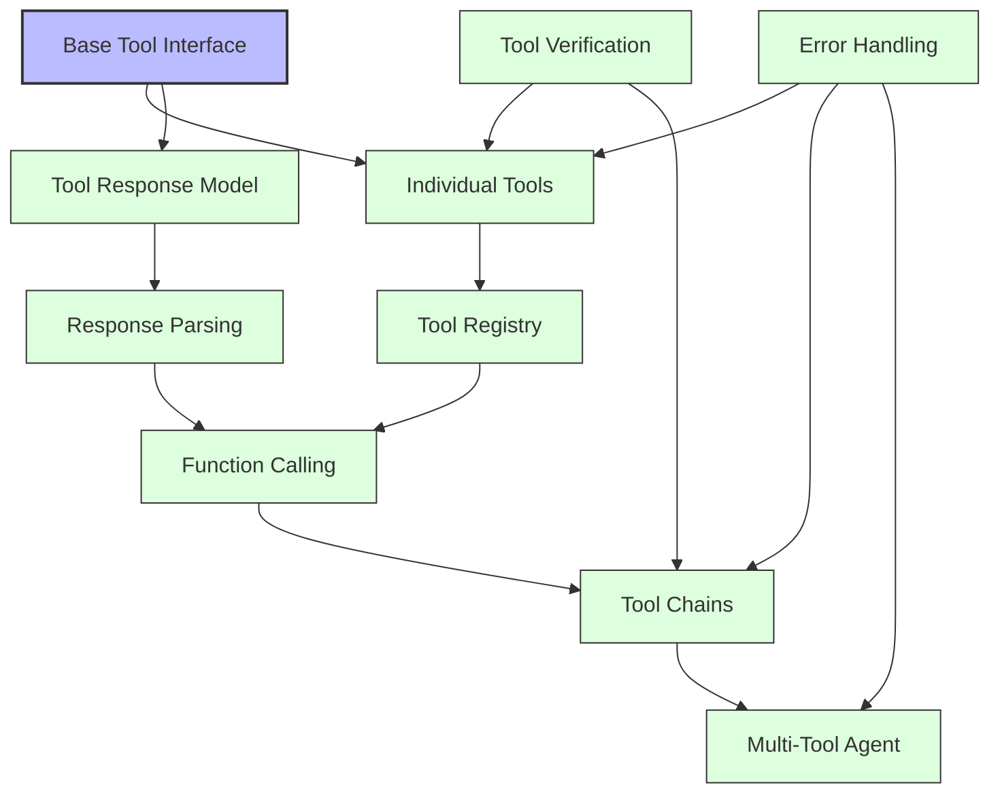
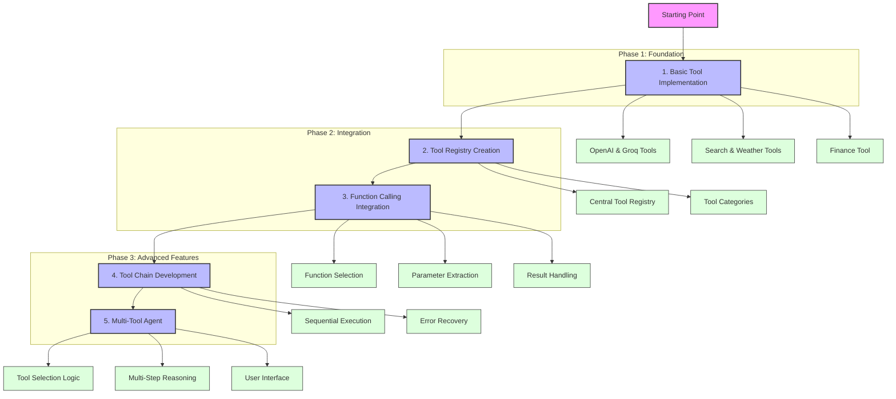
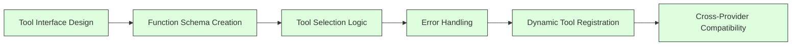
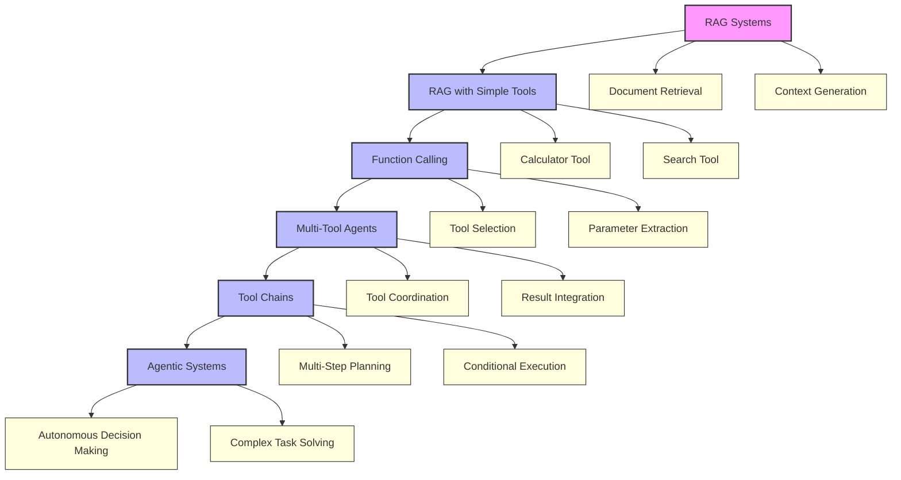

# Module 6: Progressive Journey

This document illustrates the progressive journey through Module 6, showing how concepts build upon each other.

## Module 6 Learning Journey

## Concept Dependencies

## Mini-Project Evolution

## Skills Development Journey

## From RAG to Tools Evolution

