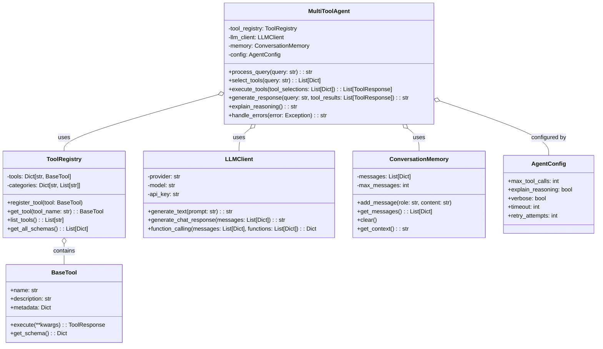
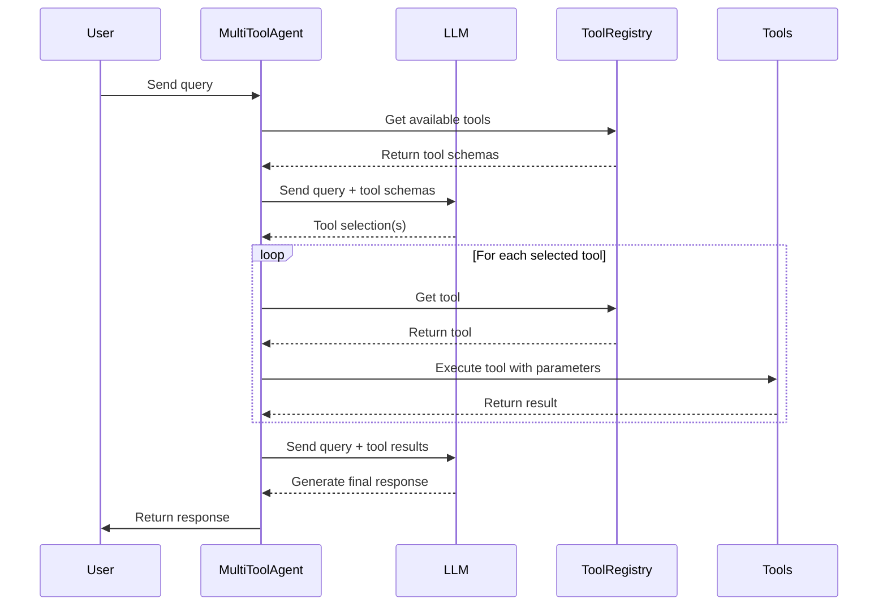
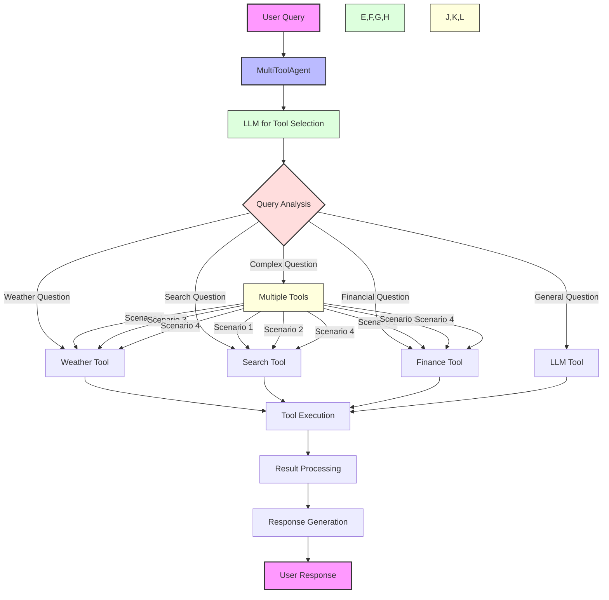
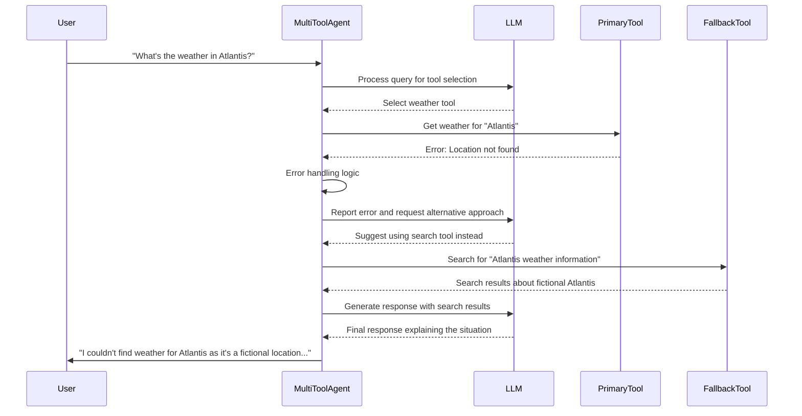
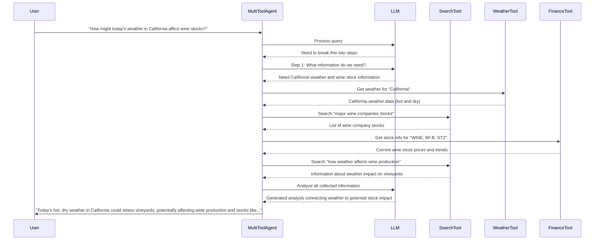
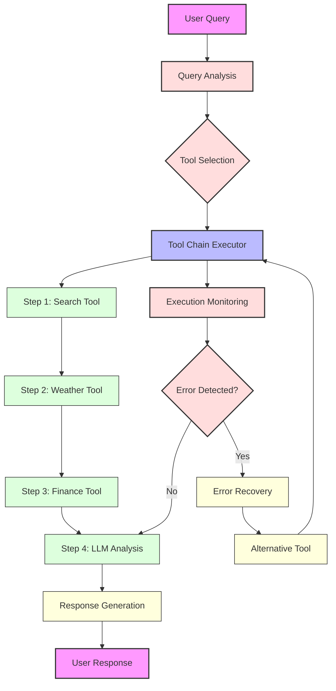

# Multi-Tool Agent

This document illustrates the architecture and functionality of the multi-tool agent in Module 6.

## Multi-Tool Agent Architecture

## Multi-Tool Agent Query Flow

## Tool Selection Logic

## Error Handling Flow

## Multi-Step Reasoning

## Tool Chain Execution

