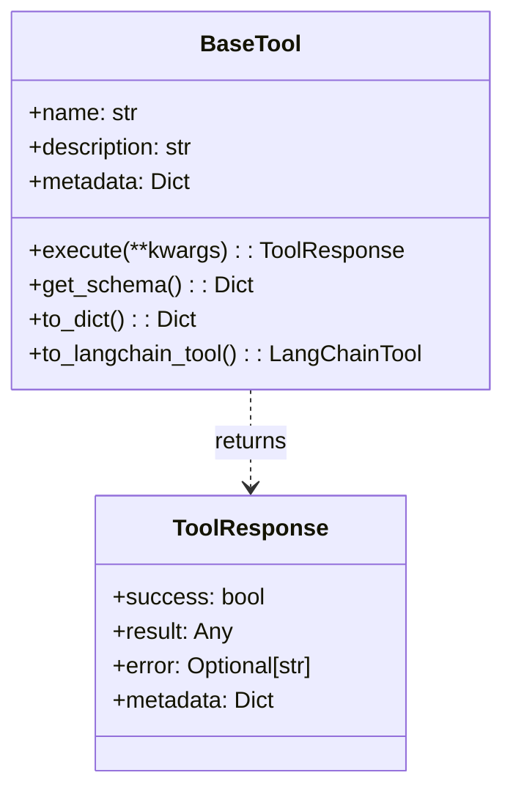
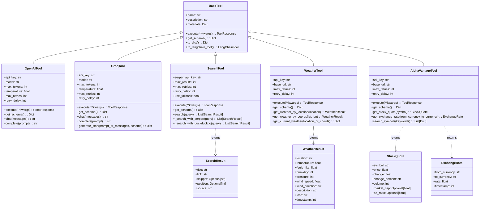
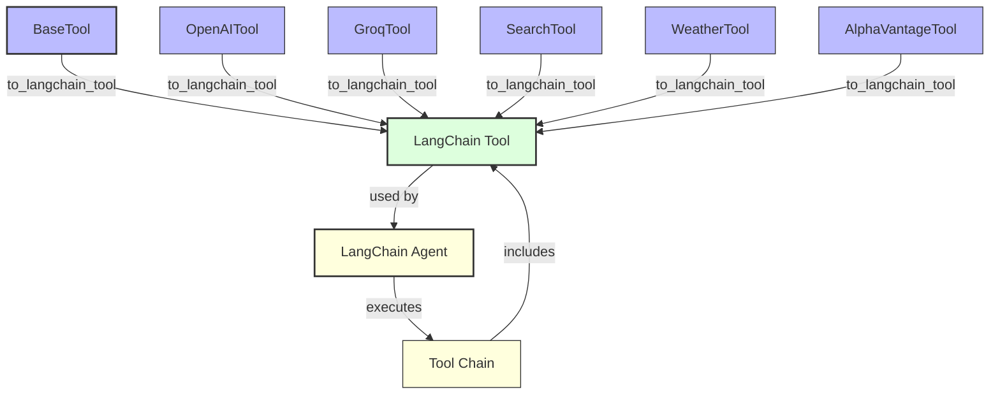

# Tool Architecture

This diagram illustrates the architecture of the tool system in Module 6, showing the relationships between the base tool interface and the specific tool implementations.

## Base Tool Interface

## Tool Implementations

## Tool Integration with LangChain

