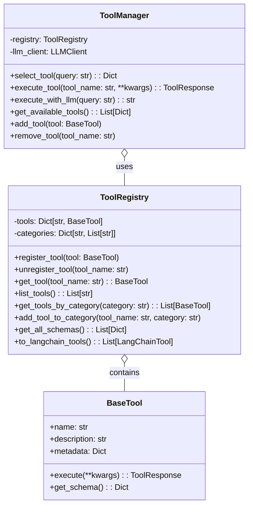
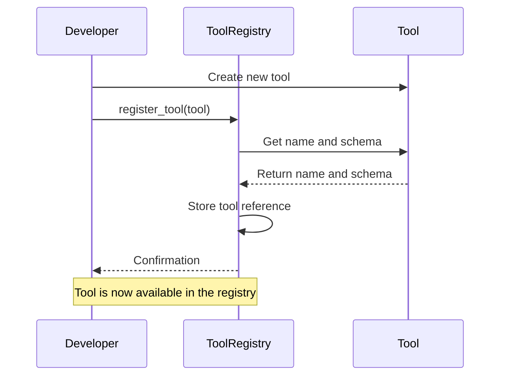
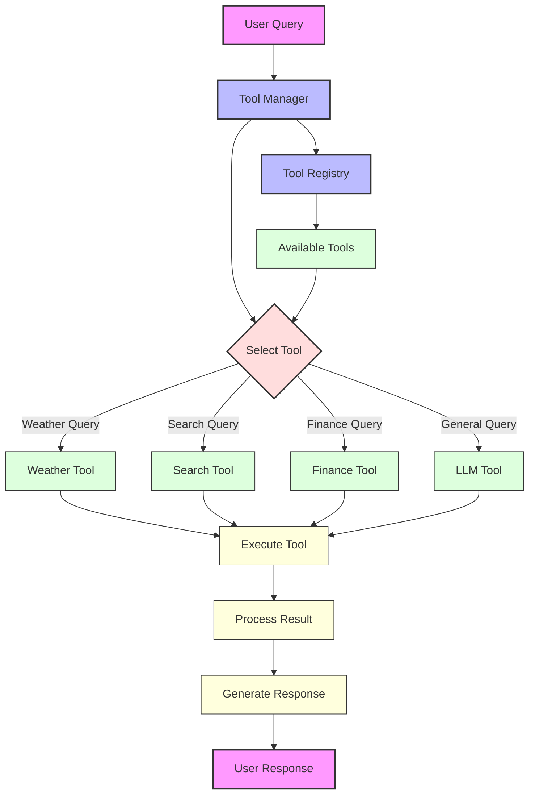
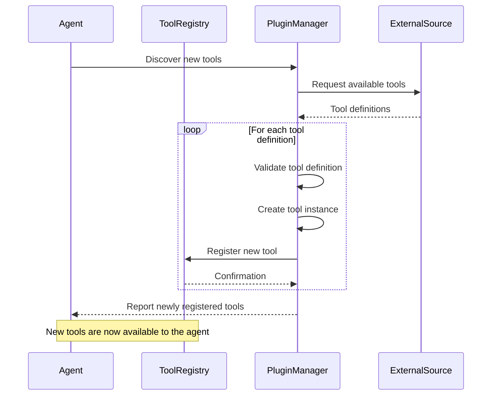
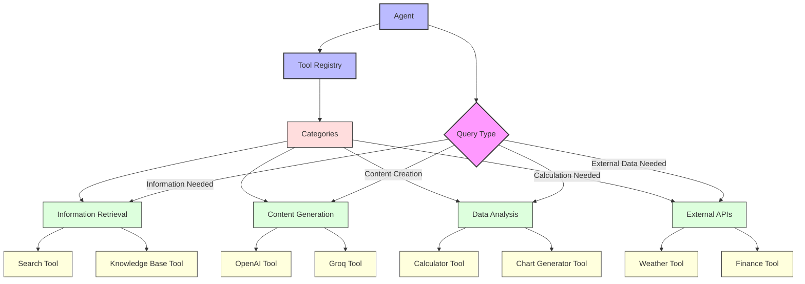

# Tool Registry System

This document illustrates the design and functionality of the tool registry system in Module 6.

## Tool Registry Architecture

## Tool Registration Flow

## Tool Discovery and Selection

## Dynamic Tool Registration

## Tool Categories and Filtering

