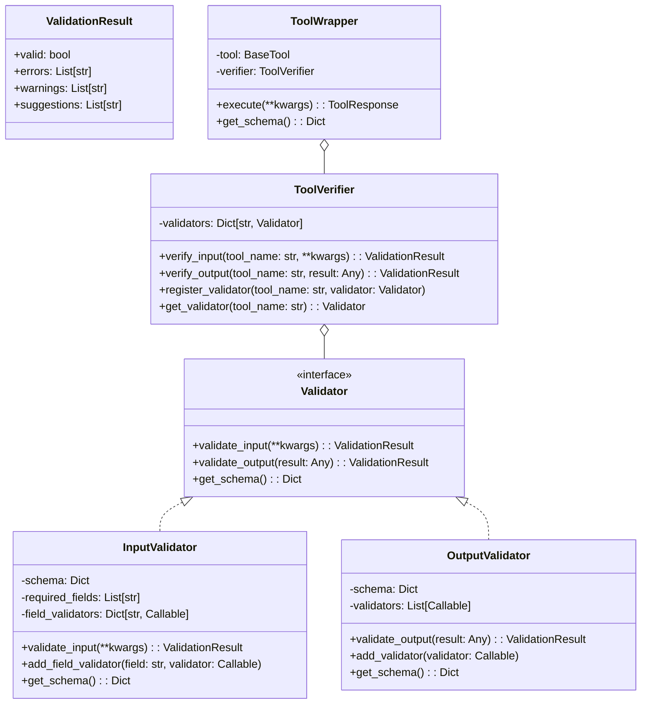
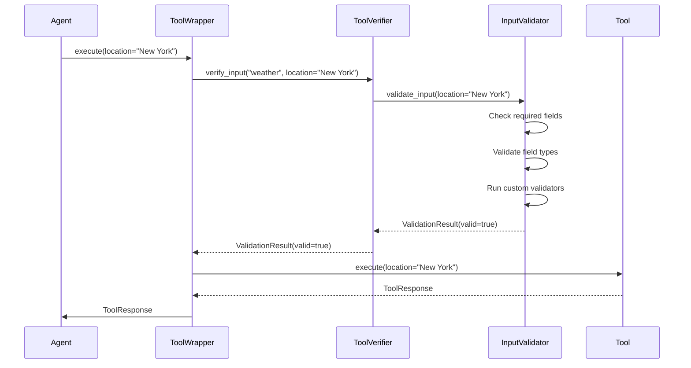
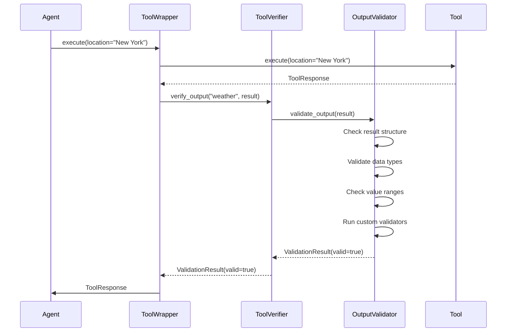
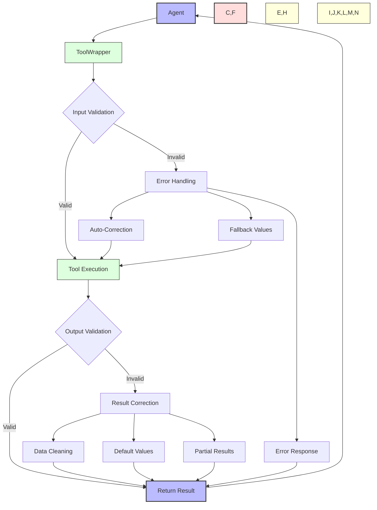
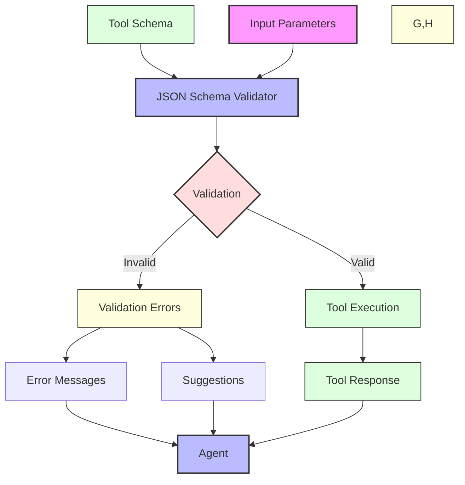
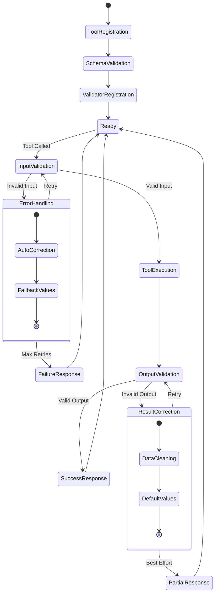

# Tool Verification and Validation

This document illustrates the verification and validation processes for tools in Module 6.

## Tool Verification Architecture

## Input Validation Flow

## Output Validation Flow

## Validation Error Handling

## Schema-Based Validation

## Tool Verification Lifecycle

